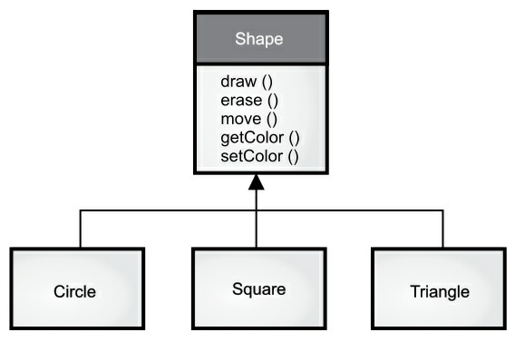
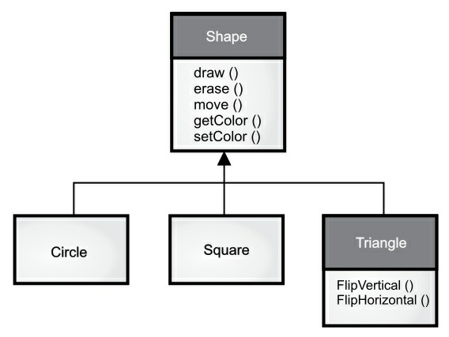

[TOC]


# 第一章 对象的概念


> “我们没有意识到惯用语言的结构有多大的力量。可以毫不夸张地说，它通过语义反应机制奴役我们，语言表现出来并在无意识中给我们留下深刻印象的结构会自动投射到我们周围的世界。”  -- Alfred Korzybski (1930)

计算机革命的起源来自机器。编程语言就像是那台机器，它不仅是我们思维的放大工具和另一种表达媒介，更像我们思想的一部分。语言的灵感来自其他形式的表达，如写作，绘画，雕塑，动画和电影制作。编程语言就是创建应用程序的思想结构。

面向对象编程（*Object-oriented programming OOP*）是一种编程思维方式和编码架构。本章讲述 OOP 的基本概述。如果读者对不太理解，可先行跳过本章。等你具备一定编程基础后，请务必再回头看。只有这样你才能深刻理解面向对象编程的重要性及设计方式。

## 抽象

所有编程语言都提供抽象机制。从某种程度上来说,问题的复杂度直接取决于抽象的类型和质量。这里的“类型”意思是：抽象的内容是什么？汇编语言是对底层机器的轻微抽象。接着出现的“命令式”语言（如 FORTRAN，BASIC 和 C）是对汇编语言的抽象。与汇编相比，这类语言已有了长足的改进，但它们的抽象原理依然要求我们着重考虑计算机的结构，而非问题本身的结构。

程序员必须要在机器模型（“解决方案空间”）和实际解决的问题模型（“问题空间”）之间建立起一种关联。这个过程既费精力，又脱离编程语言本身的范畴。这使得程序代码很难编写，维护代价高昂。同时还造就了一门副产业的“编程方法”学科。

为机器建模的另一个方法是为要解决的问题制作模型。对一些早期语言来说，如 LISP 和 APL，它们的做法是“从不同的角度观察世界”——“所有问题都归纳为列表”或“所有问题都归纳为算法”。PROLOG 则将所有
问题都归纳为决策链。对于这些语言，我们认为它们一部分是“基于约束”的编程，另一部分则是专为
处理图形符号设计的（后者被证明限制性太强）。每种方法都有自己特殊的用途，适合解决某一类的问题。只要超出了它们力所能及的范围，就会显得非常笨拙。

面向对象的程序设计在此基础上跨出了一大步，程序员可利用一些工具表达“问题空间”内的元素。由于这种
表达非常具有普遍性，所以不必受限于特定类型的问题。我们将问题空间中的元素以及它们在解决方案空间的表示物称作“对象”（**Object**）。当然，还有一些在问题空间没有对应的对象体。通过添加新的对象类型，程序可进行灵活的调整，以便与特定的问题配合。所以在阅读方案的描述代码时，会读到对问题进行表达的话语。与我们以前见过的相比，这无疑是一种更加灵活、更加强大的语言抽象方法。总之，OOP 允许我们根据问题来描述问题，而不是根据方案。然而，仍有一个联系途径回到计算机。每个对象都类似一台小计算机；它们有自己的状态，而且可要求它们进行特定的操作。与现实世界的“对象”或者“物体”相比，编程“对象”与它们也存在共通的地方：它们都有自己的特征和行为。

Smalltalk 作为第一种成功的面向对象程序设计语言和 Java 的基础语言，*Alan Kay* 总结了其五大基本特征。通过这些特征，我们可理解“纯粹”的面向对象程序设计方法是什么样的：

> 1. **万物皆对象**。你可以将对象想象成一种特殊的变量。它可以存储数据，可以在你对其“发出请求”时执行本身的操作。理论上讲，你可以从要解决的问题身上抽象出概念性的组件，然后在程序中将其表达为一个对象。
> 2. **程序是一组对象，通过信息传递来告知彼此该做什么**。要请求一个对象，你需要向该对象发送信息。
> 3. **每个对象都有自己的存储空间，可容纳其他对象**。或者说，通过封装现有对象，可制作出新型对象。所以，尽管对象的概念非常简单，但在程序中却可达到任意高的复杂程度。
> 4. **每个对象都有一种类型**。根据语法，每个对象都是某个“类”的一个“实例”。其中，“类”（Class）是“类型”（Type）的同义词。一个类最重要的特征就是“能将什么信息发给它？”。
> 5. **同一类所有对象都能接收相同的信息**。这实际是别有含义的一种说法，大家不久便能理解。由于类型为“圆”（Circle）的一个对象也属于类型为“形状”（Shape）的一个对象，所以一个圆完全能接收形状信息。这意味着可让程序代码统一指挥“形状”，令其自动控制所有符合“形状”描述的对象，其中自然包括“圆”。这一特性称为对象的“可替换性”，是OOP最重要的概念之一。

Grady Booch 提供了对对象更简洁的描述：一个对象具有自己的状态，行为和身份。这意味着对象有自己的内部数据(由状态提供)、方法 (由特性提供)，并彼此区分（每个对象在内存中都有唯一的地址）。


## 接口

亚里士多德（*Aristotle*）大概是第一个认真研究“类型”的哲学家，他曾提出过“鱼和鸟类”这样的概念。所有对象都是唯一的，但同时也是具有相同的特性和型位的对象所归属的类的一部分。这种思想被首次应用于第一个面向对象编程语言 Simula-67，它在程序中使用基本关键字 **class** 来引入新的类型（class 和 type 通常可互换使用，有些人对它们进行了进一步区分，他们强调 type 决定了接口，而 class 是那个接口的一种特殊实现方式）。

Simula 是一个很好的例子。正如这个名字所暗示的，它的作用是“模拟”（*Simulate*）类似“银行出纳员”这
样的经典问题。在这个例子里，我们有一系列出纳员、客户、帐号以及交易等。每类成员（元素）都具有一
些通用的特征：每个帐号都有一定的余额；每名出纳都能接收客户的存款；等等。与此同时，每个成员都有
自己的状态；每个帐号都有不同的余额；每名出纳都有一个名字。所以在计算机程序中，能用独一无二的实
体分别表示出纳员、客户、帐号以及交易。这个实体便是“对象”，而且每个对象都隶属一个特定的“类”，那个类具有自己的通用特征与行为。

因此，在面向对象的程序设计中，尽管我们真正要做的是新建各种各样的数据“类型”（*Type*），但几乎所
有面向对象的程序设计语言都采用了 `class` 关键字。当您看到“type”这个字的时候，请同时想到 `class`；反之亦然。

创建好一个类后，可根据情况生成许多对象。随后，可将那些对象作为要解决问题中存在的元素进行处理。事实上，当我们进行面向对象的程序设计时，面临的最大一项挑战性就是：如何在“问题空间”（问题实际存
在的地方）的元素与“方案空间”（对实际问题进行建模的地方，如计算机）的元素之间建立理想的“一对
一”的映射关系。

那么如何利用对象完成真正有用的工作呢？必须有一种办法能向对象发出请求，令其解决一些实际的问题，比如完成一次交易、在屏幕上画一些东西或者打开一个开关等等。每个对象仅能接受特定的请求。我们向对象发出的请求是通过它的“接口”（*Interface*）定义的，对象的“类型”或“类”则规定了它的接口形式。“类
型”与“接口”的对应关系是面向对象程序设计的基础。

下面让我们以电灯泡为例：


```java
Light lt = new Light();
lt.on();
```

在这个例子中，类型／类的名称是 **Light**，可向 **Light** 对象发出的请求包括包括打开（on）、关闭（*off*）、变得更明亮（*brighten*）或者变得更暗淡（*dim*）。通过简单地声明一个名字（lt），我们为 **Light** 对象创建了一个“句柄”。然后用new关键字新建类型为 **Light** 的一个对象。再用等号将其赋给句柄。

为了向对象发送一条信息，我们列出句柄名（*lt*），再用一个句点符号（`.`）把它同信息名称（*on*）连接起来。从中可以看出，使用一些预先定义好的类时，我们在程序里采用的代码是非常简单和直观的。

上图遵循 **UML**（*Unified Modeling Language*，统一建模语言）的格式。每个类由一个框表示，框的顶部有类型名称，框中间部分要描述的任何数据成员，以及方法（属于此对象的方法，它们接收任何发送到该对象的信息）在框的底部。通常，只有类的名称和公共方法在 **UML** 设计图中显示，因此中间部分未显示，如本例所示。如果您只对类名感兴趣，则也不需要显示方法信息。


## 服务提供

在开发或理解程序设计时，我们可以将对象看成是“服务提供者”。你的程序本身将为用户提供服务，并且它能通过调用其他对象提供的服务来实现这一点。我们的最终目标是开发或调用工具库中已有的一些对象，提供理想的服务来解决问题。

那么问题来了：我们该选择哪个对像来解决问题呢？ 例如，你正在开发一个记事本程序。你可能会想在屏幕输入一个默认的记事本对象，一个用于检测不同类型打印机并执行打印的对象。这些对象中的某些已经有了。那对于还没有的对象，我们该设计成啥样呢？这些对象需要提供哪些服务，以及还需要调用其他哪些对象？

我们可以将这些问题一一分解，抽象成一组服务。软件设计的基本原则是高内聚：每个组件的内部作用明确，功能紧密相关。然而经常有人将太多功能塞进一个对象中。例如：在支票打印模块中，你需要设计一个可以同时读取文本格式又能正确识别不同打印机型号的对象。正确的做法是提供三个或更多对象：一个对象检查所有排版布局的目录；一个或一组可以识别不同打印机型号的对象展示通用的打印界面；第三个对象组合上述两个服务来完成任务。这样，每个对象都提供了一组紧密的服务。在良好的面向对象设计中，每个对象功能单一且高效。这样的程序设计可以提高我们代码的复用性，同时也方便别人阅读和理解我们的代码。只有让人知道你提供什么服务，别人才能更好地将其应用到其他模块或程序中。


## 封装

我们可以把编程的侧重领域划分为研发和应用。应用程序员调用研发程序员构建的基础工具类来做快速开发。研发程序员开发一个工具类，该工具类仅向应用程序员公开必要的内容，并隐藏内部实现的细节。这样可以有效地避免该工具类被错误的使用和更改，从而减少程序出错的可能。彼此职责划分清晰，相互协作。当应用程序员调用研发程序员开发的工具类时，双方建立了关系。应用程序员通过使用现成的工具类组装应用程序或者构建更大的工具库。如果工具类的创建者将类的内部所有信息都公开给调用者，那么有些使用规则就不容易被遵守。因为前者无法保证后者是否按照正确的规则来使用或是改变了该工具类。只有设定访问控制，才能从根本上阻止。

因此，使用访问控制的原因有以下2点：

1. 让应用程序员不要触摸他们不应该触摸的部分。（请注意，这也是一个哲学决策。部分编程语言认为如果程序员有需要，则应该让他们访问细节部分。）；

2. 使类库的创建者（研发程序员）在不影响后者使用的情况下完善更新工具库。例如，我们开发了一个功能简单的工具类，后来发现可以通过优化代码来提高执行速度。假如工具类的接口和实现部分明确分开并受到保护，那我们就可以轻松的完成改造。

Java 有三个显式关键字来设置类中的访问权限：`public`（公开），`private`(私有)和`protected`（受保护）。这些修饰符可以明确谁能访问后面的方法、变量或类。

 1. `public` （公开） 表示任何人都可以访问和使用该元素；

 2. `private` （私有） 除了类本身，外界无法直接访问该元素和内部方法。`private` 是你和调用者之间的屏障。任何试图访问私有成员的人都会收到编译时错误；

 3. `protected` （受保护） 类似于 `private`，区别是继承类（下一节就会引入继承的概念）可以访问 `protected` 的成员，但不能访问 `private` 成员；

 4. `default` （默认） 如果你不使用前面的三者，默认就是 `default` 访问权限。`default` 被称之为包访问，因为该权限下的资源可以同一包（库组件）中其他类的成员访问。


## 复用

一个类经创建和测试后，理应是可复用的。然而很多时候，由于程序员没有足够的编程经验和远见，我们的代码复用性并不强。

代码和设计方案的复用性是面向对象的程序设计的优点之一。我们可以通过重复使用某个 `class` 来达到这种复用性。同时，我们也可以将这个 `class` 作为另一个 `class` 的成员变量来使用。新的对象可以是由任意数量、类型的其他对象构成。这里涉及到“组合”和“聚合”的概念：

* **组合**（*Composition*）    经常用来表示“拥有”关系（*Has-a Relationship*）。例如，“汽车拥有了主机”。

* **聚合**（*Aggregation*）    动态的 **组合**。


上图中实心棱形指向“ **Car** ”表示 **组合** 的关系；如果是 **聚合** 关系，可以使用空心棱形。

（**译者注**：组合和聚合都属于关联关系的一种，只是额外具有整体-部分的意义。至于是聚合还是组合，需要根据实际的业务需求来判断。可能相同超类和子类，在不同的业务场景，关联关系会发生变化。只看代码是无法区分聚合和组合的，具体是哪一种关系，只能从语义级别来区分。聚合关系中，整件不会拥有部件的生命周期，所以整件删除时，部件不会被删除。再者，多个整件可以共享同一个部件。组合关系中，整件拥有部件的生命周期，所以整件删除时，部件一定会跟着删除。而且，多个整件不可以同时间共享同一个部件。这个区别可以用来区分某个关联关系到底是组合还是聚合。两个类生命周期不同步，则是聚合关系，生命周期同步就是组合关系。）

使用“组合”关系会为我们的程序带来极大的灵活性。通常新构建的 `class` “成员对象”会使用 `private` 访问权限，这样应用程序员则无法对其直接访问。我们就可以在不干扰客户代码的前提下，从容地修改那些成员。也可以在“运行期”更改成员，这进一步增大了灵活性。下面一节要讲到的“继承”并不具备这种灵活性，因为编译器必须对通过继承创建的类加以限制。

在面向对象编程中经常重点强调“继承”。在新程序员的印象里，或许早已先入为主地认为“继承应当随处可见”。沿着这种思路产生的程序设计通常拙劣又复杂。相反，在创建新类时首先要考虑“组合”，因为它更简单灵活，并且设计逻辑清晰。等我们有一些编程经验后，一旦需要用到继承，就会明显意识到这一点。

## 继承

“继承”给面向对象编程带来极大的便利。它在概念上允许我们将各式各样数据和功能封装到一起。这样便可恰当表达“问题空间”的概念，而不是强制使用底层机器的习惯用法。

通过使用 `class` 关键字，这些概念在编程语言中表示为基本单元。但若能利用现成的数据类型，对其进行“克隆”，再根据情况进行添加和修改，情况就显得理想多了。“继承”正是针对这个目标而设计的。但继承并不完全等价于克隆。在继承过程中，若原始类（正式名称叫作基础类、超类或父类）发生了变化，修改过的“克隆”类（正式名称叫作继承类或者子类）也会反映出这种变化。

如果我们可以采用现有的类，克隆它，然后对克隆进行添加和修改，那就更好了。这实际上是通过继承得到的，只是如果原始类（称为基类或超类或父类）发生了更改，修改的“克隆”（称为派生类或继承类或子类或子类）也反映了这些更改。


这个图中的箭头从派生类指向基类。正如您将看到的，通常有多个派生类。类型不仅仅描述一组对象的约束，它还涉及其他类型。两种类型可以具有共同的特征和行为，但是一种类型可能包含比另一种类型更多的特征，并且还可以处理更多的信息（或者以不同的方式处理它们）。继承通过基本类型和派生类型的概念来表达这种相似性。基类型包含派生自它的类型之间共享的所有特征和行为。创建基本类型以表示思想的核心。从基类型中，可以派生出其他类型来表示实现该核心的不同方式。



例如，垃圾回收机对垃圾进行分类。基本类型是“垃圾”。每块垃圾都有重量、值等，并且可以被切碎、熔化或分解。由此，可以衍生出更具体的垃圾类型，这些垃圾具有附加特征（瓶子有颜色，钢罐有磁性）或行为（可以压碎铝罐）。此外，一些行为可以不同（纸张的价值取决于它的类型和条件）。使用继承，您将构建一个类型层次结构，该层次结构根据类型表达您试图解决的问题。第二个例子是常见的“形状”例子，可能用于计算机辅助设计系统或游戏模拟。基本类型是“形状”，每个形状都有大小、颜色、位置等等。每个形状可以绘制、擦除、移动、着色等。由此，可以导出（继承）特定类型的形状——圆形、正方形、三角形等等——每个形状可以具有附加的特征和行为。



例如，某些形状可以翻转。有些行为可能不同，比如计算形状的面积时。类型层次结构体现了形状之间的相似性和差异。以与问题相同的术语转换解决方案是有用的，因为您不需要中间模型来从问题的描述获得解决方案的描述。对于对象，类型层次结构是模型的一个重要方面，因此您可以直接从真实世界中的系统描述转到代码中的系统描述。的确，有时候，那些被训练去寻找复杂解决方案的人在面向对象设计的简单性方面有困难。从现有类型继承创建新类型。这种新类型不仅包含现有类型的所有成员（尽管私有成员被隐藏起来并且不可访问），更重要的是它复制了基类的接口。也就是说，基类对象接受的所有信息也被派生类对象接受。根据类接受的信息，我们知道类的类型，因此派生类与基类是相同的类型。


在前面的例子中，“圆是形状”。这种通过继承的类型等价是理解面向对象编程含义的基本网关之一。因为基类和派生类都具有相同的基本接口，所以必须有一些实现来支持该接口。也就是说，当对象接收到特定信息时，必须有可执行代码。如果继承一个类并且不做其他任何事情，则来自基类接口的方法直接进入派生类。这意味着派生类的对象不仅具有相同的类型，而且具有相同的行为，这并不特别有趣。有两种方法可以区分新派生类与原始基类。第一种方法很简单：向派生类添加全新的方法。这些新方法不是基类接口的一部分。这意味着基类没有按照您想要的那样多，所以您添加了更多的方法。继承的这种简单而原始的用途有时是解决问题的完美解决方案。然而，事先还是要仔细调查自己的基础类是否真的需要这些额外的方法。


## 多态

我们在处理类的层次结构时，通常是定义对象的基类而不是对象本身。通过这种方式，我们可以编写出不局限于特定类型的代码。在上个“形状”的图例中，“方法”（method）操纵的是通用“形状”，而不关心它们是“圆”、“正方形”、“三角形”还是某种尚未定义的形状。所有的形状都可以被绘制、擦除和移动，因此“方法”向其中的任何代表“形状”的对象发送信息都不必担心对象如何处理信息。

这样代码不受添加的新类型影响，并且添加新类型是扩展面向对象程序以处理新情况的常用方法。 举个例子来说吧：你可以通过这个通用的“形状”基类来得到一个新的“五角星”形状得子类。通过派生新的子类来扩展设计的这种能力是封装变化的基本方法之一。

这样的设计减少了程序的维护难度。我们把派生的对象类型统一看成是它本身的基础类型（“圆”是一种“形状”，“自行车”是“车”，“鸬鹚”也是“鸟”等等）。编译器（compiler）在编译时期无法精确的知道什么“形状”被擦除，哪一种“车”在行驶，或者是某种“鸟”在飞行。当程序接收这种信息之前程序员并不知道哪段代码会被执行。“擦除”的方法可以平等地应用到每一种可能的“形状”上。

如果不需要考虑执行了哪部分代码，那我们就能添加一个新的不同执行方式的子类而不需要更改调用它的方法。那么编译器在不确定该执行哪部分代码时是怎么做的呢？举个例子，下图的 **BirdController** 对象和通用 **Bird** 对象中，**BirdController** 不知道 **Bird** 的确切类型却还能一起工作。从 **BirdController** 的角度来看，这是很方便的，因为它不需要特殊的代码来确定 **Bird** 工作的确切类型或行为。那么，在调用 **move()** 方法时是如何保证发生正确的行为（鹅走路、苍蝇或游泳、企鹅走路或游泳）的呢？


答案是继承的主要转折点：在传统意义上，编译器不能进行函数调用。由非 OOP 编译器生成的函数调用生成所谓的早期绑定，这个术语您可能从未听说过，因为您从未以其他方式考虑过。这意味着编译器生成对特定函数名的调用，该调用解析为要执行的代码的绝对地址。

通过继承，程序直到运行时才能确定代码的地址，因此当信息被发送到对象时，还需要其他一些方案。为了解决这个问题，面向对象语言使用后期绑定的概念。当向对象发送信息时，调用的代码直到运行时才确定。编译器确保方法存在，并对参数和返回值执行类型检查，但是它不知道要执行的确切代码。

为了执行后期绑定，Java 使用一个特殊的代码位来代替绝对调用。这段代码使用对象中存储的信息来计算方法主体的地址（此过程在多态性章节中有详细介绍）。因此，每个对象的行为根据特定代码位的内容而不同。当您向对象发送信息时，该对象实际上确定如何处理该信息。在某些语言中，必须显式地授予方法后期绑定属性的灵活性。例如，C++使用虚拟关键字。在这些语言中，默认情况下方法没有动态绑定。在 Java 中，动态绑定是默认行为，不需要额外的关键字来生成多态性。

为了演示多态性，我们编写了一段代码，它忽略了类型的特定细节，只与基类对话。该代码与特定于类型的信息分离，因此更易于编写和更容易理解。而且，如果通过继承添加了一个新类型（例如，一个六边形），那么代码对于新类型的 Shape 就像对现有类型一样有效。因此，该程序是可扩展的。

代码示例：

```java
void doSomething(Shape shape) {
    shape.erase();
    // ...
    shape.draw();
}
```

此方法与任何 Shape 都相关，因此它独立于所绘制和擦除的对象的特定类型。此时程序的其他部分使用**doSomething()** 方法：

```java
    Circle circle = new Circle();
    Triangle triangle = new Triangle();
    Line line = new Line();
    doSomething(circle);
    doSomething(triangle);
    doSomething(line);

```

可以看到无论传入的“形状”是什么，程序都正确的执行了。


这实际是一个非常有用的编程技巧。分析下面这行代码：

```java
    doSomething(circle);
```
这里将 **Circle**（圆）句柄传递给一个本来期待 **Shape**（形状）句柄的方法。由于圆也是一种几何形状，所
以 **doSomething(circle)** 能正确地执行。也就是说，**doSomething()** 能接受任意 **Shape** 的信息。这是完全安全和合乎逻辑的事情。

这种把子类当成其基类来处理的过程叫做“向上转型”（**upcasting**）。在面向对象的编程里，经常利用这种方法来给程序解耦。再看下面的 **doSomething()** 代码示例：

```java
    shape.erase();
    // ...
    shape.draw();

```

我们可以看到程序并未这样表达：“如果你是一个 Circle ，就这样做；如果你是一个 Square，就那样做；等等”。若那样编写代码，就需检查 Shape 所有可能的类型，如圆、矩形等等。这显然是非常麻烦的，而且每次添加了一种新的 Shape 类型后，都要相应地进行修改。在这里，我们只需说：“你是一种几何形状，我知道你能将自己删掉，即 erase()；请自己采取具体行动，并控制所有的细节吧。”

尽管我们没作出任何特殊指示，程序的操作也是完全正确和恰当的。我们知道，为 Circle 调用draw()时执行的代码与为一个 Square 或 Line 调用 draw() 时执行的代码是不同的。但在将 draw() 信息发给一个匿名 Shape 时，根据 Shape 句柄当时连接的实际类型，会相应地采取正确的操作。这非常神奇，因为当 Java 编译器为 doSomething() 编译代码时，它并不知道自己要操作的准确类型是什么。

尽管我们确实可以保证最终会为 Shape 调用 erase()、 draw()，但并不能确定特定的 Circle，Square 或者 Line 调用什么。最后，程序执行的操作却依然是正确的，这是怎么做到的呢？

将信息发给对象时，如果程序不知道接受的具体类型是什么，但最终执行是正确的，这就是对象的“多态性”（**Polymorphism**）。面向对象的程序设计语言是通过“动态绑定”的方式来实现对象的多态性的。编译器和运行期系统会负责对所有细节的控制；我们只需知道要做什么，以及如何利用多态性来更好的设计程序。

## 单继承

自从 C++ 引入以来，OOP 问题变得尤为突出。是否所有的类都应该默认从一个基类继承呢？这个答案在 Java 中是肯定的。（实际上，除 C++ 以外的其他虚拟机语言也是这样。）在 Java 中这个最终的基类的名字就是 `Object`。

Java 的单继承结构有很多好处。由于所有对象都有继承自一个公共接口，因此它们最终都属于同一个基本类型。相反的，对于 C++ 所使用的多继承的方案则是不保证所有的对象都属于同一个的基类。这种方案的限制更少一点。从向后兼容的角度看，多继承的方案更符合 C 的模型。

对于完全面向对象编程，我们必须要构建自己的层次结构，以提供与其他 OOP 语言同样的便利。我们经常会使用到新的类库和不兼容的接口。为了整合它们而花费大气力（有可能还要用上多继承）以获得 C++ 样的“灵活性”值得吗？如果从零开始，Java 这样的替代方案会是更好的选择。

另外，单继承的结构使得垃圾收集器的实现更为容易。这也是 Java 在 C++ 基础上的根本改进之一。

由于运行期的类型信息会存在于所有对象中，所以我们永远不会遇到判断不了对象类型的情况。这对于系统级操作尤其重要，例如[异常处理](#异常处理)。同时，这也让我们的编程具有更大的灵活性。


## 集合

通常，我们并不知道解决某个具体问题需要的对象数量,持续时间，以及对象的存储方式。那么我们如何知悉程序在创建时需要分配的内存空间呢？

在面向对象的设计中，问题的解决方案有些千篇一律：创建一个新类型的对象来引用、容纳其他的对象。当然，我们也可以使用多数编程语言都支持的“数组”（**Array**）。在 Java 中“集合”（**Collection**）的使用率更高。（也可称之为“容器”，但“集合”这个称呼更通用。）

“集合”这种类型的对象可以存储任意类型、数量的其他对象。它能根据需要自动扩容，我们不用关心过程是如何实现的。

还好，一般优秀的 OOP 语言都会将“集合”作为其基础包。在 C++ 中，“集合”是其标准库的一部分。通常被称为 STL（标准模板库，*the Standard Template Library*）。SmallTalk 有一套非常完整的集合库。同样，Java 的标准库中也提供许多现成的集合类。在一些库中，一两个集合泛型就能满足我们所有的需求了。在 Java 中不同的需求对应不同种类的集合

在一些库中，一个或两个泛型集合被认为是对所有需求都足够好的，而在其他（Java）中，不同类型的集合对应不同的需求：常见的有 List，常用于保存序列；Map，也称为关联数组，常用于将对象与其他对象关联）；Set，只能保存非重复的值；其他还包括如队列（*Queue*）、树（*Tree*）、堆（*Stack*）等等。从设计的角度来看，我们真正想要的是一个能够解决某个问题的集合。如果一种集合就满足所有需求，那么我们就不需要剩下的了。之所以选择集合有以下两个原因：

1. 集合可以提供不同类型的接口和外部行为。堆栈、队列的应用场景和集合、列表不同，为我们解决问题提供了灵活的方案。

2. 不同的集合种类对应着不同的用途。例如，List 的两种基本类型：ArrayList 和 LinkedList。虽然两者具有相同接口和外部行为，但是在某些操作中它们的效率差别很大。在 ArrayList 中随机查找元素是很高效的，而 LinkedList 随机查找效率低下。反之，在 LinkedList 中插入元素的效率要比在 ArrayList 中高。由于底层数据结构的不同，每种集合类型在执行相同的操作时会表现出效率上的差异。

通过对 List 接口的抽象，我们可以很容易的将 LinkedList 改为 ArrayList。在 Java 5 泛型出来之前，集合中保存的是通用类型 `Object`。Java 单继承的结构意味着所有元素都基于 `Object` 类，所以在集合中可以保存任何类型的数据。这也使得集合易于重用。要使用这样的集合时，我们先要往集合添加元素。由于 Java 5 版本前的集合只保存 `Object`，当我们往集合中添加元素时，元素便向上转型成了 `Object`，从而丢失自己原有的类型特性。这时我们再从对象中取出该元素时，元素的类型变成了 `Object`。那么我们该怎么将其转回原先具体的类型的？这里，我们使用了强制类型转换将其转为更具体的类型。这个过程称之为对象的“向下转型”。通过“向上转型”，我们知道“圆形”也是一种“形状”，这个过程是安全的。可是我们不能从“Object”看出其就是“圆圈”或“形状”，所以除非我们能确定元素的具体类型信息，否则“向下转型”就是不安全的。也不能说这样的错误就时完全危险的，因为一旦我们转化了错误的类型，程序就会运行出错，抛出“运行时异常”（*RuntimeException*）。（后面的章节会提到） 无论如何，我们要寻找一种在取出集合元素时确定其具体类型的方法。另外，每次取出元素都要做额外的“向下转型”对程序和程序员都是一种开销。以某种方式创建集合，以确认保存元素的具体类型，减少集合元素“向下转型”中的开销和可能出现的错误难道不好吗？这种解决方案就是：参数化类型机制（*Parameterized Type Mechanism*）。

参数化类型机制可以使得编译器能够自动识别某个 `class` 的具体类型并正确地执行. 举个例子，对集合的参数化类型机制可以让其仅接受“形状”这种类型的元素，并以“形状”类型取出元素。Java 5 版本支持了参数化类型机制，称之为“泛型”（*Generic*）。泛型是 Java 5 的主要特性之一。举个例子，你可以按以下方式向 ArrayList 种添加 Shape（形状）：

```java
    ArrayList<Shape> shapes = new ArrayList<>();
```

泛型的应用，让 Java 的许多标准库和组件都发生了改变。在本书的代码示例中，你也会经常看到泛型的身影。


## 生命周期

我们在使用对象时要注意的一个关键问题就是对象的创建和销毁方式。每个对象的生存都需要资源，尤其是内存。为了资源的重复利用，当对象不再被使用时我们应该及时释放资源，清理内存。

在简单的编程场景下，对象的清理并不是问题。我们创建对象，按需使用，最后销毁它。然而，情况往往要比这更复杂：

假设，我们正在为机场设计一个空中交通管制的系统（该例也适用于仓库货柜管理、影带出租或者宠物寄养仓库系统）。第一步比较简单：创建一个用来保存飞机的集合，每当有飞机进入交通管制区域时，我们就创建一个“飞机”对象并将其加入到集合中，等到飞机离开时将其从这个集合中清除。与此同时，我们还需要一个记录飞机信息的系统。这些数据的重要性靠后，可以放在系统空闲的时候再后台处理。比如，我们要记录所有飞机中的小型飞机的的信息（比如飞行计划)。此时，我们又创建了第二个集合来记录所有小型飞机。 每当创建一个“飞机”对象的时候，将其放入第一个集合；若它属于小型飞机，也必须同时将其放入第二个集合里。

现在问题开始棘手了：我们怎么知道何时该清理这些对象呢？当某一个系统处理完成，而其他系统可能还没有处理完成。这样的问题在其他的场景下也可能发生。在 C++ 程序设计中，当使用完一个对象后，必须明确将其删除，这就让问题变复杂了。

这个对象的数据在哪？它的生命周期是怎么被控制的？ 在 C++ 设计中采用的观点是效率第一，因此它将选择权交给了程序员。为了获得最大的运行时速度，程序员可以在编写程序时，通过将对象放在堆栈（*Stack*，有时称为自动变量或作用域变量）或静态存储区域（*static storage area*）中来确定内存占用和生存时间。这些区域的对象会被优先分配内存和释放。这种控制在某些情况下非常有用。

然而相对的，我们也牺牲了程序的灵活性。因为在编写代码时，我们必须要弄清楚对象的数量、生存时间还有类型。如果我们要用它来解决一个相当普遍的问题时（如计算机辅助设计、仓库管理或空中交通管制等），限制就太大了。

第二种方法是在堆内存（*Heap*）中动态地创建对象。在这种方式下，直到程序运行我们才能确定需要创建的对象数量、生存时间和类型。什么时候需要，什么时候在堆内存中创建。 因为内存的占用是动态管理的，所以在运行时，在堆内存上开辟空间所需的时间可能比在栈内存上要长（但也不一定）。在栈内存开辟空间通常是一条将栈指针向下移动，另一条将其向后移动的汇编指令。开辟堆内存空间的时间取决于内存机制的设计。

动态方法使一般的逻辑假设对象趋于复杂，因此额外的内存查找和释放的开销对对象的创建影响不大。（原文：*The dynamic approach makes the generally logical assumption that objects tend to be  complicated, so the extra overhead of finding storage and releasing that storage will not have an important impact on the creation of an object.*）此外，更好的灵活性对于问题的解决至关重要。

Java 使用动态内存分配。每次创建对象时，使用 `new` 关键字构建该对象的动态实例。这又带来另一个问题：对象的生存周期。较之堆内存，在栈内存中创建对象，编译器能够确定该对象的生命周期并自动销毁；然而如果你在堆内存创建对象的话，编译器是不知道它的生命周期的。在 C++ 中你必须以编程方式确定何时销毁对象，否则可能导致内存泄漏。Java 的内存管理是建立在垃圾收集器上的，它能自动发现对象不再被使用并释放内存。垃圾收集器的存在带来了极大的便利，它减少了我们之前必须要跟踪的问题和编写相关代码的数量。因此，垃圾收集器提供了更高级别的保险，以防止潜在的内存泄漏问题，这使得许多 C++ 项目没落。

Java 的垃圾收集器被设计用来解决内存释放的问题（虽然这不包括对象清理的其他方面）。垃圾收集器知道对象什么时候不再被使用并且自动释放内存。结合单继承和仅可在堆中创建对象的机制，Java 的编码过程较之 C++ 要简单得多。我们所要做的决定和要克服的障碍也会少很多！


## 异常处理

自编程语言被发明以来，程序的错误处理一直都是个难题，因为很难设计出一个好的错误处理方案。许多编程语言都忽略了这个问题，把这个问题丢给了程序类库的设计者。他们提出了在许多情况下都可以工作但很容易被规避的半途而废的措施，通常只需忽略错误。多数错误处理方案的主要问题是：它们依赖程序员之间的约定俗成而不是语言层面的限制。换句话说，如果程序员赶时间或没想起来，这些方案就很容易被忘记。

异常处理机制将程序错误直接交给编程语言甚至是操作系统。“异常”（*Exception*）是一个从出错点“抛出”（*thrown*）后能被特定类型的异常处理程序捕获(*catch*)的一个对象。它不会干扰程序的正常运行，仅当程序出错的时候才被执行。这让我们的编码更简单：不用再反复检查错误了。另外，如果 **throw** 的异常类型和 **catch** 的不符，则不会触发该条件下的异常处理程序。异常的发生是不会被忽略的,它终究会在某一时刻被处理。

最后，“异常机制”提供了一种可靠地从意外情况中恢复的方法，使得我们可以编写出更健壮的程序。有时你只要处理好抛出的异常情况并恢复程序的运行即可，无需退出。

Java 的异常处理机制在编程语言中脱颖而出。在 Java 中，异常处理从一开始就被连接起来，因此你不得不使用它。这是 Java 语言唯一接受的错误报告方法。如果没有编写适当的异常处理代码，你将会收到一条编译时错误消息。这种保证错误一致性的方法有时会让程序的错误处理变得更容易。值得注意的是，异常处理并不是面向对象的特性。尽管在面向对象的语言中异常通常由对象表示，但是在面向对象语言之前也存在异常处理。


## 本章小结

面向过程程序包含数据定义和函数调用。要找到程序的意图，你必须要在脑中建立一个模型，弄清函数调用和更底层的概念。这些程序往往容易混淆，因为表达式的术语更多地面向计算机而不是我们要解决的问题。这就是我们在设计程序时需要中间表示的原因。OOP 在面向过程编程的基础上增加了许多新的概念，所以有人会认为使用 Java 来编程会比同等的面向过程编程要更复杂。在这里，我想给大家一个惊喜：通常按照 Java 规范编写的程序会比面向过程程序更容易被理解。

你看到的是对象的概念，这些概念是站在“问题空间”的（而不是站在计算机角度的“解决方案空间”），以及发送给对象以指示该空间中的活动的信息。面向对象编程的一个优点是：设计良好的 Java 程序代码更容易被人阅读理解。由于 Java 类库的复用性，通常程序要写的代码也会少得多。

OOP 和 Java 不一定适合每个人。评估自己的需求以及与现有方案作比较是很重要的。请充分考虑后再决定是不是选择 Java。如果在可预见的未来，Java 并不能很好的满足你的特定需求，那么你应该去寻找其他替代方案（特别是，我推荐看 Python）。如果你依然选择 Java 作为你的开发语言，我希望你至少应该清楚你选择的是什么，以及为什么选择这个方向。
<!-- 分页 -->
<div style="page-break-after: always;"></div>

