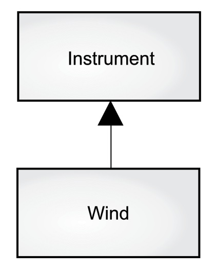
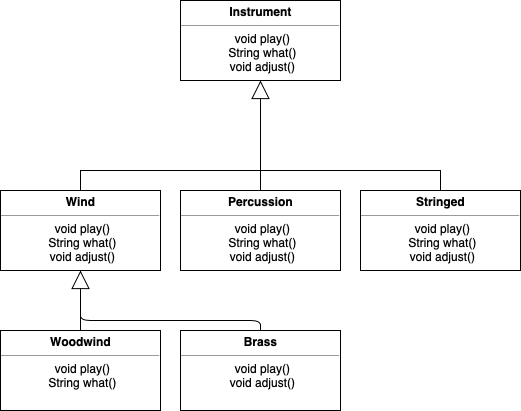
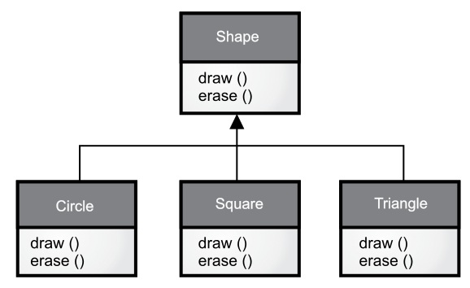
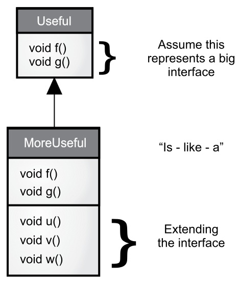
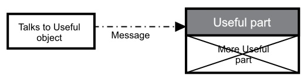

[TOC]

<!-- Polymorphism -->
# 第九章 多态

> 曾经有人请教我 “ Babbage 先生，如果输入错误的数字到机器中，会得出正确结果吗？” 我无法理解产生如此问题的概念上的困惑。 —— Charles Babbage (1791 - 1871)

多态是面向对象编程语言中，继数据抽象和继承之外的第三个重要特性。

多态提供了另一个维度的接口与实现分离，以解耦做什么和怎么做。多态不仅能改善代码的组织，提高代码的可读性，而且能创建有扩展性的程序——无论在最初创建项目时还是在添加新特性时都可以“生长”的程序。

封装通过合并特征和行为来创建新的数据类型。隐藏实现通过将细节**私有化**把接口与实现分离。这种类型的组织机制对于有面向过程编程背景的人来说，更容易理解。而多态是消除类型之间的耦合。在上一章中，继承允许把一个对象视为它本身的类型或它的基类类型。这样就能把很多派生自一个基类的类型当作同一类型处理，因而一段代码就可以无差别地运行在所有不同的类型上了。多态方法调用允许一种类型表现出与相似类型的区别，只要这些类型派生自一个基类。这种区别是当你通过基类调用时，由方法的不同行为表现出来的。

在本章中，通过一些基本、简单的例子（这些例子中只保留程序中与多态有关的行为），你将逐步学习多态（也称为*动态绑定*或*后期绑定*或*运行时绑定*）。

<!-- Upcasting Revisited -->

## 向上转型回顾

在上一章中，你看到了如何把一个对象视作它的自身类型或它的基类类型。这种把一个对象引用当作它的基类引用的做法称为向上转型，因为继承图中基类一般都位于最上方。

同样你也在下面的音乐乐器例子中发现了问题。即然几个例子都要演奏乐符（**Note**），首先我们先在包中单独创建一个 Note 枚举类：

```java
// polymorphism/music/Note.java
// Notes to play on musical instruments
package polymorphism.music;

public enum Note {
    MIDDLE_C, C_SHARP, B_FLAT; // Etc.
}
```

枚举已经在”第 6 章初始化和清理“一章中介绍过了。

这里，**Wind** 是一种 **Instrument**；因此，**Wind** 继承 **Instrument**：

```java
// polymorphism/music/Instrument.java
package polymorphism.music;

class Instrument {
    public void play(Note n) {
        System.out.println("Instrument.play()");
    }
}

// polymorphism/music/Wind.java
package polymorphism.music;
// Wind objects are instruments
// because they have the same interface:
public class Wind extends Instrument {
    // Redefine interface method:
    @Override
    public void play(Note n) {
        System.out.println("Wind.play() " + n);
    }
}
```

**Music** 的方法 `tune()` 接受一个 **Instrument** 引用，同时也接受任何派生自 **Instrument** 的类引用：

```java
// polymorphism/music/Music.java
// Inheritance & upcasting
// {java polymorphism.music.Music}
package polymorphism.music;

public class Music {
    public static void tune(Instrument i) {
        // ...
        i.play(Note.MIDDLE_C);
    }
    
    public static void main(String[] args) {
        Wind flute = new Wind();
        tune(flute); // Upcasting
    }
}
```

输出：

```
Wind.play() MIDDLE_C
```

在 `main()` 中你看到了 `tune()` 方法传入了一个 **Wind** 引用，而没有做类型转换。这样做是允许的—— **Instrument** 的接口一定存在于 **Wind** 中，因此 **Wind** 继承了 **Instrument**。从 **Wind** 向上转型为 **Instrument** 可能“缩小”接口，但不会比 **Instrument** 的全部接口更少。

###  忘掉对象类型

**Music.java** 看起来似乎有点奇怪。为什么所有人都故意忘记掉对象类型呢？当向上转型时，就会发生这种情况，而且看起来如果 `tune()` 接受的参数是一个 **Wind** 引用会更为直观。这会带来一个重要问题：如果你那么做，就要为系统内 **Instrument** 的每种类型都编写一个新的 `tune()` 方法。假设按照这种推理，再增加 **Stringed** 和 **Brass** 这两种 **Instrument** :

```java
// polymorphism/music/Music2.java
// Overloading instead of upcasting
// {java polymorphism.music.Music2}
package polymorphism.music;

class Stringed extends Instrument {
    @Override
    public void play(Note n) {
        System.out.println("Stringed.play() " + n);
    }
}

class Brass extends Instrument {
    @Override
    public void play(Note n) {
        System.out.println("Brass.play() " + n);
    }
}

public class Music2 {
    public static void tune(Wind i) {
        i.play(Note.MIDDLE_C);
    }
    
    public static void tune(Stringed i) {
        i.play(Note.MIDDLE_C);
    }
    
    public static void tune(Brass i) {
        i.play(Note.MIDDLE_C);
    }
    
    public static void main(String[] args) {
        Wind flute = new Wind();
        Stringed violin = new Stringed();
        Brass frenchHorn = new Brass();
        tune(flute); // No upcasting
        tune(violin);
        tune(frenchHorn);
    }
}
```

输出：

```
Wind.play() MIDDLE_C
Stringed.play() MIDDLE_C
Brass.play() MIDDLE_C
```

这样行得通，但是有一个主要缺点：必须为添加的每个新 **Instrument** 类编写特定的方法。这意味着开始时就需要更多的编程，而且以后如果添加类似 `tune()` 的新方法或 **Instrument** 的新类型时，还有大量的工作要做。考虑到如果你忘记重载某个方法，编译器也不会提示你，这会造成类型的整个处理过程变得难以管理。

如果只写一个方法以基类作为参数，而不用管是哪个具体派生类，这样会变得更好吗？也就是说，如果忘掉派生类，编写的代码只与基类打交道，会不会更好呢？

这正是多态所允许的。但是大部分拥有面向过程编程背景的程序员会对多态的运作方式感到一些困惑。

<!-- The Twist -->

## 转机

运行程序后会看到 **Music.java** 的难点。**Wind.play()** 的输出结果正是我们期望的，然而它看起来似乎不应该得出这样的结果。观察 `tune()` 方法：

```java
public static void tune(Instrument i) {
    // ...
    i.play(Note.MIDDLE_C);
}
```

它接受一个 **Instrument** 引用。那么编译器是如何知道这里的 **Instrument** 引用指向的是 **Wind**，而不是 **Brass** 或 **Stringed** 呢？编译器无法得知。为了深入理解这个问题，有必要研究一下*绑定*这个主题。

### 方法调用绑定

将一个方法调用和一个方法主体关联起来称作*绑定*。若绑定发生在程序运行前（如果有的话，由编译器和链接器实现），叫做*前期绑定*。你可能从来没有听说这个术语，因为它是面向过程语言不需选择默认的绑定方式，例如在 C 语言中就只有*前期绑定*这一种方法调用。

上述程序让人困惑的地方就在于前期绑定，因为编译器只知道一个 **Instrument** 引用，它无法得知究竟会调用哪个方法。

解决方法就是*后期绑定*，意味着在运行时根据对象的类型进行绑定。后期绑定也称为*动态绑定*或*运行时绑定*。当一种语言实现了后期绑定，就必须具有某种机制在运行时能判断对象的类型，从而调用恰当的方法。也就是说，编译器仍然不知道对象的类型，但是方法调用机制能找到正确的方法体并调用。每种语言的后期绑定机制都不同，但是可以想到，对象中一定存在某种类型信息。

Java 中除了 **static** 和 **final** 方法（**private** 方法也是隐式的 **final**）外，其他所有方法都是后期绑定。这意味着通常情况下，我们不需要判断后期绑定是否会发生——它自动发生。

为什么将一个对象指明为 **final** ？正如前一章所述，它可以防止方法被重写。但更重要的一点可能是，它有效地”关闭了“动态绑定，或者说告诉编译器不需要对其进行动态绑定。这可以让编译器为 **final** 方法生成更高效的代码。然而，大部分情况下这样做不会对程序的整体性能带来什么改变，因此最好是为了设计使用 **final**，而不是为了提升性能而使用。

### 产生正确的行为

一旦当你知道 Java 中所有方法都是通过后期绑定来实现多态时，就可以编写只与基类打交道的代码，而且代码对于派生类来说都能正常地工作。或者换种说法，你向对象发送一条消息，让对象自己做正确的事。

面向对象编程中的经典例子是形状 **Shape**。这个例子很直观，但不幸的是，它可能让初学者困惑，认为面向对象编程只适合图形化程序设计，实际上不是这样。

形状的例子中，有一个基类称为 **Shape** ，多个不同的派生类型分别是：**Circle**，**Square**，**Triangle** 等等。这个例子之所以好用，是因为我们可以直接说“圆(Circle)是一种形状(Shape)”，这很容易理解。继承图展示了它们之间的关系：



向上转型就像下面这么简单：

```java
Shape s = new Circle();
```

这会创建一个 **Circle** 对象，引用被赋值给 **Shape** 类型的变量 s，这看似错误（将一种类型赋值给另一种类型），然而是没问题的，因此从继承上可认为圆(Circle)就是一个形状(Shape)。因此编译器认可了赋值语句，没有报错。

假设你调用了一个基类方法（在各个派生类中都被重写）：

```java
s.draw()
```

你可能再次认为 **Shape** 的 `draw()` 方法被调用，因为 s 是一个 **Shape** 引用——编译器怎么可能知道要做其他的事呢？然而，由于后期绑定（多态）被调用的是 **Circle** 的 `draw()` 方法，这是正确的。

下面的例子稍微有些不同。首先让我们创建一个可复用的 **Shape** 类库，基类 **Shape** 为它的所有子类建立了公共接口——所有的形状都可以被绘画和擦除：

```java
// polymorphism/shape/Shape.java
package polymorphism.shape;

public class Shape {
    public void draw() {}
    public void erase() {}
}
```

派生类通过重写这些方法为每个具体的形状提供独一无二的方法行为：

```java
// polymorphism/shape/Circle.java
package polymorphism.shape;

public class Circle extends Shape {
    @Override
    public void draw() {
        System.out.println("Circle.draw()");
    }
    @Override
    public void erase() {
        System.out.println("Circle.erase()");
    }
}

// polymorphism/shape/Square.java
package polymorphism.shape;

public class Square extends Shape {
    @Override
    public void draw() {
        System.out.println("Square.draw()");
    }
    @Override
    public void erase() {
        System.out.println("Square.erase()");
    }
 }

// polymorphism/shape/Triangle.java
package polymorphism.shape;

public class Triangle extends Shape {
    @Override
    public void draw() {
        System.out.println("Triangle.draw()");
    }
    @Override
    public void erase() {
        System.out.println("Triangle.erase()");
    }
}
```

**RandomShapes** 是一种工厂，每当我们调用 `get()` 方法时，就会产生一个指向随机创建的 **Shape** 对象的引用。注意，向上转型发生在 **return** 语句中，每条 **return** 语句取得一个指向某个 **Circle**，**Square** 或 **Triangle** 的引用， 并将其以 **Shape** 类型从 `get()` 方法发送出去。因此无论何时调用 `get()` 方法，你都无法知道具体的类型是什么，因为你总是得到一个简单的 **Shape** 引用：

```java
// polymorphism/shape/RandomShapes.java
// A "factory" that randomly creates shapes
package polymorphism.shape;
import java.util.*;

public class RandomShapes {
    private Random rand = new Random(47);
    
    public Shape get() {
        switch(rand.nextInt(3)) {
            default:
            case 0: return new Circle();
            case 1: return new Square();
            case 2: return new Triangle();
        }
    }
    
    public Shape[] array(int sz) {
        Shape[] shapes = new Shape[sz];
        // Fill up the array with shapes:
        for (int i = 0; i < shapes.length; i++) {
            shapes[i] = get();
        }
        return shapes;
    }
}
```

`array()` 方法分配并填充了 **Shape** 数组，这里使用了 for-in 表达式：

```java
// polymorphism/Shapes.java
// Polymorphism in Java
import polymorphism.shape.*;

public class Shapes {
    public static void main(String[] args) {
        RandomShapes gen = new RandomShapes();
        // Make polymorphic method calls:
        for (Shape shape: gen.array(9)) {
            shape.draw();
        }
    }
}
```

输出：

```
Triangle.draw()
Triangle.draw()
Square.draw()
Triangle.draw()
Square.draw()
Triangle.draw()
Square.draw()
Triangle.draw()
Circle.draw()
```

`main()` 方法中包含了一个 **Shape** 引用组成的数组，其中每个元素通过调用 **RandomShapes** 类的 `get()` 方法生成。现在你只知道拥有一些形状，但除此之外一无所知（编译器也是如此）。然而当遍历这个数组为每个元素调用 `draw()` 方法时，从运行程序的结果中可以看到，与类型有关的特定行为奇迹般地发生了。

随机生成形状是为了让大家理解：在编译时，编译器不需要知道任何具体信息以进行正确的调用。所有对方法 `draw()` 的调用都是通过动态绑定进行的。

### 可扩展性

现在让我们回头看音乐乐器的例子。由于多态机制，你可以向系统中添加任意多的新类型，而不需要修改 `tune()` 方法。在一个设计良好的面向对象程序中，许多方法将会遵循 `tune()` 的模型，只与基类接口通信。这样的程序是可扩展的，因为可以从通用的基类派生出新的数据类型，从而添加新的功能。那些操纵基类接口的方法不需要改动就可以应用于新类。

考虑一下乐器的例子，如果在基类中添加更多的方法，并加入一些新类，将会发生什么呢：



所有的新类都可以和原有类正常运行，不需要改动 `tune()` 方法。即使 `tune()` 方法单独存放在某个文件中，而且向 **Instrument** 接口中添加了新的方法，`tune()` 方法也无需再编译就能正确运行。下面是类图的实现：

```java
// polymorphism/music3/Music3.java
// An extensible program
// {java polymorphism.music3.Music3}
package polymorphism.music3;
import polymorphism.music.Note;

class Instrument {
    void play(Note n) {
        System.out.println("Instrument.play() " + n);
    }
    
    String what() {
        return "Instrument";
    }
    
    void adjust() {
        System.out.println("Adjusting Instrument");
    }
}

class Wind extends Instrument {
    @Override
    void play(Note n) {
        System.out.println("Wind.play() " + n);
    }
    @Override
    String what() {
        return "Wind";
    }
    @Override
    void adjust() {
        System.out.println("Adjusting Wind");
    }
}

class Percussion extends Instrument {
    @Override
    void play(Note n) {
        System.out.println("Percussion.play() " + n);
    }
    @Override
    String what() {
        return "Percussion";
    }
    @Override
    void adjust() {
        System.out.println("Adjusting Percussion");
    }
}

class Stringed extends Instrument {
    @Override
    void play(Note n) {
        System.out.println("Stringed.play() " + n);
    } 
    @Override
    String what() {
        return "Stringed";
    }
    @Override
    void adjust() {
        System.out.println("Adjusting Stringed");
    }
}

class Brass extends Wind {
    @Override
    void play(Note n) {
        System.out.println("Brass.play() " + n);
    }
    @Override
    void adjust() {
        System.out.println("Adjusting Brass");
    }
}

class Woodwind extends Wind {
    @Override
    void play(Note n) {
        System.out.println("Woodwind.play() " + n);
    }
    @Override
    String what() {
        return "Woodwind";
    }
}

public class Music3 {
    // Doesn't care about type, so new types
    // added to the system still work right:
    public static void tune(Instrument i) {
        // ...
        i.play(Note.MIDDLE_C);
    }
    
    public static void tuneAll(Instrument[] e) {
        for (Instrument i: e) {
            tune(i);
        }
    }
    
    public static void main(String[] args) {
        // Upcasting during addition to the array:
        Instrument[] orchestra = {
            new Wind(),
            new Percussion(),
            new Stringed(),
            new Brass(),
            new Woodwind()
        };
        tuneAll(orchestra);
    }
}
```

输出：

```
Wind.play() MIDDLE_C
Percussion.play() MIDDLE_C
Stringed.play() MIDDLE_C
Brass.play() MIDDLE_C
Woodwind.play() MIDDLE_C
```

新方法 `what()` 返回一个带有类描述的 **String** 引用，`adjust()` 提供一些乐器调音的方法。

在 `main()` 方法中，当向 **orchestra** 数组添加元素时，元素会自动向上转型为 **Instrument**。

`tune()` 方法可以忽略周围所有代码发生的变化，仍然可以正常运行。这正是我们期待多态能提供的特性。代码中的修改不会破坏程序中其他不应受到影响的部分。换句话说，多态是一项“将改变的事物与不变的事物分离”的重要技术。

### 陷阱：“重写”私有方法

你可能天真地试图像下面这样做：

```java
// polymorphism/PrivateOverride.java
// Trying to override a private method
// {java polymorphism.PrivateOverride}
package polymorphism;

public class PrivateOverride {
    private void f() {
        System.out.println("private f()");
    }
    
    public static void main(String[] args) {
        PrivateOverride po = new Derived();
        po.f();
    }
}

public Derived extends PrivateOverride {
    public void f() {
        System.out.println("public f()");
    }
}
```

输出：

```
private f()
```

你可能期望输出是 **public f()**，然而 **private** 方法可以当作是 **final** 的，对于派生类来说是隐蔽的。因此，这里 **Derived** 的 `f()` 是一个全新的方法；因为基类版本的 `f()` 屏蔽了 **Derived** ，因此它都不算是重写方法。

结论是只有非 **private** 方法才能被重写，但是得小心重写 **private** 方法的现象，编译器不报错，但不会按我们所预期的执行。为了清晰起见，派生类中的方法名采用与基类中 **private** 方法名不同的命名。

如果使用了 `@Override` 注解，就能检测出问题：

```java
// polymorphism/PrivateOverride2.java
// Detecting a mistaken override using @Override
// {WillNotCompile}
package polymorphism;

public class PrivateOverride2 {
    private void f() {
        System.out.println("private f()");
    }
    
    public static void main(String[] args) {
        PrivateOverride2 po = new Derived2();
        po.f();
    }
}

class Derived2 extends PrivateOverride2 {
    @Override
    public void f() {
        System.out.println("public f()");
    }
}
```

编译器报错信息是：

```
error: method does not override or
implement a method from a supertype
```

### 陷阱：属性与静态方法

一旦学会了多态，就可以以多态的思维方式考虑每件事。然而，只有普通的方法调用可以是多态的。例如，如果你直接访问一个属性，该访问会在编译时解析：

```java
// polymorphism/FieldAccess.java
// Direct field access is determined at compile time
class Super {
    public int field = 0;
    
    public int getField() {
        return field;
    }
}

class Sub extends Super {
    public int field = 1;
    
    @Override
    public int getField() {
        return field;
    }
    
    public int getSuperField() {
        return super.field;
    }
}

public class FieldAccess {
    public static void main(String[] args) {
        Super sup = new Sub(); // Upcast
        System.out.println("sup.field = " + sup.field + 
                          ", sup.getField() = " + sup.getField());
        Sub sub = new Sub();
        System.out.println("sub.field = " + sub.field + 
                          ", sub.getField() = " + sub.getField()
                          + ", sub.getSuperField() = " + sub.getSuperField())
    }
}
```

输出：

```
sup.field = 0, sup.getField() = 1
sub.field = 1, sub.getField() = 1, sub.getSuperField() = 0
```

当 **Sub** 对象向上转型为 **Super** 引用时，任何属性访问都被编译器解析，因此不是多态的。在这个例子中，**Super.field** 和 **Sub.field** 被分配了不同的存储空间，因此，**Sub** 实际上包含了两个称为 **field** 的属性：它自己的和来自 **Super** 的。然而，在引用 **Sub** 的 **field** 时，默认的 **field** 属性并不是 **Super** 版本的 **field** 属性。为了获取 **Super** 的 **field** 属性，需要显式地指明 **super.field**。

尽管这看起来是个令人困惑的问题，实际上基本不会发生。首先，通常会将所有的属性都指明为 **private**，因此不能直接访问它们，只能通过方法来访问。此外，你可能也不会给基类属性和派生类属性起相同的名字，这样做会令人困惑。

如果一个方法是静态(**static**)的，它的行为就不具有多态性：

```java
// polymorphism/StaticPolymorphism.java
// static methods are not polymorphic
class StaticSuper {
    public static String staticGet() {
        return "Base staticGet()";
    }
    
    public String dynamicGet() {
        return "Base dynamicGet()";
    }
}

class StaticSub extends StaticSuper {
    public static String staticGet() {
        return "Derived staticGet()";
    }
    @Override
    public String dynamicGet() {
        return "Derived dynamicGet()";
    }
}

public class StaticPolymorphism {
    public static void main(String[] args) {
        StaticSuper sup = new StaticSub(); // Upcast
        System.out.println(StaticSuper.staticGet());
        System.out.println(sup.dynamicGet());
    }
}
```

输出：

```
Base staticGet()
Derived dynamicGet()
```

静态的方法只与类关联，与单个的对象无关。

<!-- Constructors and Polymorphism -->

## 构造器和多态

通常，构造器不同于其他类型的方法。在涉及多态时也是如此。尽管构造器不具有多态性（事实上人们会把它看作是隐式声明的静态方法），但是理解构造器在复杂层次结构中运作多态还是非常重要的。这个理解可以帮助你避免一些不愉快的困扰。

### 构造器调用顺序

在“初始化和清理”和“复用”两章中已经简单地介绍过构造器的调用顺序，但那时还没有介绍多态。

在派生类的构造过程中总会调用基类的构造器。初始化会自动按继承层次结构上移，因此每个基类的构造器都会被调用到。这么做是有意义的，因为构造器有着特殊的任务：检查对象是否被正确地构造。由于属性通常声明为 **private**，你必须假定派生类只能访问自己的成员而不能访问基类的成员。只有基类的构造器拥有恰当的知识和权限来初始化自身的元素。因此，必须得调用所有构造器；否则就不能构造完整的对象。这就是为什么编译器会强制调用每个派生类中的构造器的原因。如果在派生类的构造器主体中没有显式地调用基类构造器，编译器就会默默地调用无参构造器。如果没有无参构造器，编译器就会报错（当类中不含构造器时，编译器会自动合成一个无参构造器）。

下面的例子展示了组合、继承和多态在构建顺序上的作用：

```java
// polymorphism/Sandwich.java
// Order of constructor calls
// {java polymorphism.Sandwich}
package polymorphism;

class Meal {
    Meal() {
        System.out.println("Meal()");
    }
}

class Bread {
    Bread() {
        System.out.println("Bread()");
    }
}

class Cheese {
    Cheese() {
        System.out.println("Cheese()");
    }
}

class Lettuce {
    Lettuce() {
        System.out.println("Lettuce()");
    }
}

class Lunch extends Meal {
    Lunch() {
        System.out.println("Lunch()");
    }
}

class PortableLunch extends Lunch {
    PortableLunch() {
        System.out.println("PortableLunch()");
    }
}

public class Sandwich extends PortableLunch {
    private Bread b = new Bread();
    private Cheese c = new Cheese();
    private Lettuce l = new Lettuce();
    
    public Sandwich() {
        System.out.println("Sandwich()");
    }
    
    public static void main(String[] args) {
        new Sandwich();
    }
}
```

输出：

```
Meal()
Lunch()
PortableLunch()
Bread()
Cheese()
Lettuce()
Sandwich()
```

这个例子用其他类创建了一个复杂的类。每个类都在构造器中声明自己。重要的类是 **Sandwich**，它反映了三层继承（如果算上 **Object** 的话，就是四层），包含了三个成员对象。

从创建 **Sandwich** 对象的输出中可以看出对象的构造器调用顺序如下：

1. 基类构造器被调用。这个步骤被递归地重复，这样一来类层次的顶级父类会被最先构造，然后是它的派生类，以此类推，直到最底层的派生类。
2. 按声明顺序初始化成员。
3. 调用派生类构造器的方法体。

构造器的调用顺序很重要。当使用继承时，就已经知道了基类的一切，并可以访问基类中任意 **public** 和 **protected** 的成员。这意味着在派生类中可以假定所有的基类成员都是有效的。在一个标准方法中，构造动作已经发生过，对象其他部分的所有成员都已经创建好。

在构造器中必须确保所有的成员都已经构建完。唯一能保证这点的方法就是首先调用基类的构造器。接着，在派生类的构造器中，所有你可以访问的基类成员都已经初始化。另一个在构造器中能知道所有成员都是有效的理由是：无论何时有可能的话，你应该在所有成员对象（通过组合将对象置于类中）定义处初始化它们（例如，例子中的 **b**、**c** 和 **l**）。如果遵循这条实践，就可以帮助确保所有的基类成员和当前对象的成员对象都已经初始化。

不幸的是，这不能处理所有情况，在下一节会看到。

### 继承和清理

在使用组合和继承创建新类时，大部分时候你无需关心清理。子对象通常会留给垃圾收集器处理。如果你存在清理问题，那么必须用心地为新类创建一个 `dispose()` 方法（这里用的是我选择的名称，你可以使用更好的名称）。由于继承，如果有其他特殊的清理工作的话，就必须在派生类中重写 `dispose()` 方法。当重写 `dispose()` 方法时，记得调用基类的 `dispose()` 方法，否则基类的清理工作不会发生：

```java
// polymorphism/Frog.java
// Cleanup and inheritance
// {java polymorphism.Frog}
package polymorphism;

class Characteristic {
    private String s;
    
    Characteristic(String s) {
        this.s = s;
        System.out.println("Creating Characteristic " + s);
    }
    
    protected void dispose() {
        System.out.println("disposing Characteristic " + s);
    }
}

class Description {
    private String s;
    
    Description(String s) {
        this.s = s;
        System.out.println("Creating Description " + s);
    }
    
    protected void dispose() {
        System.out.println("disposing Description " + s);
    }
}

class LivingCreature {
    private Characteristic p = new Characteristic("is alive");
    private Description t = new Description("Basic Living Creature");
    
    LivingCreature() {
        System.out.println("LivingCreature()");
    }
    
    protected void dispose() {
        System.out.println("LivingCreature dispose");
        t.dispose();
        p.dispose();
    }
}

class Animal extends LivingCreature {
    private Characteristic p = new Characteristic("has heart");
    private Description t = new Description("Animal not Vegetable");
    
    Animal() {
        System.out.println("Animal()");
    }
    
    @Override
    protected void dispose() {
        System.out.println("Animal dispose");
        t.dispose();
        p.dispose();
        super.dispose();
    }
}

class Amphibian extends Animal {
    private Characteristic p = new Characteristic("can live in water");
    private Description t = new Description("Both water and land");
    
    Amphibian() {
        System.out.println("Amphibian()");
    }
    
    @Override
    protected void dispose() {
        System.out.println("Amphibian dispose");
        t.dispose();
        p.dispose();
        super.dispose();
    }
}

public class Frog extends Amphibian {
    private Characteristic p = new Characteristic("Croaks");
    private Description t = new Description("Eats Bugs");
    
    public Frog() {
        System.out.println("Frog()");
    }
    
    @Override
    protected void dispose() {
        System.out.println("Frog dispose");
        t.dispose();
        p.dispose();
        super.dispose();
    }
    
    public static void main(String[] args) {
        Frog frog = new Frog();
        System.out.println("Bye!");
        frog.dispose();
    }
}
```

输出：

```
Creating Characteristic is alive
Creating Description Basic Living Creature
LivingCreature()
Creating Characteristiv has heart
Creating Description Animal not Vegetable
Animal()
Creating Characteristic can live in water
Creating Description Both water and land
Amphibian()
Creating Characteristic Croaks
Creating Description Eats Bugs
Frog()
Bye!
Frog dispose
disposing Description Eats Bugs
disposing Characteristic Croaks
Amphibian dispose
disposing Description Both wanter and land
disposing Characteristic can live in water
Animal dispose
disposing Description Animal not Vegetable
disposing Characteristic has heart
LivingCreature dispose
disposing Description Basic Living Creature
disposing Characteristic is alive
```

层级结构中的每个类都有 **Characteristic** 和 **Description** 两个类型的成员对象，它们必须得被销毁。销毁的顺序应该与初始化的顺序相反，以防一个对象依赖另一个对象。对于属性来说，就意味着与声明的顺序相反（因为属性是按照声明顺序初始化的）。对于基类（遵循 C++ 析构函数的形式），首先进行派生类的清理工作，然后才是基类的清理。这是因为派生类的清理可能调用基类的一些方法，所以基类组件这时得存活，不能过早地被销毁。输出显示了，**Frog** 对象的所有部分都是按照创建的逆序销毁的。

尽管通常不必进行清理工作，但万一需要时，就得谨慎小心地执行。

**Frog** 对象拥有自己的成员对象，它创建了这些成员对象，并且知道它们能存活多久，所以它知道何时调用 `dispose()` 方法。然而，一旦某个成员对象被其它一个或多个对象共享时，问题就变得复杂了，不能只是简单地调用 `dispose()`。这里，也许就必须使用*引用计数*来跟踪仍然访问着共享对象的对象数量，如下：

```java
// polymorphism/ReferenceCounting.java
// Cleaning up shared member objects
class Shared {
    private int refcount = 0;
    private static long counter = 0;
    private final long id = counter++;
    
    Shared() {
        System.out.println("Creating " + this);
    }
    
    public void addRef() {
        refcount++;
    }
    
    protected void dispose() {
        if (--refcount == 0) {
            System.out.println("Disposing " + this);
        }
    }
    
    @Override
    public String toString() {
        return "Shared " + id;
    }
}

class Composing {
    private Shared shared;
    private static long counter = 0;
    private final long id = counter++;
    
    Composing(Shared shared) {
        System.out.println("Creating " + this);
        this.shared = shared;
        this.shared.addRef();
    }
    
    protected void dispose() {
        System.out.println("disposing " + this);
        shared.dispose();
    }
    
    @Override
    public String toString() {
        return "Composing " + id;
    }
}

public class ReferenceCounting {
    public static void main(String[] args) {
        Shared shared = new Shared();
        Composing[] composing = {
            new Composing(shared),
            new Composing(shared),
            new Composing(shared),
            new Composing(shared),
            new Composing(shared),
        };
        for (Composing c: composing) {
            c.dispose();
        }
    }
}
```

输出：

```
Creating Shared 0
Creating Composing 0
Creating Composing 1
Creating Composing 2
Creating Composing 3
Creating Composing 4
disposing Composing 0
disposing Composing 1
disposing Composing 2
disposing Composing 3
disposing Composing 4
Disposing Shared 0
```

**static long counter** 跟踪所创建的 **Shared** 实例数量，还提供了 **id** 的值。**counter** 的类型是 **long** 而不是 **int**，以防溢出（这只是个良好实践，对于本书的所有示例，**counter** 不会溢出）。**id** 是 **final** 的，因为它的值在初始化时确定后不应该变化。

在将一个 **shared** 对象附着在类上时，必须记住调用 `addRef()`，而 `dispose()` 方法会跟踪引用数，以确定在何时真正地执行清理工作。使用这种技巧需要加倍细心，但是如果正在共享需要被清理的对象，就没有太多选择了。

### 构造器内部多态方法的行为

构造器调用的层次结构带来了一个困境。如果在构造器中调用了正在构造的对象的动态绑定方法，会发生什么呢？

在普通的方法中，动态绑定的调用是在运行时解析的，因为对象不知道它属于方法所在的类还是类的派生类。

如果在构造器中调用了动态绑定方法，就会用到那个方法的重写定义。然而，调用的结果难以预料因为被重写的方法在对象被完全构造出来之前已经被调用，这使得一些 bug 很隐蔽，难以发现。

从概念上讲，构造器的工作就是创建对象（这并非是平常的工作）。在构造器内部，整个对象可能只是部分形成——只知道基类对象已经初始化。如果构造器只是构造对象过程中的一个步骤，且构造的对象所属的类是从构造器所属的类派生出的，那么派生部分在当前构造器被调用时还没有初始化。然而，一个动态绑定的方法调用向外深入到继承层次结构中，它可以调用派生类的方法。如果你在构造器中这么做，就可能调用一个方法，该方法操纵的成员可能还没有初始化——这肯定会带来灾难。

下面例子展示了这个问题：

```java
// polymorphism/PolyConstructors.java
// Constructors and polymorphism
// don't produce what you might expect
class Glyph {
    void draw() {
        System.out.println("Glyph.draw()");
    }

    Glyph() {
        System.out.println("Glyph() before draw()");
        draw();
        System.out.println("Glyph() after draw()");
    }
}

class RoundGlyph extends Glyph {
    private int radius = 1;

    RoundGlyph(int r) {
        radius = r;
        System.out.println("RoundGlyph.RoundGlyph(), radius = " + radius);
    }

    @Override
    void draw() {
        System.out.println("RoundGlyph.draw(), radius = " + radius);
    }
}

public class PolyConstructors {
    public static void main(String[] args) {
        new RoundGlyph(5);
    }
}
```

输出：

```
Glyph() before draw()
RoundGlyph.draw(), radius = 0
Glyph() after draw()
RoundGlyph.RoundGlyph(), radius = 5
```

**Glyph** 的 `draw()` 被设计为可重写，在 **RoundGlyph** 这个方法被重写。但是 **Glyph** 的构造器里调用了这个方法，结果调用了 **RoundGlyph** 的 `draw()` 方法，这看起来正是我们的目的。输出结果表明，当 **Glyph** 构造器调用了 `draw()` 时，**radius** 的值不是默认初始值 1 而是 0。这可能会导致在屏幕上只画了一个点或干脆什么都不画，于是我们只能干瞪眼，试图找到程序不工作的原因。

前一小节描述的初始化顺序并不十分完整，而这正是解决谜团的关键所在。初始化的实际过程是：

1. 在所有事发生前，分配给对象的存储空间会被初始化为二进制 0。
2. 如前所述调用基类构造器。此时调用重写后的 `draw()` 方法（是的，在调用 **RoundGraph** 构造器之前调用），由步骤 1 可知，**radius** 的值为 0。
3. 按声明顺序初始化成员。
4. 最终调用派生类的构造器。

这么做有个优点：所有事物至少初始化为 0（或某些特殊数据类型与 0 等价的值），而不是仅仅留作垃圾。这包括了通过组合嵌入类中的对象引用，被赋予 **null**。如果忘记初始化该引用，就会在运行时出现异常。观察输出结果，就会发现所有事物都是 0。

另一方面，应该震惊于输出结果。逻辑方面我们已经做得非常完美，然而行为仍不可思议的错了，编译器也没有报错（C++ 在这种情况下会产生更加合理的行为）。像这样的 bug 很容易被忽略，需要花很长时间才能发现。

因此，编写构造器有一条良好规范：做尽量少的事让对象进入良好状态。如果有可能的话，尽量不要调用类中的任何方法。在基类的构造器中能安全调用的只有基类的 **final** 方法（这也适用于可被看作是 **final** 的 **private** 方法）。这些方法不能被重写，因此不会产生意想不到的结果。你可能无法永远遵循这条规范，但应该朝着它努力。

<!-- Covariant Return Types -->

## 协变返回类型

Java 5 中引入了协变返回类型，这表示派生类的被重写方法可以返回基类方法返回类型的派生类型：

```java
// polymorphism/CovariantReturn.java
class Grain {
    @Override
    public String toString() {
        return "Grain";
    }
}

class Wheat extends Grain {
    @Override
    public String toString() {
        return "Wheat";
    }
}

class Mill {
    Grain process() {
        return new Grain();
    }
}

class WheatMill extends Mill {
    @Override
    Wheat process() {
        return new Wheat();
    }
}

public class CovariantReturn {
    public static void main(String[] args) {
        Mill m = new Mill();
        Grain g = m.process();
        System.out.println(g);
        m = new WheatMill();
        g = m.process();
        System.out.println(g);
    }
}
```

输出：

```
Grain
Wheat
```

关键区别在于 Java 5 之前的版本强制要求被重写的 `process()` 方法必须返回 **Grain** 而不是 **Wheat**，即使 **Wheat** 派生自 **Grain**，因而也应该是一种合法的返回类型。协变返回类型允许返回更具体的 **Wheat** 类型。


<!-- Designing with Inheritance -->
## 使用继承设计

学习过多态之后，一切看似都可以被继承，因为多态是如此巧妙的工具。这会给设计带来负担。事实上，如果利用已有类创建新类首先选择继承的话，事情会变得莫名的复杂。

更好的方法是首先选择组合，特别是不知道该使用哪种方法时。组合不会强制设计是继承层次结构，而且组合更加灵活，因为可以动态地选择类型（因而选择相应的行为），而继承要求必须在编译时知道确切类型。下面例子说明了这点：

```java
// polymorphism/Transmogrify.java
// Dynamically changing the behavior of an object
// via composition (the "State" design pattern)
class Actor {
    public void act() {}
}

class HappyActor extends Actor {
    @Override
    public void act() {
        System.out.println("HappyActor");
    }
}

class SadActor extends Actor {
    @Override
    public void act() {
        System.out.println("SadActor");
    }
}

class Stage {
    private Actor actor = new HappyActor();
    
    public void change() {
        actor = new SadActor();
    }
    
    public void performPlay() {
        actor.act();
    }
}

public class Transmogrify {
    public static void main(String[] args) {
        Stage stage = new Stage();
        stage.performPlay();
        stage.change();
        stage.performPlay();
    }
}
```

输出：

```
HappyActor
SadActor
```

**Stage** 对象中包含了 **Actor** 引用，该引用被初始化为指向一个 **HappyActor** 对象，这意味着 `performPlay()` 会产生一个特殊行为。但是既然引用可以在运行时与其他不同的对象绑定，那么它就可以被替换成对 **SadActor** 的引用，`performPlay()` 的行为随之改变。这样你就获得了运行时的动态灵活性（这被称为状态模式）。与之相反，我们不能在运行时决定继承不同的对象，那在编译时就完全确定下来了。

有一条通用准则：使用继承表达行为的差异，使用属性表达状态的变化。在上个例子中，两者都用到了。通过继承的到的两个不同类在 `act()` 方法中表达了不同的行为，**Stage** 通过组合使自己的状态发生变化。这里状态的改变产生了行为的改变。

### 替代 vs 扩展

采用“纯粹”的方式创建继承层次结构看上去是最清晰的方法。即只有基类的方法才能在派生类中被重写，就像下图这样：



这被称作纯粹的“is - a"关系，因为类的接口已经确定了它是什么。继承可以确保任何派生类都拥有基类的接口，绝对不会少。如果按图上这么做，派生类将只拥有基类的接口。

纯粹的替代意味着派生类可以完美地替代基类，当使用它们时，完全不需要知道这些子类的信息。也就是说，基类可以接收任意发送给派生类的消息，因为它们具有完全相同的接口。只需将派生类向上转型，不要关注对象的具体类型。所有一切都可以通过多态处理。

按这种方式思考，似乎只有纯粹的“is - a”关系才是唯一明智的做法，其他任何设计只会导致混乱且注定失败。这其实也是个陷阱。一旦按这种方式开始思考，就会转而发现继承扩展接口（遗憾的是，extends 关键字似乎怂恿我们这么做）才是解决特定问题的完美方案。这可以称为“is - like - a” 关系，因为派生类就像是基类——它有着相同的基本接口，但还具有需要额外方法实现的其他特性：



虽然这是一种有用且明智的方法（依赖具体情况），但是也存在缺点。派生类中接口的扩展部分在基类中不存在（不能通过基类访问到这些扩展接口），因此一旦向上转型，就不能通过基类调用这些新方法：



如果不向上转型，就不会遇到这个问题。但是通常情况下，我们需要重新查明对象的确切类型，从而能够访问该类型中的扩展方法。下一节说明如何做到这点。

### 向下转型与运行时类型信息

由于向上转型（在继承层次中向上移动）会丢失具体的类型信息，那么为了重新获取类型信息，就需要在继承层次中向下移动，使用*向下转型*。

向上转型永远是安全的，因为基类不会具有比派生类更多的接口。因此，每条发送给基类接口的消息都能被接收。但是对于向下转型，你无法知道一个形状是圆，它有可能是三角形、正方形或其他一些类型。

为了解决这个问题，必须得有某种方法确保向下转型是正确的，防止意外转型到一个错误类型，进而发送对象无法接收的消息。这么做是不安全的。

在某些语言中（如 C++），必须执行一个特殊的操作来获得安全的向下转型，但是在 Java 中，每次转型都会被检查！所以即使只是进行一次普通的加括号形式的类型转换，在运行时这个转换仍会被检查，以确保它的确是希望的那种类型。如果不是，就会得到 ClassCastException （类转型异常）。这种在运行时检查类型的行为称作运行时类型信息。下面例子展示了 RTTI 的行为：

```java
// polymorphism/RTTI.java
// Downcasting & Runtime type information (RTTI)
// {ThrowsException}
class Useful {
    public void f() {}
    public void g() {}
}

class MoreUseful extends Useful {
    @Override
    public void f() {}
    @Override
    public void g() {}
    public void u() {}
    public void v() {}
    public void w() {}
}

public class RTTI {
    public static void main(String[] args) {
        Useful[] x = {
            new Useful(),
            new MoreUseful()
        };
        x[0].f();
        x[1].g();
        // Compile time: method not found in Useful:
        //- x[1].u();
        ((MoreUseful) x[1]).u(); // Downcast/RTTI
        ((MoreUseful) x[0]).u(); // Exception thrown
    }
}
```

输出：

```
Exception in thread "main"
java.lang.ClassCastException: Useful cannot be cast to
MoreUseful
at RTTI.main
```

正如前面类图所示，**MoreUseful** 扩展了 **Useful** 的接口。而 **MoreUseful** 也继承了 **Useful**，所以它可以向上转型为 **Useful**。在 `main()` 方法中可以看到这种情况的发生。因为两个对象都是 **Useful** 类型，所以对它们都可以调用 `f()` 和 `g()` 方法。如果试图调用 `u()` 方法（只存在于 **MoreUseful** 中），就会得到编译时错误信息。

为了访问 **MoreUseful** 对象的扩展接口，就得尝试向下转型。如果转型为正确的类型，就转型成功。否则，就会得到 ClassCastException 异常。你不必为这个异常编写任何特殊代码，因为它指出了程序员在程序的任何地方都可能犯的错误。**{ThrowsException}** 注释标签告知本书的构建系统：在运行程序时，预期抛出一个异常。

RTTI 不仅仅包括简单的转型。例如，它还提供了一种方法，使你可以在试图向下转型前检查所要处理的类型。“类型信息”一章中会详细阐述运行时类型信息的方方面面。

<!-- Summary -->

## 本章小结

多态意味着“不同的形式”。在面向对象编程中，我们持有从基类继承而来的相同接口和使用该接口的不同形式：不同版本的动态绑定方法。

在本章中，你可以看到，如果不使用数据抽象和继承，就不可能理解甚至创建多态的例子。多态是一种不能单独看待的特性（比如像 **switch** 语句那样），它只能作为类关系全景中的一部分，与其他特性协同工作。

为了在程序中有效地使用多态乃至面向对象的技术，就必须扩展自己的编程视野，不能只看到单一类中的成员和消息，而要看到类之间的共同特性和它们之间的关系。尽管这需要很大的努力，但是这么做是值得的。它能带来更快的程序开发、更好的代码组织、扩展性更好的程序和更易维护的代码。

但是记住，多态可能被滥用。仔细分析代码以确保多态确实能带来好处。

<!-- 分页 -->

<div style="page-break-after: always;"></div>
