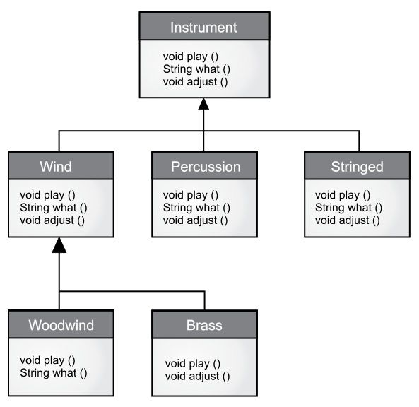

[TOC]

<!-- Polymorphism -->
# 第九章 多态

> 曾经有人请教我 ” Babbage 先生，如果输入错误的数字到机器中，会得出正确结果吗？“ 我无法理解产生如此问题的概念上的困惑。 —— Charles Babbage (1791 - 1871)

多态是面向对象编程语言中，继数据抽象和继承之外的第三个重要特性。

多态提供了另一个维度的接口与实现分离，以解耦做什么和怎么做。多态不仅能改善代码的组织，提高代码的可读性，而且能创建有扩展性的程序——无论在最初创建项目时还是在添加新特性时都可以“生长”的程序。

封装通过合并特征和行为来创建新的数据类型。隐藏实现通过将细节**私有化**把接口与实现分离。这种类型的组织机制对于有面向过程编程背景的人来说，更容易理解。而多态是消除类型之间的耦合。在上一章中，继承允许把一个对象视为它本身的类型或它的基类类型。这样就能把很多派生自一个基类的类型当作同一类型处理，因而一段代码就可以无差别地运行在所有不同的类型上了。多态方法调用允许一种类型表现出与相似类型的区别，只要这些类型派生自一个基类。这种区别是当你通过基类调用时，由方法的不同行为表现出来的。

在本章中，通过一些基本、简单的例子（这些例子中只保留程序中与多态有关的行为），你将逐步学习多态（也称为*动态绑定*或*后期绑定*或*运行时绑定*）。

<!-- Upcasting Revisited -->

## 向上转型回顾

在上一章中，你看到了如何把一个对象视作它的自身类型或它的基类类型。这种把一个对象引用当作它的基类引用的做法称为向上转型，因为继承图中基类一般都位于最上方。

同样你也在下面的音乐乐器例子中发现了问题。即然几个例子都要演奏乐符（**Note**），首先我们先在包中单独创建一个 Note 枚举类：

```java
// polymorphism/music/Note.java
// Notes to play on musical instruments
package polymorphism.music;

public enum Note {
    MIDDLE_C, C_SHARP, B_FLAT; // Etc.
}
```

枚举已经在”第 6 章初始化和清理“一章中介绍过了。

这里，**Wind** 是一种 **Instrument**；因此，**Wind** 继承 **Instrument**：

```java
// polymorphism/music/Instrument.java
package polymorphism.music;

class Instrument {
    public void play(Note n) {
        System.out.println("Instrument.play()");
    }
}

// polymorphism/music/Wind.java
package polymorphism.music;
// Wind objects are instruments
// because they have the same interface:
public class Wind extends Instrument {
    // Redefine interface method:
    @Override
    public void play(Note n) {
        System.out.println("Wind.play() " + n);
    }
}
```

**Music** 的方法 `tune()` 接受一个 **Instrument** 引用，同时也接受任何派生自 **Instrument** 的类引用：

```java
// polymorphism/music/Music.java
// Inheritance & upcasting
// {java polymorphism.music.Music}
package polymorphism.music;

public class Music {
    public static void tune(Instrument i) {
        // ...
        i.play(Note.MIDDLE_C);
    }
    
    public static void main(String[] args) {
        Wind flute = new Wind();
        tune(flute); // Upcasting
    }
}
```

输出：

```
Wind.play() MIDDLE_C
```

在 `main()` 中你看到了 `tune()` 方法传入了一个 **Wind** 引用，而没有做类型转换。这样做是允许的—— **Instrument** 的接口一定存在于 **Wind** 中，因此 **Wind** 继承了 **Instrument**。从 **Wind** 向上转型为 **Instrument** 可能“缩小”接口，但不会比 **Instrument** 的全部接口更少。

###  忘掉对象类型

**Music.java** 看起来似乎有点奇怪。为什么所有人都故意忘记掉对象类型呢？当向上转型时，就会发生这种情况，而且看起来如果 `tune()` 接受的参数是一个 **Wind** 引用会更为直观。这会带来一个重要问题：如果你那么做，就要为系统内 **Instrument** 的每种类型都编写一个新的 `tune()` 方法。假设按照这种推理，再增加 **Stringed** 和 **Brass** 这两种 **Instrument** :

```java
// polymorphism/music/Music2.java
// Overloading instead of upcasting
// {java polymorphism.music.Music2}
package polymorphism.music;

class Stringed extends Instrument {
    @Override
    public void play(Note n) {
        System.out.println("Stringed.play() " + n);
    }
}

class Brass extends Instrument {
    @Override
    public void play(Note n) {
        System.out.println("Brass.play() " + n);
    }
}

public class Music2 {
    public static void tune(Wind i) {
        i.play(Note.MIDDLE_C);
    }
    
    public static void tune(Stringed i) {
        i.play(Note.MIDDLE_C);
    }
    
    public static void tune(Brass i) {
        i.play(Note.MIDDLE_C);
    }
    
    public static void main(String[] args) {
        Wind flute = new Wind();
        Stringed violin = new Stringed();
        Brass frenchHorn = new Brass();
        tune(flute); // No upcasting
        tune(violin);
        tune(frenchHorn);
    }
}
```

输出：

```
Wind.play() MIDDLE_C
Stringed.play() MIDDLE_C
Brass.play() MIDDLE_C
```

这样行得通，但是有一个主要缺点：必须为添加的每个新 **Instrument** 类编写特定的方法。这意味着开始时就需要更多的编程，而且以后如果添加类似 `tune()` 的新方法或 **Instrument** 的新类型时，还有大量的工作要做。考虑到如果你忘记重载某个方法，编译器也不会提示你，这会造成类型的整个处理过程变得难以管理。

如果只写一个方法以基类作为参数，而不用管是哪个具体派生类，这样会变得更好吗？也就是说，如果忘掉派生类，编写的代码只与基类打交道，会不会更好呢？

这正是多态所允许的。但是大部分拥有面向过程编程背景的程序员会对多态的运作方式感到一些困惑。

<!-- The Twist -->

## 转机

运行程序后会看到 **Music.java** 的难点。**Wind.play()** 的输出结果正是我们期望的，但它看起来似乎不能产生我们所期望的结果。观察 `tune()` 方法：

```java
public static void tune(Instrument i) {
    // ...
    i.play(Note.MIDDLE_C);
}
```

它接受一个 **Instrument** 引用。那么编译器是如何知道这里的 **Instrument** 引用指向的是 **Wind**，而不是 **Brass** 或 **Stringed** 呢？编译器无法得知。为了深入理解这个问题，有必要研究一下*绑定*这个主题。

### 方法调用绑定

将一个方法调用和一个方法主体关联起来称作*绑定*。若绑定发生在程序运行前（如果有的话，由编译器和链接器实现），叫做*前期绑定*。你可能从来没有听说这个术语，因为它是面向过程语言不需选择默认的绑定方式，例如在 C 语言中就只有*前期绑定*这一种方法调用。

上述程序让人困惑的地方就在于前期绑定，因为编译器只知道一个 **Instrument** 引用，它无法得知究竟会调用哪个方法。

解决方法就是*后期绑定*，意味着在运行时根据对象的类型进行绑定。后期绑定也称为*动态绑定*或*运行时绑定*。当一种语言实现了后期绑定，就必须具有某种机制在运行时能判断对象的类型，从而调用恰当的方法。也就是说，编译器仍然不知道对象的类型，但是方法调用机制能找到正确的方法体并调用。每种语言的后期绑定机制都不同，但是可以想到，对象中一定存在某种类型信息。

Java 中除了 **static** 和 **final** 方法（**private** 方法也是隐式的 **final**）外，其他所有方法都是后期绑定。这意味着通常情况下，我们不需要判断后期绑定是否会发生——它自动发生。

为什么将一个对象指明为 **final** ？正如前一章所述，它可以防止方法被覆写。但更重要的一点可能是，它有效地”关闭了“动态绑定，或者说告诉编译器不需要对其进行动态绑定。这可以让编译器为 **final** 方法生成更高效的代码。然而，大部分情况下这样做不会对程序的整体性能带来什么改变，因此最好是为了设计使用 **final**，而不是为了提升性能而使用。

### 产生正确的行为

一旦当你知道 Java 中所有方法都是通过后期绑定来实现多态时，就可以编写只与基类打交道的代码，而且代码对于派生类来说都能正常地工作。或者换种说法，你向对象发送一条消息，让对象自己做正确的事。

面向对象编程中的经典例子是形状 **Shape**。这个例子很直观，但不幸的是，它可能让初学者困惑，认为面向对象编程只适合图形化程序设计，实际上不是这样。

形状的例子中，有一个基类称为 **Shape** ，多个不同的派生类型分别是：**Circle**，**Square**，**Triangle** 等等。这个例子之所以好用，是因为我们可以直接说“圆(Circle)是一种形状(Shape)”，这很容易理解。继承图展示了它们之间的关系：


向上转型就像下面这么简单：

```java
Shape s = new Circle();
```

这会创建一个 **Circle** 对象，引用被赋值给 **Shape** 类型的变量 s，这看似错误（将一种类型赋值给另一种类型），然而是没问题的，因此从继承上可认为圆(Circle)就是一个形状(Shape)。因此编译器认可了赋值语句，没有报错。

假设你调用了一个基类方法（在派生类中都被覆写）：

```java
s.draw()
```

你可能再次认为 **Shape** 的 `draw()` 方法被调用，因为 s 是一个 **Shape** 引用——编译器怎么可能知道要做其他的事呢？然而，由于后期绑定（多态）被调用的是 **Circle** 的 `draw()` 方法，这是正确的。

下面的例子稍微有些不同。首先让我们创建一个可复用的 **Shape** 类库，基类 **Shape** 中建立了所有继承自 **Shape** 的类的共同接口——所有的形状都可以被绘画和擦除：

```java
// polymorphism/shape/Shape.java
package polymorphism.shape;

public class Shape {
    public void draw() {}
    public void erase() {}
}
```

派生类通过覆写这些方法为每个具体的形状提供独一无二的方法行为：

```java
// polymorphism/shape/Circle.java
package polymorphism.shape;

public class Circle extends Shape {
    @Override
    public void draw() {
        System.out.println("Circle.draw()");
    }
    @Override
    public void erase() {
        System.out.println("Circle.erase()");
    }
}

// polymorphism/shape/Square.java
package polymorphism.shape;

public class Square extends Shape {
    @Override
    public void draw() {
        System.out.println("Square.draw()");
    }
    @Override
    public void erase() {
        System.out.println("Square.erase()");
    }
 }

// polymorphism/shape/Triangle.java
package polymorphism.shape;

public class Triangle extends Shape {
    @Override
    public void draw() {
        System.out.println("Triangle.draw()");
    }
    @Override
    public void erase() {
        System.out.println("Triangle.erase()");
    }
}
```

**RandomShapes** 是一种工厂，每当我们调用 `get()` 方法时，就会产生一个指向随机创建的 **Shape** 对象的引用。注意，向上转型发生在 **return** 语句中，每条 **return** 语句取得一个指向某个 **Circle**，**Square** 或 **Triangle** 的引用， 并将其以 **Shape** 类型从 `get()` 方法发送出去。因此无论何时调用 `get()` 方法，你都无法知道具体的类型是什么，因为你总是得到一个简单的 **Shape** 引用：

```java
// polymorphism/shape/RandomShapes.java
// A "factory" that randomly creates shapes
package polymorphism.shape;
import java.util.*;

public class RandomShapes {
    private Random rand = new Random(47);
    
    public Shape get() {
        switch(rand.nextInt(3)) {
            default:
            case 0: return new Circle();
            case 1: return new Square();
            case 2: return new Triangle();
        }
    }
    
    public Shape[] array(int sz) {
        Shape[] shapes = new Shape[sz];
        // Fill up the array with shapes:
        for (int i = 0; i < shapes.length; i++) {
            shapes[i] = get();
        }
        return shapes;
    }
}
```

`array()` 方法分配并填充了 **Shape** 数组，这里使用了 for-in 表达式：

```java
// polymorphism/Shapes.java
// Polymorphism in Java
import polymorphism.shape.*;

public class Shapes {
    public static void main(String[] args) {
        RandomShapes gen = new RandomShapes();
        // Make polymorphic method calls:
        for (Shape shape: gen.array(9)) {
            shape.draw();
        }
    }
}
```

输出：

```
Triangle.draw()
Triangle.draw()
Square.draw()
Triangle.draw()
Square.draw()
Triangle.draw()
Square.draw()
Triangle.draw()
Circle.draw()
```

`main()` 方法中包含了一个 **Shape** 引用组成的数组，其中每个元素通过调用 **RandomShapes** 类的 `get()` 方法生成。现在你只知道拥有一些形状，但除此之外一无所知（编译器也是如此）。然而当遍历这个数组为每个元素调用 `draw()` 方法时，从运行程序的结果中可以看到，与类型有关的特定行为奇迹般地发生了。

随机生成形状是为了让大家理解：在编译时，编译器不需要知道任何具体信息以进行正确的调用。所有对方法 `draw()` 的调用都是通过动态绑定进行的。

### 可扩展性

现在让我们回头看音乐乐器的例子。由于多态机制，你可以向系统中添加任意多的新类型，而不需要修改 `tune()` 方法。在一个设计良好的面向对象程序中，许多方法将会遵循 `tune()` 的模型，只与基类接口通信。这样的程序时可扩展的，因为可以从通用的基类派生出新的数据类型，从而添加新的功能。那些操纵基类接口的方法不需要改动就可以应用于新类。

考虑一下乐器的例子，如果在基类中添加更多的方法，并加入一些新类，将会发生什么呢：



所有的新类都可以和原有类正常运行，不需要改动 `tune()` 方法。即使 `tune()` 方法单独存放在某个文件中，而且向 **Instrument** 接口中添加了新的方法，`tune()` 方法也无需再编译就能正确运行。下面是类图的实现：

```java
// polymorphism/music3/Music3.java
// An extensible program
// {java polymorphism.music3.Music3}
package polymorphism.music3;
import polymorphism.music.Note;

class Instrument {
    void play(Note n) {
        System.out.println("Instrument.play() " + n);
    }
    
    String what() {
        return "Instrument";
    }
    
    void adjust() {
        System.out.println("Adjusting Instrument");
    }
}

class Wind extends Instrument {
    @Override
    void play(Note n) {
        System.out.println("Wind.play() " + n);
    }
    @Override
    String what() {
        return "Wind";
    }
    @Override
    void adjust() {
        System.out.println("Adjusting Wind");
    }
}

class Percussion extends Instrument {
    @Override
    void play(Note n) {
        System.out.println("Percussion.play() " + n);
    }
    @Override
    String what() {
        return "Percussion";
    }
    @Override
    void adjust() {
        System.out.println("Adjusting Percussion");
    }
}

class Stringed extends Instrument {
    @Override
    void play(Note n) {
        System.out.println("Stringed.play() " + n);
    } 
    @Override
    String what() {
        return "Stringed";
    }
    @Override
    void adjust() {
        System.out.println("Adjusting Stringed");
    }
}

class Brass extends Wind {
    @Override
    void play(Note n) {
        System.out.println("Brass.play() " + n);
    }
    @Override
    void adjust() {
        System.out.println("Adjusting Brass");
    }
}

class Woodwind extends Wind {
    @Override
    void play(Note n) {
        System.out.println("Woodwind.play() " + n);
    }
    @Override
    String what() {
        return "Woodwind";
    }
}

public class Music3 {
    // Doesn't care about type, so new types
    // added to the system still work right:
    public static void tune(Instrument i) {
        // ...
        i.play(Note.MIDDLE_C);
    }
    
    public static void tuneAll(Instrument[] e) {
        for (Instrument i: e) {
            tune(i);
        }
    }
    
    public static void main(String[] args) {
        // Upcasting during addition to the array:
        Instrument[] orchestra = {
            new Wind(),
            new Percussion(),
            new Stringed(),
            new Brass(),
            new Woodwind()
        };
        tuneAll(orchestra);
    }
}
```

输出：

```
Wind.play() MIDDLE_C
Percussion.play() MIDDLE_C
Stringed.play() MIDDLE_C
Brass.play() MIDDLE_C
Woodwind.play() MIDDLE_C
```

新方法 `what()` 返回一个带有类描述的 **String** 引用，`adjust()` 提供一些乐器调音的方法。

在 `main()` 方法中，当向 **orchestra** 数组添加元素时，元素会自动向上转型为 **Instrument**。

`tune()` 方法可以忽略周围所有代码发生的变化，仍然可以正常运行。这正是我们期待多态能提供的特性。代码中的修改不会破坏程序中其他不应受到影响的部分。换句话说，多态是一项“将改变的事物与不变的事物分离”的重要技术。

### 陷阱：”覆写“私有方法


<!-- Constructors and Polymorphism -->

## 构造器和多态

<!-- Covariant Return Types -->

## 返回类型协变


<!-- Designing with Inheritance -->
## 使用继承设计


<!-- Summary -->
## 本章小结

<!-- 分页 -->

<div style="page-break-after: always;"></div>