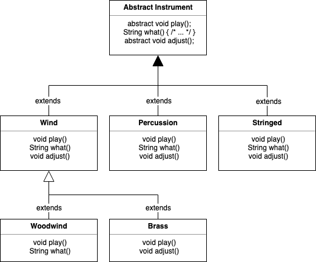
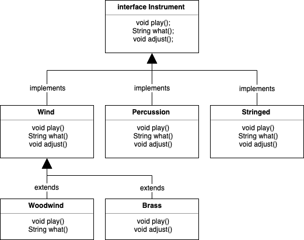
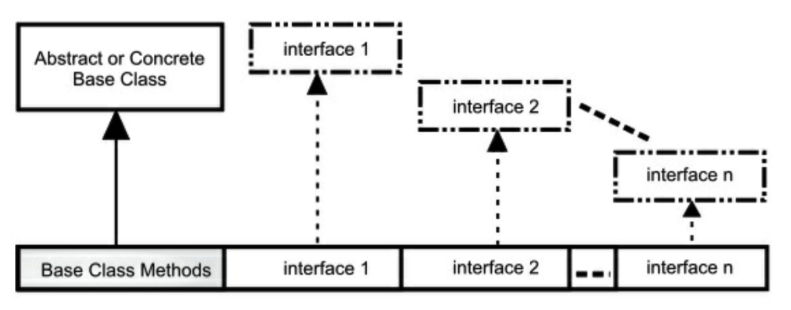

[TOC]

<!-- Interfaces -->
# 第十章 接口

接口和抽象类提供了一种将接口与实现分离的更加结构化的方法。

这种机制在编程语言中不常见，例如 C++ 只对这种概念有间接的支持。而在 Java 中存在这些关键字，说明这些思想很重要，Java 为它们提供了直接支持。

首先，我们将学习抽象类，一种介于普通类和接口之间的折中手段。尽管你的第一想法是创建接口，但是对于构建具有属性和未实现方法的类来说，抽象类也是重要且必要的工具。你不可能总是使用纯粹的接口。


<!-- Abstract Classes and Methods -->
## 抽象类和方法

在上一章的乐器例子中，基类 **Instrument** 中的方法往往是“哑”方法。如果调用了这些方法，就会出现一些错误。这是因为接口的目的是为它的派生类创建一个通用接口。

在那些例子中，创建这个通用接口的唯一理由是，不同的子类可以用不同的方式表示此接口。通用接口建立了一个基本形式，以此表达所有派生类的共同部分。另一种说法把 **Instrument** 称为抽象基类，或简称抽象类。

对于像 **Instrument** 那样的抽象类来说，它的对象几乎总是没有意义的。创建一个抽象类是为了通过通用接口操纵一系列类。因此，**Instrument** 只是表示接口，不是具体实现，所以创建一个 **Instrument** 的对象毫无意义，我们可能希望阻止用户这么做。通过让 **Instrument** 所有的方法产生错误，就可以达到这个目的，但是这么做会延迟到运行时才能得知错误信息，并且需要用户进行可靠、详尽的测试。最好能在编译时捕捉问题。

Java 提供了一个叫做*抽象方法*的机制，这个方法是不完整的：它只有声明没有方法体。下面是抽象方法的声明语法：

```java
abstract void f();
```

包含抽象方法的类叫做*抽象类*。如果一个类包含一个或多个抽象方法，那么类本身也必须限定为抽象的，否则，编译器会报错。

```java
// interface/Basic.java
abstract class Basic {
    abstract void unimplemented();
}
```

如果一个抽象类是不完整的，当试图创建这个类的对象时，Java 会怎么做呢？它不会创建抽象类的对象，所以我们只会得到编译器的错误信息。这样保证了抽象类的纯粹性，我们不用担心误用它。

```java
// interfaces/AttemptToUseBasic.java
// {WillNotCompile}
public class AttemptToUseBasic {
    Basic b = new Basic();
    // error: Basic is abstract; cannot be instantiated
}
```

如果创建一个继承抽象类的新类并为之创建对象，那么就必须为基类的所有抽象方法提供方法定义。如果不这么做（可以选择不做），新类仍然是一个抽象类，编译器会强制我们为新类加上 **abstract** 关键字。

```java
// interfaces/Basic2.java
abstract class Basic2 extends Basic {
    int f() {
        return 111;
    }
    
    abstract void g() {
        // unimplemented() still not implemented
    }
}
```

可以将一个不包含任何抽象方法的类指明为 **abstract**，在类中的抽象方法没啥意义但想阻止创建类的对象时，这么做就很有用。

```java
// interfaces/AbstractWithoutAbstracts.java
abstract class Basic3 {
    int f() {
        return 111;
    }
    
    // No abstract methods
}

public class AbstractWithoutAbstracts {
    // Basic b3 = new Basic3();
    // error: Basic 3 is abstract; cannot be instantiated
}
```

为了创建可初始化的类，就要继承抽象类，并提供所有抽象方法的定义：

```java
// interfaces/Instantiable.java
abstract class Uninstantiable {
    abstract void f();
    abstract int g();
}

public class Instantiable extends Uninstantiable {
    @Override
    void f() {
        System.out.println("f()");
    }
    
    @Override
    int g() {
        return 22;
    }
    
    public static void main(String[] args) {
        Uninstantiable ui = new Instantiable();
    }
}
```

留意 `@Override` 的使用。没有这个注解的话，如果你没有定义相同的方法名或签名，抽象机制会认为你没有实现抽象方法从而产生编译时错误。因此，你可能认为这里的 `@Override` 是多余的。但是，`@Override` 还提示了这个方法被覆写——我认为这是有用的，所以我会使用 `@Override`，即使在没有这个注解，编译器告诉我错误的时候。 

记住，事实上的访问权限是“friendly”。你很快会看到接口自动将其方法指明为 **public**。事实上，接口只允许 **public** 方法，如果不加访问修饰符的话，接口的方法不是 **friendly** 而是 **public**。然而，抽象类允许每件事：

```java
// interfaces/AbstractAccess.java
abstract class AbstractAccess {
    private void m1() {}
    
    // private abstract void m1a(); // illegal
    
    protected void m2() {}
    
    protected abstract void m2a();
    
    void m3() {}
    
    abstract void m3a();
    
    public void m4() {}
    
    public abstract void m4a();
}
```

**private abstract** 被禁止了是有意义的，因为你不可能在 **AbstractAccess** 的任何子类中合法地定义它。

上一章的 **Instrument** 类可以很轻易地转换为一个抽象类。只需要部分方法是 **abstract** 即可。将一个类指明为 **abstract** 并不强制类中的所有方法必须都是抽象方法。如下图所示：



下面是修改成使用抽象类和抽象方法的管弦乐器的例子：

```java
// interfaces/music4/Music4.java
// Abstract classes and methods
// {java interfaces.music4.Music4}
package interfaces.music4;
import polymorphism.music.Note;

abstract class Instrument {
    private int i; // Storage allocated for each
    
    public abstract void play(Note n);
    
    public String what() {
        return "Instrument";
    }
    
    public abstract void adjust();
}

class Wind extends Instrument {
    @Override
    public void play(Note n) {
        System.out.println("Wind.play() " + n);
    }
    
    @Override
    public String what() {
        return "Wind";
    }
    
    @Override
    public void adjust() {
        System.out.println("Adjusting Wind");
    }
}

class Percussion extends Instrument {
    @Override
    public void play(Note n) {
        System.out.println("Percussion.play() " + n);
    }
    
    @Override
    public String what() {
        return "Percussion";
    }
    
    @Override
    public void adjust() {
        System.out.println("Adjusting Percussion");
    }
}

class Stringed extends Instrument {
    @Override
    public void play(Note n) {
        System.out.println("Stringed.play() " + n);
    }
    
    @Override
    public String what() {
        return "Stringed";
    }
    
    @Override
    public void adjust() {
        System.out.println("Adjusting Stringed");
    }
}

class Brass extends Wind {
    @Override
    public void play(Note n) {
        System.out.println("Brass.play() " + n);
    }
    
    @Override
    public void adjust() {
        System.out.println("Adjusting Brass");
    }
}

class Woodwind extends Wind {
    @Override
    public void play(Note n) {
        System.out.println("Woodwind.play() " + n);
    }
    
    @Override
    public String what() {
        return "Woodwind";
    }
}

public class Music4 {
    // Doesn't care about type, so new types
    // added to system still work right:
    static void tune(Instrument i) {
        // ...
        i.play(Note.MIDDLE_C);
    }
    
    static void tuneAll(Instrument[] e) {
        for (Instrument i: e) {
            tune(i);
        }
    }
    
    public static void main(String[] args) {
        // Upcasting during addition to the array:
        Instrument[] orchestra = {
            new Wind(),
            new Percussion(),
            new Stringed(),
            new Brass(),
            new Woodwind()
        };
        tuneAll(orchestra);
    }
}
```

输出：

```
Wind.play() MIDDLE_C
Percussion.play() MIDDLE_C
Stringed.play() MIDDLE_C
Brass.play() MIDDLE_C
Woodwind.play() MIDDLE_C
```

除了 **Instrument**，基本没区别。

创建抽象类和抽象方法是有帮助的，因为它们使得类的抽象性很明确，并能告知用户和编译器使用意图。抽象类同时也是一种有用的重构工具，使用它们使得我们很容易地将沿着继承层级结构上移公共方法。

<!-- Interfaces -->

## 接口创建

使用 **interface** 关键字创建接口。在本书中，interface 和 class 一样随处常见，除非特指关键字 **interface**，其他情况下都采用正常字体书写 interface。

描述 Java 8 之前的接口更加容易，因为它们只允许抽象方法。像下面这样：

```java
// interfaces/PureInterface.java
// Interface only looked like this before Java 8
public interface PureInterface {
    int m1(); 
    void m2();
    double m3();
}
```

我们甚至不用为方法加上 **abstract** 关键字，因为方法在接口中。Java 知道这些方法不能有方法体（仍然可以为方法加上 **abstract** 关键字，但是看起来像是不明白接口，徒增难堪罢了）。

因此，在 Java 8之前我们可以这么说：**interface** 关键字产生一个完全抽象的类，没有提供任何实现。我们只能描述类应该像什么，做什么，但不能描述怎么做，即只能决定方法名、参数列表和返回类型，但是无法确定方法体。接口只提供形式，通常来说没有实现，尽管在某些受限制的情况下可以有实现。

一个接口表示：所有实现了该接口的类看起来都像这样。因此，任何使用某特定接口的代码都知道可以调用该接口的哪些方法，而且仅需知道这些。所以，接口被用来建立类之间的协议。（一些面向对象编程语言中，使用 protocol 关键字完成相同的功能。）

Java 8 中接口稍微有些变化，因为 Java 8 允许接口包含默认方法和静态方法——基于某些重要原因，看到后面你会理解。接口的基本概念仍然没变，介于类型之上、实现之下。接口与抽象类最明显的区别可能就是使用上的惯用方式。接口的典型使用是代表一个类的类型或一个形容词，如 Runnable 或 Serializable，而抽象类通常是类层次结构的一部分或一件事物的类型，如 String 或 ActionHero。

使用关键字 **interface** 而不是 **class** 来创建接口。和类一样，需要在关键字 **interface** 前加上 **public** 关键字（但只是在接口名与文件名相同的情况下），否则接口只有包访问权限，只能在接口相同的包下才能使用它。

接口同样可以包含属性，这些属性被隐式指明为 **static** 和 **final**。

使用 **implements** 关键字使一个类遵循某个特定接口（或一组接口），它表示：接口只是外形，现在我要说明它是如何工作的。除此之外，它看起来像继承。

```java
// interfaces/ImplementingAnInterface.java
interface Concept { // Package access
    void idea1();
    void idea2();
}

class Implementation implements Concept {
    @Override
    public void idea1() {
        System.out.println("idea1");
    }
    
    @Override
    public void idea2() {
        System.out.println("idea2");
    }
}
```

你可以选择显式地声明接口中的方法为 **public**，但是即使你不这么做，它们也是 **public** 的。所以当实现一个接口时，来自接口中的方法必须被定义为 **public**。否则，它们只有包访问权限，这样在继承时，它们的可访问权限就被降低了，这是 Java 编译器所不允许的。

### 默认方法

Java 8 为关键字 **default** 增加了一个新的用途（之前只用于 **switch** 语句和注解中）。当在接口中使用它时，任何实现接口却没有定义方法的时候可以使用 **default** 创建的方法体。默认方法比抽象类中的方法受到更多的限制，但是非常有用，我们将在“流式编程”一章中看到。现在让我们看下如何使用：

```java
// interfaces/AnInterface.java
interface AnInterface {
    void firstMethod();
    void secondMethod();
}
```

我们可以像这样实现接口：

```java
// interfaces/AnImplementation.java
public class AnImplementation implements AnInterface {
    public void firstMethod() {
        System.out.println("firstMethod");
    }
    
    public void secondMethod() {
        System.out.println("secondMethod");
    }
    
    public static void main(String[] args) {
        AnInterface i = new AnImplementation();
        i.firstMethod();
        i.secondMethod();
    }
}
```

输出：

```
firstMethod
secondMethod
```

如果我们在 **AnInterface** 中增加一个新方法 `newMethod()`，而在 **AnImplementation** 中没有实现它，编译器就会报错：

```
AnImplementation.java:3:error: AnImplementation is not abstract and does not override abstract method newMethod() in AnInterface
public class AnImplementation implements AnInterface {
^
1 error
```

如果我们使用关键字 **default** 为 `newMethod()` 方法提供默认的实现，那么所有与接口有关的代码能正常工作，不受影响，而且这些代码还可以调用新的方法 `newMethod()`：

```java
// interfaces/InterfaceWithDefault.java
interface InterfaceWithDefault {
    void firstMethod();
    void secondMethod();
    
    default void newMethod() {
        System.out.println("newMethod");
    }
}
```

关键字 **default** 允许在接口中提供方法实现——在 Java 8 之前被禁止。

```java
// interfaces/Implementation2.java
public class Implementation2 implements InterfaceWithDefault {
    @Override
    public void firstMethod() {
        System.out.println("firstMethod");
    }
    
    @Override
    public void secondMethod() {
        System.out.println("secondMethod")
    }
    
    public static void main(String[] args) {
        InterfaceWithDefault i = new Implementation2();
        i.firstMethod();
        i.secondMethod();
        i.newMethod();
    }
}
```

输出：

```
firstMethod
secondMethod
newMethod
```

尽管 **Implementation2** 中未定义 `newMethod()`，但是可以使用 `newMethod()` 了。 

增加默认方法的极具说服力的理由是它允许在不破坏已使用接口的代码的情况下，在接口中增加新的方法。默认方法有时也被称为*守卫方法*或*虚拟扩展方法*。

### 多继承

多继承意味着一个类可能从多个父类型中继承特征和特性。

Java 在设计之初，C++ 的多继承机制饱受诟病。Java 过去是一种严格要求单继承的语言：只能继承自一个类（或抽象类），但可以实现任意多个接口。在 Java 8 之前，接口没有包袱——它只是方法外貌的描述。

多年后的现在，Java 通过默认方法具有了某种多继承的特性。结合带有默认方法的接口意味着结合了多个基类中的行为。因为接口中仍然不允许存在属性（只有静态属性，不适用），所以属性仍然只会来自单个基类或抽象类，也就是说，不会存在状态的多继承。正如下面这样：

```java
// interfaces/MultipleInheritance.java
import java.util.*;

interface One {
    default void first() {
        System.out.println("first");
    }
}

interface Two {
    default void second() {
        System.out.println("second");
    }
}

interface Three {
    default void third() {
        System.out.println("third");
    }
}

class MI implements One, Two, Three {}

public class MultipleInheritance {
    public static void main(String[] args) {
        MI mi = new MI();
        mi.first();
        mi.second();
        mi.third();
    }
}
```

输出：

```
first
second
third
```

现在我们做些在 Java 8 之前不可能完成的事：结合多个源的实现。只要基类方法中的方法名和参数列表不同，就能工作得很好，否则会得到编译器错误：

```java
// interface/MICollision.java
import java.util.*;

interface Bob1 {
    default void bob() {
        System.out.println("Bob1::bob");
    }
}

interface Bob2 {
    default void bob() {
        System.out.println("Bob2::bob");
    }
}

// class Bob implements Bob1, Bob2 {}
/* Produces:
error: class Bob inherits unrelated defaults
for bob() from types Bob1 and Bob2
class Bob implements Bob1, Bob2 {}
^
1 error
*/

interface Sam1 {
    default void sam() {
        System.out.println("Sam1::sam");
    }
}

interface Sam2 {
    default void sam(int i) {
        System.out.println(i * 2);
    }
}

// This works because the argument lists are distinct:
class Sam implements Sam1, Sam2 {}

interface Max1 {
    default void max() {
        System.out.println("Max1::max");
    }
}

interface Max2 {
    default int max() {
        return 47;
    }
}

// class Max implements Max1, Max2 {}
/* Produces:
error: types Max2 and Max1 are imcompatible;
both define max(), but with unrelated return types
class Max implements Max1, Max2 {}
^
1 error
*/
```

**Sam** 类中的两个 `sam()` 方法有相同的方法名但是签名不同——方法签名包括方法名和参数类型，编译器也是用它来区分方法。但是从 **Max** 类可看出，返回类型不是方法签名的一部分，因此不能用来区分方法。为了解决这个问题，需要覆写冲突的方法：

```java
// interfaces/Jim.java
import java.util.*;

interface Jim1 {
    default void jim() {
        System.out.println("Jim1::jim");
    }
}

interface Jim2 {
    default void jim() {
        System.out.println("Jim2::jim");
    }
}

public class Jim implements Jim1, Jim2 {
    @Override
    public void jim() {
        Jim2.super.jim();
    }
    
    public static void main(String[] args) {
        new Jim().jim();
    }
}
```

输出：

```
Jim2::jim
```

当然，你可以重定义 `jim()` 方法，但是也能像上例中那样使用 **super** 关键字选择基类实现中的一种。

### 接口中的静态方法

Java 8 允许在接口中添加静态方法。这么做能恰当地把工具功能置于接口中，从而操作接口，或者成为通用的工具：

```java
// onjava/Operations.java
package onjava;
import java.util.*;

public interface Operations {
    void execute();
    
    static void runOps(Operations... ops) {
        for (Operations op: ops) {
            op.execute();
        }
    }
    
    static void show(String msg) {
        System.out.println(msg);
    }
}
```

这是模版方法设计模式的一个版本（在“设计模式”一章中详细描述），`runOps()` 是一个模版方法。`runOps()` 使用可变参数列表，因而我们可以传入任意多的 **Operation** 参数并按顺序运行它们：

```java
// interface/Machine.java
import java.util.*;
import onjava.Operations;

class Bing implements Operations {
    @Override
    public void execute() {
        Operations.show("Bing");
    }
}

class Crack implements Operations {
    @Override
    public void execute() {
        Operations.show("Crack");
    }
}

class Twist implements Operations {
    @Override
    public void execute() {
        Operations.show("Twist");
    }
}

public class Machine {
    public static void main(String[] args) {
        Operations.runOps(
        	new Bing(), new Crack(), new Twist());
    }
}
```

输出：

```
Bing
Crack
Twist
```

这里展示了创建 **Operations** 的不同方式：一个外部类(Bing)，一个匿名类，一个方法引用和 lambda 表达式——毫无疑问用在这里是最好的解决方法。

这个特性是一项改善，因为它允许把静态方法放在更合适的地方。

### Instrument 作为接口

回顾下乐器的例子，使用接口的话：



类 **Woodwind** 和 **Brass** 说明一旦实现了某个接口，那么其实现就变成一个普通类，可以按常规方式扩展它。

接口的工作方式使得我们不需要显式声明其中的方法为 **public**，它们自动就是 **public** 的。`play()` 和 `adjust()` 使用 **default** 关键字定义实现。在 Java 8 之前，这些定义要在每个实现中重复实现，显得多余且令人烦恼：

```java
// interfaces/music5/Music5.java
// {java interfaces.music5.Music5}
package interfaces.music5;
import polymorphism.music.Note;

interface Instrument {
    // Compile-time constant:
    int VALUE = 5; // static & final
    
    default void play(Note n)  // Automatically public 
        System.out.println(this + ".play() " + n);
    }
    
    default void adjust() {
        System.out.println("Adjusting " + this);
    }
}

class Wind implements Instrument {
    @Override
    public String toString() {
        return "Wind";
    }
}

class Percussion implements Instrument {
    @Override
    public String toString() {
        return "Percussion";
    }
}

class Stringed implements Instrument {
    @Override
    public String toString() {
        return "Stringed";
    }
}

class Brass extends Wind {
    @Override
    public String toString() {
        return "Brass";
    }
}

class Woodwind extends Wind {
    @Override
    public String toString() {
        return "Woodwind";
    }
}

public class Music5 {
    // Doesn't care about type, so new types
    // added to the system still work right:
    static void tune(Instrument i) {
        // ...
        i.play(Note.MIDDLE_C);
    }
    
    static void tuneAll(Instrument[] e) {
        for (Instrument i: e) {
            tune(i);
        }
    }
    
    public static void main(String[] args) {
        // Upcasting during addition to the array:
        Instrument[] orchestra = {
            new Wind(),
            new Percussion(),
            new Stringed(),
            new Brass(),
            new Woodwind()
        }
        tuneAll(orchestra);
    }
}
```

输出：

```
Wind.play() MIDDLE_C
Percussion.play() MIDDLE_C
Stringed.play() MIDDLE_C
Brass.play() MIDDLE_C
Woodwind.play() MIDDLE_C
```

这个版本的例子的另一个变化是：`what()` 被修改为 `toString()` 方法，因为 `toString()` 实现的正是 `what()` 方法要实现的逻辑。因为 `toString()` 是根基类 **Object** 的方法，所以它不需要出现在接口中。

注意到，无论是将其向上转型为称作 **Instrument** 的普通类，或称作 **Instrument** 的抽象类，还是叫作 **Instrument** 的接口，其行为都是相同的。事实上，从 `tune()` 方法上看不出来 **Instrument** 到底是一个普通类、抽象类，还是一个接口。

<!-- Abstract Classes vs. Interfaces -->

## 抽象类和接口

尤其是在 Java 8 引入 **default** 方法之后，选择用抽象类还是用接口变得更加令人困惑。下表做了明确的区分：

|         特性         |                            接口                            |                  抽象类                  |
| :------------------: | :--------------------------------------------------------: | :--------------------------------------: |
|         组合         |                    新类可以组合多个接口                    |            只能继承单一抽象类            |
|         状态         |        不能包含属性（除了静态属性，不支持对象状态）        | 可以包含属性，非抽象方法可能引用这些属性 |
| 默认方法 和 抽象方法 | 不需要在子类中实现默认方法。默认方法可以引用其他接口的方法 |         必须在子类中实现抽象方法         |
|        构造器        |                         没有构造器                         |               可以有构造器               |
|        可见性        |                      隐式 **public**                       |       可以是 **protected** 或友元        |

抽象类仍然是一个类，在创建新类时只能继承它一个。而创建类的过程中可以实现多个接口。

有一条实际经验：尽可能地抽象。因此，更倾向使用接口而不是抽象类。只有当必要时才使用抽象类。除非必须使用，否则不要用接口和抽象类。大多数时候，普通类已经做得很好，如果不行的话，再移动到接口或抽象类中。

<!-- Complete Decoupling -->

## 完全解耦

当方法操纵的是一个类而非接口时，它就只能作用于那个类或其子类。如果想把方法应用于那个继承层级结构之外的类，就会触霉头。接口在很大程度上放宽了这个限制，因而使用接口可以编写复用性更好的代码。

例如有一个类 **Process** 有两个方法 `name()` 和 `process()`。`process()` 方法接受输入，修改并输出。把这个类作为基类用来创建各种不同类型的 **Processor**。下例中，**Processor** 的各个子类修改 String 对象（注意，返回类型可能是协变类型而非参数类型）：

```java
// interfaces/Applicator.java
import java.util.*;

class Processor {
    public String name() {
        return getClass().getSimpleName();
    }
    
    public Object process(Object input) {
        return input;
    }
}

class Upcase extends Processor {
    // 返回协变类型
    @Override 
    public String process(Object input) {
        return ((String) input).toUpperCase();
    }
}

class Downcase extends Processor {
    @Override
    public String process(Object input) {
        return ((String) input).toLowerCase();
    }
}

class Splitter extends Processor {
    @Override
    public String process(Object input) {
        // split() divides a String into pieces:
        return Arrays.toString(((String) input).split(" "));
    }
}

public class Applicator {
    public static void apply(Processor p, Object s) {
        System.out.println("Using Processor " + p.name());
        System.out.println(p.process(s));
    }
    
    public static void main(String[] args) {
        String s = "We are such stuff as dreams are made on";
        apply(new Upcase(), s);
        apply(new Downcase(), s);
        apply(new Splitter(), s);
    }
}
```

输出：

```
Using Processor Upcase
WE ARE SUCH STUFF AS DREAMS ARE MADE ON
Using Processor Downcase
we are such stuff as dreams are made on
Using Processor Splitter
[We, are, such, stuff, as, dreams, are, made, on]
```

**Applicator** 的 `apply()` 方法可以接受任何类型的 **Processor**，并将其应用到一个 **Object** 对象上输出结果。像本例中这样，创建一个能根据传入的参数类型从而具备不同行为的方法称为*策略*设计模式。方法包含算法中不变的部分，策略包含变化的部分。策略就是传入的对象，它包含要执行的代码。在这里，**Processor** 对象是策略，`main()` 方法展示了三种不同的应用于 **String s** 上的策略。

`split()` 是 **String** 类中的方法，它接受 **String** 类型的对象并以传入的参数作为分割界限，返回一个数组 **String[]**。在这里用它是为了更快地创建 **String** 数组。

假设现在发现了一组电子滤波器，它们看起来好像能使用 **Applicator** 的 `apply()` 方法：

```java
// interfaces/filters/Waveform.java
package interfaces.filters;

public class Waveform {
    private static long counter;
    private final long id = counter++;
    
    @Override
    public String toString() {
        return "Waveform " + id;
    }
}

// interfaces/filters/Filter.java
package interfaces.filters;

public class Filter {
    public String name() {
        return getClass().getSimpleName();
    }
    
    public Waveform process(Waveform input) {
        return input;
    }
}

// interfaces/filters/LowPass.java
package interfaces.filters;

public class LowPass extends Filter {
    double cutoff;
    
    public LowPass(double cutoff) {
        this.cutoff = cutoff;
    }
    
    @Override
    public Waveform process(Waveform input) {
        return input; // Dummy processing 哑处理
    }
}

// interfaces/filters/HighPass.java
package interfaces.filters;

public class HighPass extends Filter {
    double cutoff;
    
    public HighPass(double cutoff) {
        this.cutoff = cutoff;
    }
    
    @Override
    public Waveform process(Waveform input) {
        return input;
    }
}

// interfaces/filters/BandPass.java
package interfaces.filters;

public class BandPass extends Filter {
    double lowCutoff, highCutoff;
    
    public BandPass(double lowCut, double highCut) {
        lowCutoff = lowCut;
        highCutoff = highCut;
    }
    
    @Override
    public Waveform process(Waveform input) {
        return input;
    }
}
```

**Filter** 类与 **Processor** 类具有相同的接口元素，但是因为它不是继承自 **Processor** —— 因为 **Filter** 类的创建者根本不知道你想将它当作 **Processor** 使用 —— 因此你不能将 **Applicator** 的 `apply()` 方法应用在 **Filter** 类上，即使这样做也能正常运行。主要是因为 **Applicator** 的 `apply()` 方法和 **Processor** 过于耦合，这阻止了 **Applicator** 的 `apply()` 方法被复用。另外要注意的一点是 Filter 类中 `process()` 方法的输入输出都是 **Waveform**。

但如果 **Processor** 是一个接口，那么限制就会变得松动到足以复用 **Applicator** 的 `apply()` 方法，用来接受那个接口参数。下面是修改后的 **Processor** 和 **Applicator** 版本：

```java
// interfaces/interfaceprocessor/Processor.java
package interfaces.interfaceprocessor;

public interface Processor {
    default String name() {
        return getClass().getSimpleName();
    }
    
    Object process(Object input);
}

// interfaces/interfaceprocessor/Applicator.java
package interfaces.interfaceprocessor;

public class Applicator {
    public static void apply(Processor p, Object s) {
        System.out.println("Using Processor " + p.name());
        System.out.println(p.process(s));
    }
}
```

复用代码的第一种方式是客户端程序员遵循接口编写类，像这样：

```java
// interfaces/interfaceprocessor/StringProcessor.java
// {java interfaces.interfaceprocessor.StringProcessor}
package interfaces.interfaceprocessor;
import java.util.*;

interface StringProcessor extends Processor {
    @Override
    String process(Object input); // [1]
    String S = "If she weighs the same as a duck, she's made of wood"; // [2]
    
    static void main(String[] args) { // [3]
        Applicator.apply(new Upcase(), S);
        Applicator.apply(new Downcase(), S);
        Applicator.apply(new Splitter(), S);
    }
}

class Upcase implements StringProcessor {
    // 返回协变类型
    @Override
    public String process(Object input) {
        return ((String) input).toUpperCase();
    }
}

class Downcase implements StringProcessor {
    @Override
    public String process(Object input) {
        return ((String) input).toLowerCase();
    }
}

class Splitter implements StringProcessor {
    @Override
    public String process(Object input) {
        return Arrays.toString(((String) input).split(" "));
    }
}
```

输出：

```
Using Processor Upcase
IF SHE WEIGHS THE SAME AS A DUCK, SHE'S MADE OF WOOD
Using Processor Downcase
if she weighs the same as a duck, she's made of wood
Using Processor Splitter
[If, she, weighs, the, same, as, a, duck,, she's, made, of, wood]
```

>[1] 该声明不是必要的，即使移除它，编译器也不会报错。但是注意这里的协变返回类型从 Object 变成了 String。
>
>[2] S 自动就是 final 和 static 的，因为它是在接口中定义的。
>
>[3] 可以在接口中定义 `main()` 方法。

这种方式运作得很好，然而你经常遇到的情况是无法修改类。例如在电子滤波器的例子中，类库是被发现而不是创建的。在这些情况下，可以使用*适配器*设计模式。适配器允许代码接受已有的接口产生需要的接口，如下：

```java
// interfaces/interfaceprocessor/FilterProcessor.java
// {java interfaces.interfaceprocessor.FilterProcessor}
package interfaces.interfaceprocessor;
import interfaces.filters.*;

class FilterAdapter implements Processor {
    Filter filter;
    
    FilterAdapter(Filter filter) {
        this.filter = filter;
    }
    
    @Override
    public String name() {
        return filter.name();
    }
    
    @Override
    public Waveform process(Object input) {
        return filter.process((Waveform) input);
    }
}

public class FilterProcessor {
    public static void main(String[] args) {
        Waveform w = new Waveform();
        Applicator.apply(new FilterAdapter(new LowPass(1.0)), w);
        Applicator.apply(new FilterAdapter(new HighPass(2.0)), w);
        Applicator.apply(new FilterAdapter(new BandPass(3.0, 4.0)), w);
    }
}
```

输出：

```
Using Processor LowPass
Waveform 0
Using Processor HighPass
Waveform 0
Using Processor BandPass
Waveform 0
```

在这种使用适配器的方式中，**FilterAdapter** 的构造器接受已有的接口 **Filter**，继而产生需要的 **Processor** 接口的对象。你可能还注意到 **FilterAdapter** 中使用了委托。

协变允许我们从 `process()` 方法中产生一个 **Waveform** 而非 **Object** 对象。

将接口与实现解耦使得接口可以应用于多种不同的实现，因而代码更具可复用性。

<!-- Combining Multiple Interfaces -->

## 多接口结合

接口没有任何实现——也就是说，没有任何与接口相关的存储——因此无法阻止结合的多接口。这是有价值的，因为你有时需要表示“一个 **x** 是一个 **a** 和一个 **b** 以及一个 **c**”。



派生类并不要求必须继承自抽象的或“具体的”（没有任何抽象方法）的基类。如果继承一个非接口的类，那么只能继承一个类，其余的基元素必须都是接口。需要将所有的接口名称置于 **implements** 关键字之后且用逗号分隔。可以有任意多个接口，并可以向上转型为每个接口，因为每个接口都是独立的类型。下例展示了一个由多个接口组合而成的具体类产生的新类：

```java
// interfaces/Adventure.java
// Multiple interfaces
interface CanFight {
    void fight();
}

interface CanSwim {
    void swim();
}

interface CanFly {
    void fly();
}

class ActionCharacter {
    public void fight(){}
}

class Hero extends ActionCharacter implements CanFight, CanSwim, CanFly {
    public void swim() {}
    
    public void fly() {}
}

public class Adventure {
    public static void t(CanFight x) {
        x.fight();
    }
    
    public static void u(CanSwim x) {
        x.swim();
    }
    
    public static void v(CanFly x) {
        x.fly();
    }
    
    public static void w(ActionCharacter x) {
        x.fight();
    }
    
    public static void main(String[] args) {
        Hero h = new Hero();
        t(h); // Treat it as a CanFight
        u(h); // Treat it as a CanSwim
        v(h); // Treat it as a CanFly
        w(h); // Treat it as an ActionCharacter
    }
}
```

类 **Hero** 结合了具体类 **ActionCharacter** 和接口 **CanFight**、**CanSwim** 和 **CanFly**。当通过这种方式结合具体类和接口时，需要将具体类放在前面，后面跟着接口（否则编译器会报错）。

接口 **CanFight** 和类 **ActionCharacter** 中的 `fight()` 方法签名相同，而在类 Hero 中也没有提供 `fight()` 的定义。可以扩展一个接口，但是得到的是另一个接口。当想创建一个对象时，所有的定义必须首先都存在。类 **Hero** 中没有显式地提供 `fight()` 的定义，是由于该方法在类 **ActionCharacter** 中已经定义过，这样才使得创建 **Hero** 对象成为可能。

在类 **Adventure** 中可以看到四个方法，它们把不同的接口和具体类作为参数。当创建一个 **Hero** 对象时，它可以被传入这些方法中的任意一个，意味着它可以依次向上转型为每个接口。Java 中这种接口的设计方式，使得程序员不需要付出特别的努力。

记住，前面例子展示了使用接口的核心原因之一：为了能够向上转型为多个基类型（以及由此带来的灵活性）。然而，使用接口的第二个原因与使用抽象基类相同：防止客户端程序员创建这个类的对象，确保这仅仅只是一个接口。这带来了一个问题：应该使用接口还是抽象类呢？如果创建不带任何方法定义或成员变量的基类，就选择接口而不是抽象类。事实上，如果知道某事物是一个基类，可以考虑用接口实现它（这个主题在本章总结会再次讨论）。

<!-- Extending an Interface with Inheritance -->

## 使用继承扩展接口

通过继承，可以很容易在接口中增加方法声明，还可以在新接口中结合多个接口。这两种情况都可以得到新接口，如下例所示：

```java
// interfaces/HorrorShow.java
// Extending an interface with inheritance
interface Monster {
    void menace();
}

interface DangerousMonster extends Monster {
    void destroy();
}

interface Lethal {
    void kill();
}

class DragonZilla implements DangerousMonster {
    @Override
    public void menace() {}
    
    @Override
    public void destroy() {}
}

interface Vampire extends DangerousMonster, Lethal {
    void drinkBlood();
}

class VeryBadVampire implements Vampire {
    @Override
    public void menace() {}
    
    @Override
    public void destroy() {}
    
    @Override
    public void kill() {}
    
    @Override
    public void drinkBlood() {}
}

public class HorrorShow {
    static void u(Monster b) {
        b.menace();
    }
    
    static void v(DangerousMonster d) {
        d.menace();
        d.destroy();
    }
    
    static void w(Lethal l) {
        l.kill();
    }
    
    public static void main(String[] args) {
        DangerousMonster barney = new DragonZilla();
        u(barney);
        v(barney);
        Vampire vlad = new VeryBadVampire();
        u(vlad);
        v(vlad);
        w(vlad);
    }
}
```

接口 **DangerousMonster** 是 **Monster** 简单扩展的一个新接口，类 **DragonZilla** 实现了这个接口。

**Vampire** 中使用的语法仅适用于接口继承。通常来说，**extends** 只能用于单一类，但是在构建接口时可以引用多个基类接口。注意到，接口名之间用逗号分隔。

### 结合接口时的命名冲突

当实现多个接口时可能会存在一个小陷阱。在前面的例子中，**CanFight** 和 **ActionCharacter** 具有完全相同的 `fight()` 方法。完全相同的方法没有问题，但是如果它们的签名或返回类型不同会怎么样呢？这里有一个例子：

```java
// interfaces/InterfaceCollision.java
interface I1 {
    void f();
}

interface I2 {
    int f(int i);
}

interface I3 {
    int f();
}

class C {
    public int f() {
        return 1;
    }
}

class C2 implements I1, I2 {
    @Override
    public void f() {}
    
    @Override
    public int f(int i) {
        return 1;  // 重载
    }
}

class C3 extends C implements I2 {
    @Override
    public int f(int i) {
        return 1; // 重载
    }
}

class C4 extends C implements I3 {
    // 完全相同，没问题
    @Override
    public int f() {
        return 1;
    }
}

// 方法的返回类型不同
//- class C5 extends C implements I1 {}
//- interface I4 extends I1, I3 {}
```

覆写、实现和重载令人不快地搅和在一起带来了困难。同时，重载方法仅根据返回类型是区分不了的。当不注释最后两行时，报错信息如下：

```
error: C5 is not abstract and does not override abstract
method f() in I1
class C5 extends C implements I1 {}
error: types I3 and I1 are incompatible; both define f(),
but with unrelated return types
interfacce I4 extends I1, I3 {}
```

当打算组合接口时，在不同的接口中使用相同的方法名通常会造成代码可读性的混乱，尽量避免这种情况。

<!-- Adapting to an Interface -->

## 接口适配

接口最吸引人的原因之一是相同的接口可以有多个实现。在简单情况下体现在一个方法接受接口作为参数，该接口的实现和传递对象给方法则交由你来做。

因此，接口的一种常见用法是前面提到的*策略*设计模式。编写一个方法执行某些操作并接受一个指定的接口作为参数。可以说：“只要对象遵循接口，就可以调用方法” ，这使得方法更加灵活，通用，并更具可复用性。

例如，类 **Scanner** 的构造器接受的是一个 **Readable** 接口（在“字符串”一章中学习更多相关内容）。你会发现 **Readable** 没有用作 Java 标准库中其他任何方法的参数——它是单独为 **Scanner** 创建的，因此 **Scanner** 没有将其参数限制为某个特定类。通过这种方式，**Scanner** 可以与更多的类型协作。如果你创建了一个新类并想让 **Scanner** 作用于它，就让它实现 **Readable** 接口，像这样：

```java
// interfaces/RandomStrings.java
// Implementing an interface to conform to a method
import java.nio.*;
import java.util.*;

public class RandomStrings implements Readable {
    private static Random rand = new Random(47);
    private static final char[] CAPITALS = "ABCDEFGHIJKLMNOPQRSTUVWXYZ".toCharArray();
    private static final char[] LOWERS = "abcdefghijklmnopqrstuvwxyz".toCharArray();
    private static final char[] VOWELS = "aeiou".toCharArray();
    private int count;
    
    public RandomStrings(int count) {
        this.count = count;
    }
    
    @Override
    public int read(CharBuffer cb) {
        if (count-- == 0) {
            return -1; // indicates end of input
        }
        cb.append(CAPITALS[rand.nextInt(CAPITALS.length)]);
        for (int i = 0; i < 4; i++) {
            cb.append(VOWELS[rand.nextInt(VOWELS.length)]);
            cb.append(LOWERS[rand.nextInt(LOWERS.length)]);
        }
        cb.append(" ");
        return 10; // Number of characters appended
    }
    
    public static void main(String[] args) {
        Scanner s = new Scanner(new RandomStrings(10));
        while (s.hasNext()) {
            System.out.println(s.next());
        }
    }
}
```

输出：

```
Yazeruyac
Fowenucor
Goeazimom
Raeuuacio
Nuoadesiw
Hageaikux
Ruqicibui
Numasetih
Kuuuuozog
Waqizeyoy
```

**Readable** 接口只需要实现 `read()` 方法（注意 `@Override` 注解的突出方法）。在 `read()` 方法里，将输入内容添加到 **CharBuffer** 参数中（有多种方法可以实现，查看 **CharBuffer** 文档），或在没有输入时返回 **-1**。

假设你有一个类没有实现 **Readable** 接口，怎样才能让 **Scanner** 作用于它呢？下面是一个产生随机浮点数的例子：

```java
// interfaces/RandomDoubles.java
import java.util.*;

public interface RandomDoubles {
    Random RAND = new Random(47);
    
    default double next() {
        return RAND.nextDouble();
    }
    
    static void main(String[] args) {
        RandomDoubles rd = new RandomDoubles(){};
        for (int i = 0; i < 7; i++) {
            System.out.println(rd.next() + " ");
        }
    }
}
```

输出：

```
0.7271157860730044 
0.5309454508634242 
0.16020656493302599 
0.18847866977771732 
0.5166020801268457 
0.2678662084200585 
0.2613610344283964
```

我们可以再次使用适配器模式，但这里适配器类可以实现两个接口。因此，通过关键字 **interface** 提供的多继承，我们可以创建一个既是 **RandomDoubles**，又是 **Readable** 的类：

```java
// interfaces/AdaptedRandomDoubles.java
// creating an adapter with inheritance
import java.nio.*;
import java.util.*;

public class AdaptedRandomDoubles implements RandomDoubles, Readable {
    private int count;
    
    public AdaptedRandomDoubles(int count) {
        this.count = count;
    }
    
    @Override
    public int read(CharBuffer cb) {
        if (count-- == 0) {
            return -1;
        }
        String result = Double.toString(next()) + " ";
        cb.append(result);
        return result.length();
    }
    
    public static void main(String[] args) {
        Scanner s = new Scanner(new AdaptedRandomDoubles(7));
        while (s.hasNextDouble()) {
            System.out.print(s.nextDouble() + " ");
        }
    }
}
```

输出：

```
0.7271157860730044 0.5309454508634242 
0.16020656493302599 0.18847866977771732 
0.5166020801268457 0.2678662084200585 
0.2613610344283964
```

因为你可以以这种方式在已有类中增加新接口，所以这就意味着一个接受接口类型的方法提供了一种让任何类都可以与该方法进行适配的方式。这就是使用接口而不是类的强大之处。

<!-- Fields in Interfaces -->

## 接口字段

因为接口中的字段都自动是 **static** 和 **final** 的，所以接口就成为了创建一组常量的方便的工具。在 Java 5 之前，这是产生与 C 或 C++ 中的 enum (枚举类型) 具有相同效果的唯一方式。所以你可能在 Java 5 之前的代码中看到：

```java
// interfaces/Months.java
// Using interfaces to create groups of constants
public interface Months {
    int 
    JANUARY = 1, FEBRUARY = 2, MARCH = 3,
    APRIL = 4, MAY = 5, JUNE = 6, JULY = 7,
    AUGUST = 8, SEPTEMBER = 9, OCTOBER = 10,
    NOVEMBER = 11, DECEMBER = 12;
}
```

注意 Java 中使用大写字母的风格定义具有初始化值的 **static** **final** 变量。接口中的字段自动是 **public** 的，所以没有显式指明这点。

自 Java 5 开始，我们有了更加强大和灵活的关键字 **enum**，那么在接口中定义常量组就显得没什么意义了。然而当你阅读遗留的代码时，在很多场合你还会碰到这种旧的习惯用法。在“枚举”一章中你会学习到更多关于枚举的内容。

### 初始化接口中的字段

接口中定义的字段不能是“空 **final**"，但是可以用非常量表达式初始化。例如：

```java
// interfaces/RandVals.java
// Initializing interface fields with
// non-constant initializers
import java.util.*;

public interface RandVals {
    Random RAND = new Random(47);
    int RANDOM_INT = RAND.nextInt(10);
    long RANDOM_LONG = RAND.nextLong() * 10;
    float RANDOM_FLOAT = RAND.nextLong() * 10;
    double RANDOM_DOUBLE = RAND.nextDouble() * 10;
}
```

因为字段是 **static** 的，所以它们在类第一次被加载时初始化，这发生在任何字段首次被访问时。下面是个简单的测试：

```java
// interfaces/TestRandVals.java
public class TestRandVals {
    public static void main(String[] args) {
        System.out.println(RandVals.RANDOM_INT);
        System.out.println(RandVals.RANDOM_LONG);
        System.out.println(RandVals.RANDOM_FLOAT);
        System.out.println(RandVals.RANDOM_DOUBLE);
    }
}
```

输出：

```
8
-32032247016559954
-8.5939291E18
5.779976127815049
```

这些字段不是接口的一部分，它们的值被存储在接口的静态存储区域中。

<!-- Nesting Interfaces -->

## 接口嵌套

接口可以嵌套在类或其他接口中。下面揭示一些有趣的特性：

```java
// interfaces/nesting/NestingInterfaces.java
// {java interfaces.nesting.NestingInterfaces}
package interfaces.nesting;

class A {
    interface B {
        void f();
    }
    
    public class BImp implements B {
        @Override
        public void f() {}
    }
    
    public class BImp2 implements B {
        @Override
        public void f() {}
    }
    
    public interface C {
        void f();
    }
    
    class CImp implements C {
        @Override
        public void f() {}
    }
    
    private class CImp2 implements C {
        @Override
        public void f() {}
    }
    
    private interface D {
        void f();
    }
    
    private class DImp implements D {
        @Override
        public void f() {}
    }
    
    public class DImp2 implements D {
        @Override
        public void f() {}
    }
    
    public D getD() {
        return new DImp2();
    }
    
    private D dRef;
    
    public void receiveD(D d) {
        dRef = d;
        dRef.f();
    }
}

interface E {
    interface G {
        void f();
    }
    // Redundant "public"
    public interface H {
        void f();
    }
    
    void g();
    // Cannot be private within an interface
    //- private interface I {}
}

public class NestingInterfaces {
    public class BImp implements A.B {
        @Override
        public void f() {}
    }
    
    class CImp implements A.C {
        @Override
        public void f() {}
    }
    // Cannot implements a private interface except
    // within that interface's defining class:
    //- class DImp implements A.D {
    //- public void f() {}
    //- }
    class EImp implements E {
        @Override
        public void g() {}
    }
    
    class EGImp implements E.G {
        @Override
        public void f() {}
    }
    
    class EImp2 implements E {
        @Override
        public void g() {}
        
        class EG implements E.G {
            @Override
            public void f() {}
        }
    }
    
    public static void main(String[] args) {
        A a = new A();
        // Can't access to A.D:
        //- A.D ad = a.getD();
        // Doesn't return anything but A.D:
        //- A.DImp2 di2 = a.getD();
        // cannot access a member of the interface:
        //- a.getD().f();
        // Only another A can do anything with getD():
        A a2 = new A();
        a2.receiveD(a.getD());
    }
}
```

在类中嵌套接口的语法是相当显而易见的。就像非嵌套接口一样，它们具有 **public** 或包访问权限的可见性。

作为一种新添加的方式，接口也可以是 **private** 的，例如 **A.D**（同样的语法同时适用于嵌套接口和嵌套类）。那么 **private** 嵌套接口有什么好处呢？你可能猜测它只是被用来实现一个 **private** 内部类，就像 **DImp**。然而 **A.DImp2** 展示了它可以被实现为 **public** 类，但是 **A.DImp2** 只能被自己使用，你无法说它实现了 **private** 接口 **D**，所以实现 **private** 接口是一种可以强制该接口中的方法定义不会添加任何类型信息（即不可以向上转型）的方式。

`getD()` 方法产生了一个与 **private** 接口有关的窘境。它是一个 **public** 方法却返回了对 **private** 接口的引用。能对这个返回值做些什么呢？`main()` 方法里进行了一些使用返回值的尝试但都失败了。返回值必须交给有权使用它的对象，本例中另一个 **A** 通过 `receiveD()` 方法接受了它。

接口 **E** 说明了接口之间也能嵌套。然而，作用于接口的规则——尤其是，接口中的元素必须是 **public** 的——在此都会被严格执行，所以嵌套在另一个接口中的接口自动就是 **public** 的，不能指明为 **private**。

类 **NestingInterfaces** 展示了嵌套接口的不同实现方式。尤其是当实现某个接口时，并不需要实现嵌套在其内部的接口。同时，**private** 接口不能在定义它的类之外被实现。

添加这些特性的最初原因看起来像是出于对严格的语法一致性的考虑，但是我通常认为，一旦你了解了某种特性，就总能找到其用武之地。

<!-- Interfaces and Factories -->

## 接口和工厂方法模式

接口是多实现的途径，而生成符合某个接口的对象的典型方式是*工厂方法*设计模式。不同于直接调用构造器，只需调用工厂对象中的创建方法就能生成对象的实现——理论上，通过这种方式可以将接口与实现的代码完全分离，使得可以透明地将某个实现替换为另一个实现。这里是一个展示工厂方法结构的例子：

```java
// interfaces/Factories.java
interface Service {
    void method1();
    void method2();
}

interface ServiceFactory {
    Service getService();
}

class Service1 implements Service {
    Service1() {} // Package access
    
    @Override
    public void method1() {
        System.out.println("Service1 method1");
    }
    
    @Override
    public void method2() {
        System.out.println("Service1 method2");
    }
}

class Service1Factory implements ServiceFactory {
    @Override
    public Service getService() {
        return new Service1();
    }
}

class Service2 implements Service {
    Service2() {} // Package access
    
    @Override
    public void method1() {
        System.out.println("Service2 method1");
    }
    
    @Override
    public void method2() {
        System.out.println("Service2 method2");
    }
}

class Service2Factory implements ServiceFactory {
    @Override
    public Service getService() {
        return new Service2();
    }
}

public class Factories {
    public static void serviceConsumer(ServiceFactory fact) {
        Service s = fact.getService();
        s.method1();
        s.method2();
    }
    
    public static void main(String[] args) {
        serviceConsumer(new Service1Factory());
        // Services are completely interchangeable:
        serviceConsumer(new Service2Factory());
    }
}
```

输出：

```
Service1 method1
Service1 method2
Service2 method1
Service2 method2
```

如果没有工厂方法，代码就必须在某处指定将要创建的 **Service** 的确切类型，从而调用恰当的构造器。

为什么要添加额外的间接层呢？一个常见的原因是创建框架。假设你正在创建一个游戏系统；例如，在相同的棋盘下国际象棋和西洋跳棋：

```java
// interfaces/Games.java
// A Game framework using Factory Methods
interface Game {
    boolean move();
}

interface GameFactory {
    Game getGame();
}

class Checkers implements Game {
    private int moves = 0;
    private static final int MOVES = 3;
    
    @Override
    public boolean move() {
        System.out.println("Checkers move " + moves);
        return ++moves != MOVES;
    }
}

class CheckersFactory implements GameFactory {
    @Override
    public Game getGame() {
        return new Checkers();
    }
}

class Chess implements Game {
    private int moves = 0;
    private static final int MOVES = 4;
    
    @Override
    public boolean move() {
        System.out.println("Chess move " + moves);
        return ++moves != MOVES;
    }
}

class ChessFactory implements GameFactory {
    @Override
    public Game getGame() {
        return new Chess();
    }
}

public class Games {
    public static void playGame(GameFactory factory) {
        Game s = factory.getGame();
        while (s.move()) {
            ;
        }
    }
    
    public static void main(String[] args) {
        playGame(new CheckersFactory());
        playGame(new ChessFactory());
    }
}
```

输出：

```
Checkers move 0
Checkers move 1
Checkers move 2
Chess move 0
Chess move 1
Chess move 2
Chess move 3
```

如果类 **Games** 表示一段很复杂的代码，那么这种方式意味着你可以在不同类型的游戏里复用这段代码。你可以再想象一些能够从这个模式中受益的更加精巧的游戏。

在下一章，你将会看到一种更加优雅的使用匿名内部类的工厂实现方式。

<!-- Summary -->

## 本章小结

认为接口是好的选择，从而使用接口不用具体类，这具有诱惑性。几乎任何时候，创建类都可以替代为创建一个接口和工厂。

很多人都掉进了这个陷阱，只要有可能就创建接口和工厂。这种逻辑看起来像是可能会使用不同的实现，所以总是添加这种抽象性。这变成了一种过早的设计优化。

任何抽象性都应该是由真正的需求驱动的。当有必要时才应该使用接口进行重构，而不是到处添加额外的间接层，从而带来额外的复杂性。这种复杂性非常显著，如果你让某人去处理这种复杂性，只是因为你意识到“以防万一”而添加新接口，而没有其他具有说服力的原因——好吧，如果我碰上了这种设计，就会质疑此人所作的所有其他设计了。

恰当的原则是优先使用类而不是接口。从类开始，如果使用接口的必要性变得很明确，那么就重构。接口是一个伟大的工具，但它们容易被滥用。

<!-- 分页 -->

<div style="page-break-after: always;"></div>
