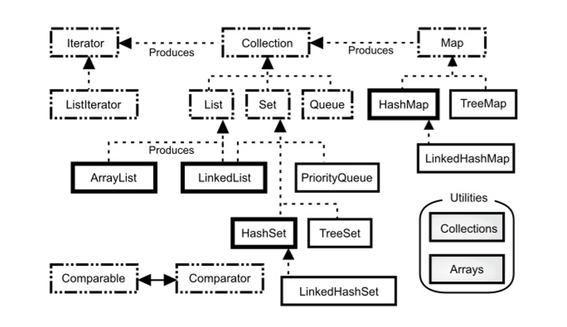
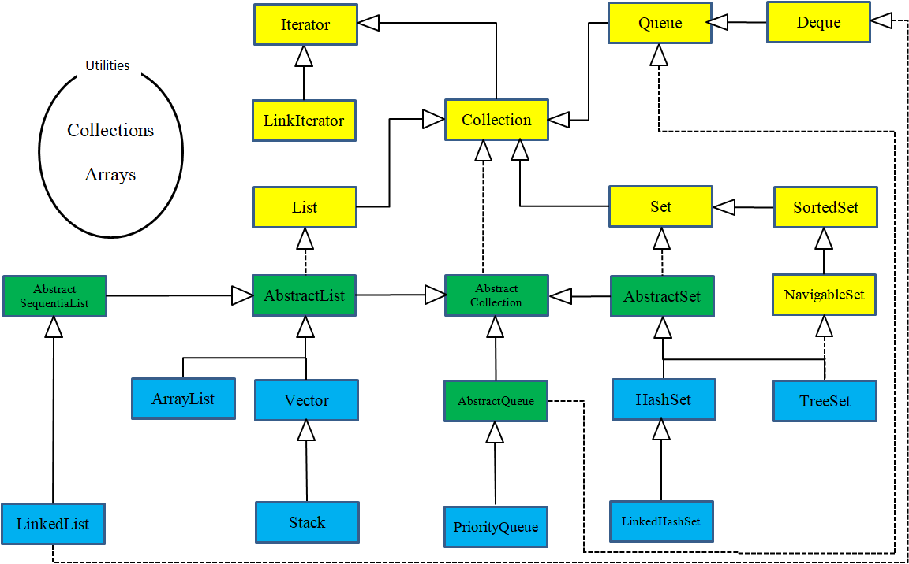
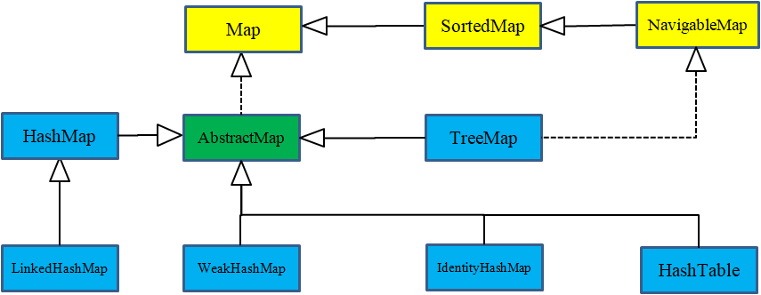

[TOC]

<!-- Collections -->
# 第十二章 集合

> 如果一个程序只包含固定数量的对象且对象的生命周期都是已知的，那么这是一个非常简单的程序。

通常，程序总是根据运行时才知道的某些条件去创建新的对象。在此之前，无法知道所需对象的数量甚至确切类型。为了解决这个普遍的编程问题，需要在任意时刻和任意位置创建任意数量的对象。因此，不能依靠创建命名的引用来持有每一个对象：
```java
MyType aReference;
```
因为从来不会知道实际需要多少个这样的引用。

大多数编程语言都提供了某种方法来解决这个基本问题。Java有多种方式保存对象（确切地说，是对象的引用）。例如前边曾经学习过的数组，它是编译器支持的类型。数组是保存一组对象的最有效的方式，如果想要保存一组基本类型数据，也推荐使用数组。但是数组具有固定的大小尺寸，而且在更一般的情况下，在写程序的时候并不知道将需要多少个对象，或者是否需要更复杂的方式来存储对象，因此数组尺寸固定这一限制就显得太过受限了。

**java.util** 库提供了一套相当完整的*集合类*（collection classes）来解决这个问题，其中基本的类型有 **List** 、 **Set** 、 **Queue** 和 **Map**。这些类型也被称作*容器类*（container classes），但我将使用Java类库使用的术语。集合提供了完善的方法来保存对象，可以使用这些工具来解决大量的问题。

集合还有一些其它特性。例如， **Set** 对于每个值都只保存一个对象， **Map** 是一个关联数组，允许将某些对象与其他对象关联起来。Java集合类都可以自动地调整自己的大小。因此，与数组不同，在编程时，可以将任意数量的对象放置在集合中，而不用关心集合应该有多大。

尽管在 Java 中没有直接的关键字支持，[^1]但集合类仍然是可以显著增强编程能力的基本工具。在本章中，将介绍 Java 集合类库的基本知识，并重点介绍一些典型用法。这里将专注于在日常编程中使用的集合。稍后，在[附录：集合主题]()中，还将学习到其余的那些集合和相关功能，以及如何使用它们的更多详细信息。

<!-- Generics and Type-Safe Collections -->
## 泛型和类型安全的集合

使用 Java 5 之前的集合的一个主要问题是编译器允许你向集合中插入不正确的类型。例如，考虑一个 **Apple** 对象的集合，这里使用最基本最可靠的 **ArrayList** 。现在，可以把 **ArrayList** 看作“可以自动扩充自身尺寸的数组”来看待。使用 **ArrayList** 相当简单：创建一个实例，用 `add()` 插入对象；然后用 `get()` 来访问这些对象，此时需要使用索引，就像数组那样，但是不需要方括号。[^2] **ArrayList** 还有一个 `size()` 方法，来说明集合中包含了多少个元素，所以不会不小心因数组越界而引发错误（通过抛出*运行时异常*，[异常]()章节介绍了异常）。

在本例中， **Apple** 和 **Orange** 都被放到了集合中，然后将它们取出。正常情况下，Java编译器会给出警告，因为这个示例没有使用泛型。在这里，使用特定的注解来抑制警告信息。注解以“@”符号开头，可以带参数。这里的 `@SuppressWarning` 注解及其参数表示只抑制“unchecked”类型的警告（[注解]()章节将介绍更多有关注解的信息）：

```java
// collections/ApplesAndOrangesWithoutGenerics.java
// Simple collection use (suppressing compiler warnings)
// {ThrowsException}
import java.util.*;

class Apple {
  private static long counter;
  private final long id = counter++;
  public long id() { return id; }
}

class Orange {}

public class ApplesAndOrangesWithoutGenerics {
  @SuppressWarnings("unchecked")
  public static void main(String[] args) {
    ArrayList apples = new ArrayList();
    for(int i = 0; i < 3; i++)
      apples.add(new Apple());
    // No problem adding an Orange to apples:
    apples.add(new Orange());
    for(Object apple : apples) {
      ((Apple) apple).id();
      // Orange is detected only at run time
    }
  }
}
/* Output:
___[ Error Output ]___
Exception in thread "main"
java.lang.ClassCastException: Orange cannot be cast to
Apple
        at ApplesAndOrangesWithoutGenerics.main(ApplesA
ndOrangesWithoutGenerics.java:23)
*/
```

**Apple** 和 **Orange** 是截然不同的，它们除了都是 **Object** 之外没有任何共同点（如果一个类没有显式地声明继承自哪个类，那么它就自动继承自 **Object**）。因为 **ArrayList** 保存的是 **Object** ，所以不仅可以通过 **ArrayList** 的 `add()` 方法将 **Apple** 对象放入这个集合，而且可以放入 **Orange** 对象，这无论在编译期还是运行时都不会有问题。当使用 **ArrayList** 的 `get()` 方法来取出你认为是 **Apple** 的对象时，得到的只是 **Object** 引用，必须将其转型为 **Apple**。然后需要将整个表达式用括号括起来，以便在调用 **Apple** 的 `id()` 方法之前，强制执行转型。否则，将会产生语法错误。

在运行时，当尝试将 **Orange** 对象转为 **Apple** 时，会出现输出中显示的错误。

在[泛型]()章节中，你将了解到使用 Java 泛型来创建类可能很复杂。但是，使用预先定义的泛型类却相当简单。例如，要定义一个用于保存 **Apple** 对象的 **ArrayList** ，只需要使用 **ArrayList\<Apple\>** 来代替 **ArrayList** 。尖括号括起来的是*类型参数*（可能会有多个），它指定了这个集合实例可以保存的类型。

通过使用泛型，就可以在编译期防止将错误类型的对象放置到集合中。[^3]下面还是这个示例，但是使用了泛型：
```java
// collections/ApplesAndOrangesWithGenerics.java
import java.util.*;

public class ApplesAndOrangesWithGenerics {
  public static void main(String[] args) {
    ArrayList<Apple> apples = new ArrayList<>();
    for(int i = 0; i < 3; i++)
      apples.add(new Apple());
    // Compile-time error:
    // apples.add(new Orange());
    for(Apple apple : apples) {
      System.out.println(apple.id());
    }
  }
}
/* Output:
0
1
2
*/
```

在 **apples** 定义的右侧，可以看到 `new ArrayList<>()` 。这有时被称为“菱形语法”（diamond syntax）。在 Java 7 之前，必须要在两端都进行类型声明，如下所示：

```java
ArrayList<Apple> apples = new ArrayList<Apple>();
```

随着类型变得越来越复杂，这种重复产生的代码非常混乱且难以阅读。程序员发现所有类型信息都可以从左侧获得，因此，编译器没有理由强迫右侧再重复这些。虽然*类型推断*（type inference）只是个很小的请求，Java 语言团队仍然欣然接受并进行了改进。

有了 **ArrayList** 声明中的类型指定，编译器会阻止将 **Orange** 放入 **apples** ，因此，这会成为一个编译期错误而不是运行时错误。

使用泛型，从 **List** 中获取元素不需要强制类型转换。因为 **List** 知道它持有什么类型，因此当调用 `get()` 时，它会替你执行转型。因此，使用泛型，你不仅知道编译器将检查放入集合的对象类型，而且在使用集合中的对象时也可以获得更清晰的语法。

当指定了某个类型为泛型参数时，并不仅限于只能将确切类型的对象放入集合中。向上转型也可以像作用于其他类型一样作用于泛型：
```java
// collections/GenericsAndUpcasting.java
import java.util.*;

class GrannySmith extends Apple {}
class Gala extends Apple {}
class Fuji extends Apple {}
class Braeburn extends Apple {}

public class GenericsAndUpcasting {
  public static void main(String[] args) {
    ArrayList<Apple> apples = new ArrayList<>();
    apples.add(new GrannySmith());
    apples.add(new Gala());
    apples.add(new Fuji());
    apples.add(new Braeburn());
    for(Apple apple : apples)
      System.out.println(apple);
  }
}
/* Output:
GrannySmith@15db9742
Gala@6d06d69c
Fuji@7852e922
Braeburn@4e25154f
*/
```

因此，可以将 **Apple** 的子类型添加到被指定为保存 **Apple** 对象的集合中。

程序的输出是从 **Object** 默认的 `toString()` 方法产生的，该方法打印类名，后边跟着对象的散列码的无符号十六进制表示（这个散列码是通过 `hashCode()` 方法产生的）。将在[附录：理解equals和hashCode方法]()中了解有关散列码的内容。

<!-- Basic Concepts -->
## 基本概念

Java集合类库采用“持有对象”（holding objects）的思想，并将其分为两个不同的概念，表示为类库的基本接口：

1. **集合（Collection）** ：一个独立元素的序列，这些元素都服从一条或多条规则。**List** 必须以插入的顺序保存元素， **Set** 不能包含重复元素， **Queue** 按照*排队规则*来确定对象产生的顺序（通常与它们被插入的顺序相同）。
2. **映射（Map）** ： 一组成对的“键值对”对象，允许使用键来查找值。 **ArrayList** 使用数字来查找对象，因此在某种意义上讲，它是将数字和对象关联在一起。  **map** 允许我们使用一个对象来查找另一个对象，它也被称作*关联数组*（associative array），因为它将对象和其它对象关联在一起；或者称作*字典*（dictionary），因为可以使用一个键对象来查找值对象，就像在字典中使用单词查找定义一样。 **Map** 是强大的编程工具。

尽管并非总是可行，但在理想情况下，你编写的大部分代码都在与这些接口打交道，并且唯一需要指定所使用的精确类型的地方就是在创建的时候。因此，可以像下面这样创建一个 **List** ：

```java
List<Apple> apples = new ArrayList<>();
```

请注意， **ArrayList** 已经被向上转型为了 **List** ，这与之前示例中的处理方式正好相反。使用接口的目的是，如果想要改变具体实现，只需在创建时修改它就行了，就像下面这样：

```java
List<Apple> apples = new LinkedList<>();
```

因此，应该创建一个具体类的对象，将其向上转型为对应的接口，然后在其余代码中都是用这个接口。

这种方式并非总是有效的，因为某些具体类有额外的功能。例如， **LinkedList** 具有 **List** 接口中未包含的额外方法，而 **TreeMap** 也具有在 **Map** 接口中未包含的方法。如果需要使用这些方法，就不能将它们向上转型为更通用的接口。

**Collection** 接口概括了*序列*的概念——一种存放一组对象的方式。下面是个简单的示例，用 **Integer** 对象填充了一个 **Collection** （这里用 **ArrayList** 表示），然后打印集合中的每个元素：
```java
// collections/SimpleCollection.java
import java.util.*;

public class SimpleCollection {
  public static void main(String[] args) {
    Collection<Integer> c = new ArrayList<>();
    for(int i = 0; i < 10; i++)
      c.add(i); // Autoboxing
    for(Integer i : c)
      System.out.print(i + ", ");
  }
}
/* Output:
0, 1, 2, 3, 4, 5, 6, 7, 8, 9,
*/
```

这个例子仅使用了 **Collection** 中的方法（即 `add()` ），所以使用任何继承自 **Collection** 的类的对象都可以正常工作。但是 **ArrayList** 是最基本的序列类型。

`add()` 方法的名称就表明它是在 **Collection** 中添加一个新元素。但是，文档中非常详细地叙述到 `add()` “要确保这个 **Collection** 包含指定的元素。”这是因为考虑到了 **Set** 的含义，因为在 **Set**中，只有当元素不存在时才会添加元素。在使用 **ArrayList** ，或任何其他类型的 **List** 时，`add()` 总是表示“把它放进去”，因为 **List** 不关心是否存在重复元素。

可以使用 *for-in* 语法来遍历所有的 **Collection** ，就像这里所展示的那样。在本章的后续部分，还将学习到一个更灵活的概念，*迭代器*。

<!-- Adding Groups of Elements -->

## 添加元素组

在 **java.util** 包中的 **Arrays** 和 **Collections** 类中都有很多实用的方法，可以在一个 **Collection** 中添加一组元素。

`Arrays.asList()` 方法接受一个数组或是逗号分隔的元素列表（使用可变参数），并将其转换为 **List** 对象。 `Collections.addAll()` 方法接受一个 **Collection** 对象，以及一个数组或是一个逗号分隔的列表，将其中元素添加到 **Collection** 中。下边的示例展示了这两个方法，以及更通用的 、所有 **Collection** 类型都包含的`addAll()` 方法：

```java
// collections/AddingGroups.java
// Adding groups of elements to Collection objects
import java.util.*;

public class AddingGroups {
  public static void main(String[] args) {
    Collection<Integer> collection =
      new ArrayList<>(Arrays.asList(1, 2, 3, 4, 5));
    Integer[] moreInts = { 6, 7, 8, 9, 10 };
    collection.addAll(Arrays.asList(moreInts));
    // Runs significantly faster, but you can't
    // construct a Collection this way:
    Collections.addAll(collection, 11, 12, 13, 14, 15);
    Collections.addAll(collection, moreInts);
    // Produces a list "backed by" an array:
    List<Integer> list = Arrays.asList(16,17,18,19,20);
    list.set(1, 99); // OK -- modify an element
    // list.add(21); // Runtime error; the underlying
                     // array cannot be resized.
  }
}
```

**Collection** 的构造器可以接受另一个 **Collection**，用它来将自身初始化。因此，可以使用 `Arrays.asList()` 来为这个构造器产生输入。但是， `Collections.addAll()` 运行得更快，而且很容易构建一个不包含元素的 **Collection** ，然后调用 `Collections.addAll()` ，因此这是首选方式。

`Collection.addAll()` 方法只能接受另一个 **Collection** 作为参数，因此它没有 `Arrays.asList()` 或 `Collections.addAll()` 灵活。这两个方法都使用可变参数列表。

也可以直接使用 `Arrays.asList()` 的输出作为一个 **List** ，但是这里的底层实现是数组，没法调整大小。如果尝试在这个 **List** 上调用 `add()` 或 `remove()`，由于这两个方法会尝试修改数组大小，所以会在运行时得到“Unsupported Operation（不支持的操作）”错误：

```java
// collections/AsListInference.java
import java.util.*;

class Snow {}
class Powder extends Snow {}
class Light extends Powder {}
class Heavy extends Powder {}
class Crusty extends Snow {}
class Slush extends Snow {}

public class AsListInference {
  public static void main(String[] args) {
    List<Snow> snow1 = Arrays.asList(
      new Crusty(), new Slush(), new Powder());
    //- snow1.add(new Heavy()); // Exception

    List<Snow> snow2 = Arrays.asList(
      new Light(), new Heavy());
    //- snow2.add(new Slush()); // Exception

    List<Snow> snow3 = new ArrayList<>();
    Collections.addAll(snow3,
      new Light(), new Heavy(), new Powder());
    snow3.add(new Crusty());

    // Hint with explicit type argument specification:
    List<Snow> snow4 = Arrays.<Snow>asList(
       new Light(), new Heavy(), new Slush());
    //- snow4.add(new Powder()); // Exception
  }
}
```

在 **snow4** 中，注意 `Arrays.asList()` 中间的“暗示”（即 `<Snow>` ），告诉编译器 `Arrays.asList()` 生成的结果 **List** 类型的实际目标类型是什么。这称为*显式类型参数说明*（explicit type argument specification）。

<!-- Printing Collections -->
## 集合的打印

必须使用 `Arrays.toString()` 来生成数组的可打印形式。但是打印集合无需任何帮助。下面是一个例子，这个例子中也介绍了基本的Java集合：
```java
// collections/PrintingCollections.java
// Collections print themselves automatically
import java.util.*;

public class PrintingCollections {
  static Collection
  fill(Collection<String> collection) {
    collection.add("rat");
    collection.add("cat");
    collection.add("dog");
    collection.add("dog");
    return collection;
  }
  static Map fill(Map<String, String> map) {
    map.put("rat", "Fuzzy");
    map.put("cat", "Rags");
    map.put("dog", "Bosco");
    map.put("dog", "Spot");
    return map;
  }
  public static void main(String[] args) {
    System.out.println(fill(new ArrayList<>()));
    System.out.println(fill(new LinkedList<>()));
    System.out.println(fill(new HashSet<>()));
    System.out.println(fill(new TreeSet<>()));
    System.out.println(fill(new LinkedHashSet<>()));
    System.out.println(fill(new HashMap<>()));
    System.out.println(fill(new TreeMap<>()));
    System.out.println(fill(new LinkedHashMap<>()));
  }
}
/* Output:
[rat, cat, dog, dog]
[rat, cat, dog, dog]
[rat, cat, dog]
[cat, dog, rat]
[rat, cat, dog]
{rat=Fuzzy, cat=Rags, dog=Spot}
{cat=Rags, dog=Spot, rat=Fuzzy}
{rat=Fuzzy, cat=Rags, dog=Spot}
*/
```

这显示了Java集合库中的两个主要类型。它们的区别在于集合中的每个“槽”（slot）保存的元素个数。 **Collection** 类型在每个槽中只能保存一个元素。此类集合包括： **List** ，它以特定的顺序保存一组元素； **Set** ，其中元素不允许重复； **Queue** ，只能在集合一端插入对象，并从另一端移除对象（就本例而言，这只是查看序列的另一种方式，因此并没有显示它）。 **Map** 在每个槽中存放了两个元素，即*键*和与之关联的*值*。

默认的打印行为，使用集合提供的 `toString()` 方法即可生成可读性很好的结果。 **Collection** 打印出的内容用方括号括住，每个元素由逗号分隔。 **Map** 则由大括号括住，每个键和值用等号连接（键在左侧，值在右侧）。

第一个 `fill()` 方法适用于所有类型的 **Collection** ，这些类型都实现了 `add()` 方法以添加新元素。

**ArrayList** 和 **LinkedList** 都是 **List** 的类型，从输出中可以看出，它们都按插入顺序保存元素。两者之间的区别不仅在于执行某些类型的操作时的性能，而且 **LinkedList** 包含的操作多于 **ArrayList** 。本章后面将对这些内容进行更全面的探讨。

**HashSet** ， **TreeSet** 和 **LinkedHashSet** 是 **Set** 的类型。从输出中可以看到， **Set** 仅保存每个相同项中的一个，并且不同的 **Set** 实现存储元素的方式也不同。 **HashSet** 使用相当复杂的方法存储元素，这在[附录：集合主题]()中进行了探讨。现在只需要知道，这种技术是检索元素的最快方法，因此，存储顺序看上去没有什么意义（通常只关心某事物是否是 **Set** 的成员，而存储顺序并不重要）。如果存储顺序很重要，则可以使用 **TreeSet** ，它将按比较结果的升序保存对象）或 **LinkedHashSet** ，它按照被添加的先后顺序保存对象。

**Map** （也称为*关联数组*）使用*键*来查找对象，就像一个简单的数据库。所关联的对象称为*值*。 假设有一个 **Map** 将美国州名与它们的首府联系在一起，如果想要俄亥俄州（Ohio）的首府，可以用“Ohio”作为键来查找，几乎就像使用数组下标一样。正是由于这种行为，对于每个键， **Map** 只存储一次。

`Map.put(key, value)` 添加一个所想要添加的值并将它与一个键（用来查找值）相关联。 `Map.get(key)` 生成与该键相关联的值。上面的示例仅添加键值对，并没有执行查找。这将在稍后展示。

请注意，这里没有指定（或考虑） **Map** 的大小，因为它会自动调整大小。 此外， **Map** 还知道如何打印自己，它会显示相关联的键和值。

本例使用了 **Map** 的三种基本风格： **HashMap** ， **TreeMap** 和 **LinkedHashMap** 。

键和值保存在 **HashMap** 中的顺序不是插入顺序，因为 **HashMap** 实现使用了非常快速的算法来控制顺序。 **TreeMap** 通过比较结果的升序来保存键， **LinkedHashMap** 在保持 **HashMap** 查找速度的同时按键的插入顺序保存键。

<!-- List -->

## 列表List

**List**承诺将元素保存在特定的序列中。 **List** 接口在 **Collection** 的基础上添加了许多方法，允许在 **List** 的中间插入和删除元素。

有两种类型的 **List** ：

- 基本的 **ArrayList** ，擅长随机访问元素，但在 **List** 中间插入和删除元素时速度较慢。
- **LinkedList** ，它通过代价较低的在 **List** 中间进行的插入和删除操作，提供了优化的顺序访问。 **LinkedList** 对于随机访问来说相对较慢，但它具有比 **ArrayList** 更大的特征集。

下面的示例导入 **typeinfo.pets** ，超前使用了[类型信息]()一章中的类库。这个类库包含了 **Pet** 类层次结构，以及用于随机生成 **Pet** 对象的一些工具类。此时不需要了解完整的详细信息，只需要知道两点：

1. 有一个 **Pet** 类，以及 **Pet** 的各种子类型。
2. 静态的 `Pets.arrayList()` 方法返回一个填充了随机选取的 **Pet** 对象的 **ArrayList**：

```java
// collections/ListFeatures.java
import typeinfo.pets.*;
import java.util.*;

public class ListFeatures {
  public static void main(String[] args) {
    Random rand = new Random(47);
    List<Pet> pets = Pets.list(7);
    System.out.println("1: " + pets);
    Hamster h = new Hamster();
    pets.add(h); // Automatically resizes
    System.out.println("2: " + pets);
    System.out.println("3: " + pets.contains(h));
    pets.remove(h); // Remove by object
    Pet p = pets.get(2);
    System.out.println(
      "4: " +  p + " " + pets.indexOf(p));
    Pet cymric = new Cymric();
    System.out.println("5: " + pets.indexOf(cymric));
    System.out.println("6: " + pets.remove(cymric));
    // Must be the exact object:
    System.out.println("7: " + pets.remove(p));
    System.out.println("8: " + pets);
    pets.add(3, new Mouse()); // Insert at an index
    System.out.println("9: " + pets);
    List<Pet> sub = pets.subList(1, 4);
    System.out.println("subList: " + sub);
    System.out.println("10: " + pets.containsAll(sub));
    Collections.sort(sub); // In-place sort
    System.out.println("sorted subList: " + sub);
    // Order is not important in containsAll():
    System.out.println("11: " + pets.containsAll(sub));
    Collections.shuffle(sub, rand); // Mix it up
    System.out.println("shuffled subList: " + sub);
    System.out.println("12: " + pets.containsAll(sub));
    List<Pet> copy = new ArrayList<>(pets);
    sub = Arrays.asList(pets.get(1), pets.get(4));
    System.out.println("sub: " + sub);
    copy.retainAll(sub);
    System.out.println("13: " + copy);
    copy = new ArrayList<>(pets); // Get a fresh copy
    copy.remove(2); // Remove by index
    System.out.println("14: " + copy);
    copy.removeAll(sub); // Only removes exact objects
    System.out.println("15: " + copy);
    copy.set(1, new Mouse()); // Replace an element
    System.out.println("16: " + copy);
    copy.addAll(2, sub); // Insert a list in the middle
    System.out.println("17: " + copy);
    System.out.println("18: " + pets.isEmpty());
    pets.clear(); // Remove all elements
    System.out.println("19: " + pets);
    System.out.println("20: " + pets.isEmpty());
    pets.addAll(Pets.list(4));
    System.out.println("21: " + pets);
    Object[] o = pets.toArray();
    System.out.println("22: " + o[3]);
    Pet[] pa = pets.toArray(new Pet[0]);
    System.out.println("23: " + pa[3].id());
  }
}
/* Output:
1: [Rat, Manx, Cymric, Mutt, Pug, Cymric, Pug]
2: [Rat, Manx, Cymric, Mutt, Pug, Cymric, Pug, Hamster]
3: true
4: Cymric 2
5: -1
6: false
7: true
8: [Rat, Manx, Mutt, Pug, Cymric, Pug]
9: [Rat, Manx, Mutt, Mouse, Pug, Cymric, Pug]
subList: [Manx, Mutt, Mouse]
10: true
sorted subList: [Manx, Mouse, Mutt]
11: true
shuffled subList: [Mouse, Manx, Mutt]
12: true
sub: [Mouse, Pug]
13: [Mouse, Pug]
14: [Rat, Mouse, Mutt, Pug, Cymric, Pug]
15: [Rat, Mutt, Cymric, Pug]
16: [Rat, Mouse, Cymric, Pug]
17: [Rat, Mouse, Mouse, Pug, Cymric, Pug]
18: false
19: []
20: true
21: [Manx, Cymric, Rat, EgyptianMau]
22: EgyptianMau
23: 14
*/
```

打印行都编了号，因此可从输出追溯到源代码。 第 1 行输出展示了原始的由 **Pet** 组成的 **List** 。 与数组不同， **List** 可以在创建后添加或删除元素，并自行调整大小。这正是它的重要价值：一种可修改的序列。在第 2 行输出中可以看到添加一个 **Hamster** 的结果，该对象将被追加到列表的末尾。

可以使用 `contains()` 方法确定对象是否在列表中。如果要删除一个对象，可以将该对象的引用传递给 `remove()` 方法。同样，如果有一个对象的引用，可以使用 `indexOf()` 在 **List** 中找到该对象所在位置的下标号，如第 4 行输出所示中所示。

当确定元素是否是属于某个 **List** ，寻找某个元素的索引，以及通过引用从 **List** 中删除元素时，都会用到 `equals()` 方法（根类 **Object** 的一个方法）。每个 **Pet** 被定义为一个唯一的对象，所以即使列表中已经有两个 **Cymrics** ，如果再创建一个新的 **Cymric** 对象并将其传递给 `indexOf()` 方法，结果仍为 **-1** （表示未找到），并且尝试调用 `remove()` 方法来删除这个对象将返回 **false** 。对于其他类， `equals()` 的定义可能有所不同。例如，如果两个 **String** 的内容相同，则这两个 **String** 相等。因此，为了防止出现意外，请务必注意 **List** 行为会根据 `equals()` 行为而发生变化。

第 7、8 行输出展示了删除与 **List** 中的对象完全匹配的对象是成功的。

可以在 **List** 的中间插入一个元素，就像在第 9 行输出和它之前的代码那样。但这会带来一个问题：对于 **LinkedList** ，在列表中间插入和删除都是廉价操作（在本例中，除了对列表中间进行的真正的随机访问），但对于 **ArrayList** ，这可是代价高昂的操作。这是否意味着永远不应该在 **ArrayList** 的中间插入元素，并最好是转换为 **LinkedList** ？不，它只是意味着你应该意识到这个问题，如果你开始在某个 **ArrayList** 中间执行很多插入操作，并且程序开始变慢，那么你应该看看你的 **List** 实现有可能就是罪魁祸首（发现此类瓶颈的最佳方式是使用分析器 profiler）。优化是一个很棘手的问题，最好的策略就是置之不顾，直到发现必须要去担心它了（尽管去理解这些问题总是一个很好的主意）。

`subList()` 方法可以轻松地从更大的列表中创建切片，当将切片结果传递给原来这个较大的列表的 `containsAll()` 方法时，很自然地会得到 **true**。请注意，顺序并不重要，在第 11、12 行输出中可以看到，在 **sub** 上调用直观命名的 `Collections.sort()` 和 `Collections.shuffle()` 方法，不会影响 `containsAll()` 的结果。 `subList()` 所产生的列表的幕后支持就是原始列表。因此，对所返回列表的更改都将会反映在原始列表中，反之亦然。

`retainAll()` 方法实际上是一个“集合交集”操作，在本例中，它保留了同时在 **copy** 和 **sub** 中的所有元素。请再次注意，所产生的结果行为依赖于 `equals()` 方法。

第 14 行输出展示了使用索引号来删除元素的结果，与通过对象引用来删除元素相比，它显得更加直观，因为在使用索引时，不必担心 `equals()` 的行为。

`removeAll()` 方法也是基于 `equals()` 方法运行的。 顾名思义，它会从 **List** 中删除在参数 **List** 中的所有元素。

`set()` 方法的命名显得很不合时宜，因为它与 **Set** 类存在潜在的冲突。在这里使用“replace”可能更适合，因为它的功能是用第二个参数替换索引处的元素（第一个参数）。

第 17 行输出表明，对于 **List** ，有一个重载的 `addAll()` 方法可以将新列表插入到原始列表的中间位置，而不是仅能用 **Collection** 的 `addAll()` 方法将其追加到列表的末尾。

第 18 - 20 行输出展示了 `isEmpty()` 和 `clear()` 方法的效果。

第 22、23 行输出展示了如何使用 `toArray()` 方法将任意的 **Collection** 转换为数组。这是一个重载方法，其无参版本返回一个 **Object** 数组，但是如果将目标类型的数组传递给这个重载版本，那么它会生成一个指定类型的数组（假设它通过了类型检查）。如果参数数组太小而无法容纳 **List** 中的所有元素（就像本例一样），则 `toArray()` 会创建一个具有合适尺寸的新数组。 **Pet** 对象有一个 `id()` 方法，可以在所产生的数组中的对象上调用这个方法。

<!-- Iterators -->

## 迭代器Iterators

在任何集合中，都必须有某种方式可以插入元素并再次获取它们。毕竟，保存事物是集合最基本的工作。对于 **List** ， `add()` 是插入元素的一种方式， `get()` 是获取元素的一种方式。

如果从更高层次的角度考虑，会发现这里有个缺点：要使用集合，必须对集合的确切类型编程。这一开始可能看起来不是很糟糕，但是考虑下面的情况：如果原本是对 **List** 编码的，但是后来发现如果能够将相同的代码应用于 **Set** 会更方便，此时应该怎么做？或者假设想从一开始就编写一段通用代码，它不知道或不关心它正在使用什么类型的集合，因此它可以用于不同类型的集合，那么如何才能不重写代码就可以应用于不同类型的集合？

*迭代器*（也是一种设计模式）的概念实现了这种抽象。迭代器是一个对象，它在一个序列中移动并选择该序列中的每个对象，而客户端程序员不知道或不关心该序列的底层结构。另外，迭代器通常被称为*轻量级对象*（lightweight object）：创建它的代价小。因此，经常可以看到一些对迭代器有些奇怪的约束。例如，Java 的 **Iterator** 只能单向移动。这个 **Iterator** 只能用来：

1. 使用 `iterator()` 方法要求集合返回一个 **Iterator**。 **Iterator** 将准备好返回序列中的第一个元素。
2. 使用 `next()` 方法获得序列中的下一个元素。
3. 使用 `hasNext()` 方法检查序列中是否还有元素。
4. 使用 `remove()` 方法将迭代器最近返回的那个元素删除。

为了观察它的工作方式，这里再次使用[类型信息]()章节中的 **Pet** 工具：

```java
// collections/SimpleIteration.java
import typeinfo.pets.*;
import java.util.*;

public class SimpleIteration {
  public static void main(String[] args) {
    List<Pet> pets = Pets.list(12);
    Iterator<Pet> it = pets.iterator();
    while(it.hasNext()) {
      Pet p = it.next();
      System.out.print(p.id() + ":" + p + " ");
    }
    System.out.println();
    // A simpler approach, when possible:
    for(Pet p : pets)
      System.out.print(p.id() + ":" + p + " ");
    System.out.println();
    // An Iterator can also remove elements:
    it = pets.iterator();
    for(int i = 0; i < 6; i++) {
      it.next();
      it.remove();
    }
    System.out.println(pets);
  }
}
/* Output:
0:Rat 1:Manx 2:Cymric 3:Mutt 4:Pug 5:Cymric 6:Pug
7:Manx 8:Cymric 9:Rat 10:EgyptianMau 11:Hamster
0:Rat 1:Manx 2:Cymric 3:Mutt 4:Pug 5:Cymric 6:Pug
7:Manx 8:Cymric 9:Rat 10:EgyptianMau 11:Hamster
[Pug, Manx, Cymric, Rat, EgyptianMau, Hamster]
*/
```

有了 **Iterator** ，就不必再为集合中元素的数量操心了。这是由 `hasNext()` 和 `next()` 关心的事情。

如果只是想向前遍历 **List** ，并不打算修改 **List** 对象本身，那么使用 *for-in* 语法更加简洁。

**Iterator** 还可以删除由 `next()` 生成的最后一个元素，这意味着在调用 `remove()` 之前必须先调用 `next()` 。[^4]

在集合中的每个对象上执行操作，这种思想十分强大，并且贯穿于本书。

现在考虑创建一个 `display()` 方法，它不必知晓集合的确切类型：

```java
// collections/CrossCollectionIteration.java
import typeinfo.pets.*;
import java.util.*;

public class CrossCollectionIteration {
  public static void display(Iterator<Pet> it) {
    while(it.hasNext()) {
      Pet p = it.next();
      System.out.print(p.id() + ":" + p + " ");
    }
    System.out.println();
  }
  public static void main(String[] args) {
    List<Pet> pets = Pets.list(8);
    LinkedList<Pet> petsLL = new LinkedList<>(pets);
    HashSet<Pet> petsHS = new HashSet<>(pets);
    TreeSet<Pet> petsTS = new TreeSet<>(pets);
    display(pets.iterator());
    display(petsLL.iterator());
    display(petsHS.iterator());
    display(petsTS.iterator());
  }
}
/* Output:
0:Rat 1:Manx 2:Cymric 3:Mutt 4:Pug 5:Cymric 6:Pug
7:Manx
0:Rat 1:Manx 2:Cymric 3:Mutt 4:Pug 5:Cymric 6:Pug
7:Manx
0:Rat 1:Manx 2:Cymric 3:Mutt 4:Pug 5:Cymric 6:Pug
7:Manx
5:Cymric 2:Cymric 7:Manx 1:Manx 3:Mutt 6:Pug 4:Pug
0:Rat
*/
```

`display()` 方法不包含任何有关它所遍历的序列的类型信息。这也展示了 **Iterator** 的真正威力：能够将遍历序列的操作与该序列的底层结构分离。出于这个原因，我们有时会说：迭代器统一了对集合的访问方式。

我们可以使用 **Iterable** 接口生成上一个示例的更简洁版本，该接口描述了“可以产生 **Iterator** 的任何东西”：

```java
// collections/CrossCollectionIteration2.java
import typeinfo.pets.*;
import java.util.*;

public class CrossCollectionIteration2 {
  public static void display(Iterable<Pet> ip) {
    Iterator<Pet> it = ip.iterator();
    while(it.hasNext()) {
      Pet p = it.next();
      System.out.print(p.id() + ":" + p + " ");
    }
    System.out.println();
  }
  public static void main(String[] args) {
    List<Pet> pets = Pets.list(8);
    LinkedList<Pet> petsLL = new LinkedList<>(pets);
    HashSet<Pet> petsHS = new HashSet<>(pets);
    TreeSet<Pet> petsTS = new TreeSet<>(pets);
    display(pets);
    display(petsLL);
    display(petsHS);
    display(petsTS);
  }
}
/* Output:
0:Rat 1:Manx 2:Cymric 3:Mutt 4:Pug 5:Cymric 6:Pug
7:Manx
0:Rat 1:Manx 2:Cymric 3:Mutt 4:Pug 5:Cymric 6:Pug
7:Manx
0:Rat 1:Manx 2:Cymric 3:Mutt 4:Pug 5:Cymric 6:Pug
7:Manx
5:Cymric 2:Cymric 7:Manx 1:Manx 3:Mutt 6:Pug 4:Pug
0:Rat
*/
```

这里所有的类都是 **Iterable** ，所以现在对 `display()` 的调用显然更简单。

<!-- ListIterator -->
### ListIterator

**ListIterator** 是一个更强大的 **Iterator** 子类型，它只能由各种 **List** 类生成。 **Iterator** 只能向前移动，而 **ListIterator** 可以双向移动。它可以生成迭代器在列表中指向位置的后一个和前一个元素的索引，并且可以使用 `set()` 方法替换它访问过的最近一个元素。可以通过调用 `listIterator()` 方法来生成指向 **List** 开头处的 **ListIterator** ，还可以通过调用 `listIterator(n)` 创建一个一开始就指向列表索引号为 **n** 的元素处的 **ListIterator** 。 下面的示例演示了所有这些能力：

```java
// collections/ListIteration.java
import typeinfo.pets.*;
import java.util.*;

public class ListIteration {
  public static void main(String[] args) {
    List<Pet> pets = Pets.list(8);
    ListIterator<Pet> it = pets.listIterator();
    while(it.hasNext())
      System.out.print(it.next() +
        ", " + it.nextIndex() +
        ", " + it.previousIndex() + "; ");
    System.out.println();
    // Backwards:
    while(it.hasPrevious())
      System.out.print(it.previous().id() + " ");
    System.out.println();
    System.out.println(pets);
    it = pets.listIterator(3);
    while(it.hasNext()) {
      it.next();
      it.set(Pets.get());
    }
    System.out.println(pets);
  }
}
/* Output:
Rat, 1, 0; Manx, 2, 1; Cymric, 3, 2; Mutt, 4, 3; Pug,
5, 4; Cymric, 6, 5; Pug, 7, 6; Manx, 8, 7;
7 6 5 4 3 2 1 0
[Rat, Manx, Cymric, Mutt, Pug, Cymric, Pug, Manx]
[Rat, Manx, Cymric, Cymric, Rat, EgyptianMau, Hamster,
EgyptianMau]
*/
```

`Pets.get()` 方法用来从位置 3 开始替换 **List** 中的所有 Pet 对象。

<!-- LinkedList -->

## 链表LinkedList

**LinkedList** 也像 **ArrayList** 一样实现了基本的 **List** 接口，但它在 **List** 中间执行插入和删除操作时比 **ArrayList** 更高效。然而,它在随机访问操作效率方面却要逊色一些。

**LinkedList 还添加了一些方法，使其可以被用作栈、队列或双端队列（deque）** 。在这些方法中，有些彼此之间可能只是名称有些差异，或者只存在些许差异，以使得这些名字在特定用法的上下文环境中更加适用（特别是在 **Queue** 中）。例如：

- `getFirst()` 和 `element()` 是相同的，它们都返回列表的头部（第一个元素）而并不删除它，如果 **List** 为空，则抛出 **NoSuchElementException** 异常。 `peek()` 方法与这两个方法只是稍有差异，它在列表为空时返回 **null** 。
- `removeFirst()` 和 `remove()` 也是相同的，它们删除并返回列表的头部元素，并在列表为空时抛出 **NoSuchElementException** 异常。 `poll()` 稍有差异，它在列表为空时返回 **null** 。
- `addFirst()` 在列表的开头插入一个元素。
- `offer()` 与 `add()` 和 `addLast()` 相同。 它们都在列表的尾部（末尾）添加一个元素。
- `removeLast()` 删除并返回列表的最后一个元素。

下面的示例展示了这些功能之间基本的相似性和差异性。它并不是重复执行 **ListFeatures.java** 中所示的行为：

```java
// collections/LinkedListFeatures.java
import typeinfo.pets.*;
import java.util.*;

public class LinkedListFeatures {
  public static void main(String[] args) {
    LinkedList<Pet> pets =
      new LinkedList<>(Pets.list(5));
    System.out.println(pets);
    // Identical:
    System.out.println(
      "pets.getFirst(): " + pets.getFirst());
    System.out.println(
      "pets.element(): " + pets.element());
    // Only differs in empty-list behavior:
    System.out.println("pets.peek(): " + pets.peek());
    // Identical; remove and return the first element:
    System.out.println(
      "pets.remove(): " + pets.remove());
    System.out.println(
      "pets.removeFirst(): " + pets.removeFirst());
    // Only differs in empty-list behavior:
    System.out.println("pets.poll(): " + pets.poll());
    System.out.println(pets);
    pets.addFirst(new Rat());
    System.out.println("After addFirst(): " + pets);
    pets.offer(Pets.get());
    System.out.println("After offer(): " + pets);
    pets.add(Pets.get());
    System.out.println("After add(): " + pets);
    pets.addLast(new Hamster());
    System.out.println("After addLast(): " + pets);
    System.out.println(
      "pets.removeLast(): " + pets.removeLast());
  }
}
/* Output:
[Rat, Manx, Cymric, Mutt, Pug]
pets.getFirst(): Rat
pets.element(): Rat
pets.peek(): Rat
pets.remove(): Rat
pets.removeFirst(): Manx
pets.poll(): Cymric
[Mutt, Pug]
After addFirst(): [Rat, Mutt, Pug]
After offer(): [Rat, Mutt, Pug, Cymric]
After add(): [Rat, Mutt, Pug, Cymric, Pug]
After addLast(): [Rat, Mutt, Pug, Cymric, Pug, Hamster]
pets.removeLast(): Hamster
*/
```

`Pets.list()` 的结果被传递给 **LinkedList** 的构造器，以便使用它来填充 **LinkedList** 。如果查看 **Queue** 接口就会发现，它在 **LinkedList** 的基础上添加了 `element()` ， `offer()` ， `peek()` ， `poll()` 和 `remove()` 方法，以使其可以成为一个 **Queue** 的实现。 **Queue** 的完整示例将在本章稍后给出。

<!-- Stack -->

## 堆栈Stack

堆栈是“后进先出”（LIFO）集合。它有时被称为*叠加栈*（pushdown stack），因为最后“压入”（push）栈的元素，第一个被“弹出”（pop）栈。经常用来类比栈的事物是带有弹簧支架的自助餐厅托盘。最后装入的托盘总是最先拿出来使用的。

Java 1.0 中附带了一个 **Stack** 类，结果设计得很糟糕（为了向后兼容，我们永远坚持 Java 中的旧设计错误）。Java 6 添加了 **ArrayDeque** ，其中包含直接实现堆栈功能的方法：

```java
// collections/StackTest.java
import java.util.*;

public class StackTest {
  public static void main(String[] args) {
    Deque<String> stack = new ArrayDeque<>();
    for(String s : "My dog has fleas".split(" "))
      stack.push(s);
    while(!stack.isEmpty())
      System.out.print(stack.pop() + " ");
  }
}
/* Output:
fleas has dog My
*/
```

即使它是作为一个堆栈在使用，我们仍然必须将其声明为 **Deque** 。有时一个名为 **Stack** 的类更能把事情讲清楚：

```java
// onjava/Stack.java
// A Stack class built with an ArrayDeque
package onjava;
import java.util.Deque;
import java.util.ArrayDeque;

public class Stack<T> {
  private Deque<T> storage = new ArrayDeque<>();
  public void push(T v) { storage.push(v); }
  public T peek() { return storage.peek(); }
  public T pop() { return storage.pop(); }
  public boolean isEmpty() { return storage.isEmpty(); }
  @Override
  public String toString() {
    return storage.toString();
  }
}
```

这里引入了使用泛型的类定义的最简单的可能示例。类名称后面的 **<T>** 告诉编译器这是一个参数化类型，而其中的类型参数 **T** 会在使用类时被实际类型替换。基本上，这个类是在声明“我们在定义一个可以持有 **T** 类型对象的 **Stack** 。” **Stack** 是使用 **ArrayDeque** 实现的，而 **ArrayDeque** 也被告知它将持有 **T** 类型对象。注意， `push()` 接受类型为 **T** 的对象，而 `peek()` 和 `pop()` 返回类型为 **T** 的对象。 `peek()` 方法将返回栈顶元素，但并不将其从栈顶删除，而 `pop()` 删除并返回顶部元素。

如果只需要栈的行为，那么使用继承是不合适的，因为这将产生一个具有 **ArrayDeque** 的其它所有方法的类（在[附录：集合主题]()中将会看到， **Java 1.0** 设计者在创建 **java.util.Stack** 时，就犯了这个错误）。使用组合，可以选择要公开的方法以及如何命名它们。

下面将使用 **StackTest.java** 中的相同代码来演示这个新的 **Stack** 类：

```java
// collections/StackTest2.java
import onjava.*;

public class StackTest2 {
  public static void main(String[] args) {
    Stack<String> stack = new Stack<>();
    for(String s : "My dog has fleas".split(" "))
      stack.push(s);
    while(!stack.isEmpty())
      System.out.print(stack.pop() + " ");
  }
}
/* Output:
fleas has dog My
*/
```

如果想在自己的代码中使用这个 **Stack** 类，当在创建其实例时，就需要完整指定包名，或者更改这个类的名称；否则，就有可能会与 **java.util** 包中的 **Stack** 发生冲突。例如，如果我们在上面的例子中导入 **java.util.***，那么就必须使用包名来防止冲突：

```java
// collections/StackCollision.java

public class StackCollision {
  public static void main(String[] args) {
    onjava.Stack<String> stack = new onjava.Stack<>();
    for(String s : "My dog has fleas".split(" "))
      stack.push(s);
    while(!stack.isEmpty())
      System.out.print(stack.pop() + " ");
    System.out.println();
    java.util.Stack<String> stack2 =
      new java.util.Stack<>();
    for(String s : "My dog has fleas".split(" "))
      stack2.push(s);
    while(!stack2.empty())
      System.out.print(stack2.pop() + " ");
  }
}
/* Output:
fleas has dog My
fleas has dog My
*/
```

尽管已经有了 **java.util.Stack** ，但是 **ArrayDeque** 可以产生更好的 **Stack** ，因此更可取。

还可以使用显式导入来控制对“首选” **Stack** 实现的选择：
```java
import onjava.Stack;
```

现在,任何对 **Stack** 的引用都将选择 **onjava** 版本，而在选择 **java.util.Stack** 时，必须使用全限定名称（full qualification）。

<!-- Set -->
## 集合Set

**Set** 不保存重复的元素。 如果试图将相同对象的多个实例添加到 **Set** 中，那么它会阻止这种重复行为。  **Set** 最常见的用途是测试归属性，可以很轻松地询问某个对象是否在一个 **Set** 中。因此，查找通常是 **Set** 最重要的操作，因此通常会选择 **HashSet** 实现，该实现针对快速查找进行了优化。

**Set** 具有与 **Collection** 相同的接口，因此没有任何额外的功能，不像前面两种不同类型的 **List** 那样。实际上， **Set** 就是一个 **Collection**  ，只是行为不同。（这是继承和多态思想的典型应用：表现不同的行为。）**Set** 根据对象的“值”确定归属性，更复杂的内容将在[附录：集合主题]()中介绍。

下面是使用存放 **Integer** 对象的 **HashSet** 的示例：

```java
// collections/SetOfInteger.java
import java.util.*;

public class SetOfInteger {
  public static void main(String[] args) {
    Random rand = new Random(47);
    Set<Integer> intset = new HashSet<>();
    for(int i = 0; i < 10000; i++)
      intset.add(rand.nextInt(30));
    System.out.println(intset);
  }
}
/* Output:
[0, 1, 2, 3, 4, 5, 6, 7, 8, 9, 10, 11, 12, 13, 14, 15,
16, 17, 18, 19, 20, 21, 22, 23, 24, 25, 26, 27, 28, 29]
*/
```

在 0 到 29 之间的 10000 个随机整数被添加到 **Set** 中，因此可以想象每个值都重复了很多次。但是从结果中可以看到，每一个数只有一个实例出现在结果中。

早期 Java 版本中的 **HashSet** 产生的输出没有可辨别的顺序。这是因为出于对速度的追求， **HashSet** 使用了散列，请参阅[附录：集合主题]()一章。由 **HashSet** 维护的顺序与 **TreeSet** 或 **LinkedHashSet** 不同，因为它们的实现具有不同的元素存储方式。 **TreeSet** 将元素存储在红-黑树数据结构中，而 **HashSet** 使用散列函数。  **LinkedHashSet** 因为查询速度的原因也使用了散列，但是看起来使用了链表来维护元素的插入顺序。看起来散列算法好像已经改变了，现在 **Integer** 按顺序排序。但是，您不应该依赖此行为：

```java
// collections/SetOfString.java
import java.util.*;

public class SetOfString {
  public static void main(String[] args) {
    Set<String> colors = new HashSet<>();
    for(int i = 0; i < 100; i++) {
      colors.add("Yellow");
      colors.add("Blue");
      colors.add("Red");
      colors.add("Red");
      colors.add("Orange");
      colors.add("Yellow");
      colors.add("Blue");
      colors.add("Purple");
    }
    System.out.println(colors);
  }
}
/* Output:
[Red, Yellow, Blue, Purple, Orange]
*/
```

**String** 对象似乎没有排序。要对结果进行排序，一种方法是使用 **TreeSet** 而不是 **HashSet** ：

```java
// collections/SortedSetOfString.java
import java.util.*;

public class SortedSetOfString {
  public static void main(String[] args) {
    Set<String> colors = new TreeSet<>();
    for(int i = 0; i < 100; i++) {
      colors.add("Yellow");
      colors.add("Blue");
      colors.add("Red");
      colors.add("Red");
      colors.add("Orange");
      colors.add("Yellow");
      colors.add("Blue");
      colors.add("Purple");
    }
    System.out.println(colors);
  }
}
/* Output:
[Blue, Orange, Purple, Red, Yellow]
*/
```

最常见的操作之一是使用 `contains()` 测试成员归属性，但也有一些其它操作，这可能会让你想起在小学学过的维恩图（译者注：利用图形的交合表示多个集合之间的逻辑关系）：

```java
// collections/SetOperations.java
import java.util.*;

public class SetOperations {
  public static void main(String[] args) {
    Set<String> set1 = new HashSet<>();
    Collections.addAll(set1,
      "A B C D E F G H I J K L".split(" "));
    set1.add("M");
    System.out.println("H: " + set1.contains("H"));
    System.out.println("N: " + set1.contains("N"));
    Set<String> set2 = new HashSet<>();
    Collections.addAll(set2, "H I J K L".split(" "));
    System.out.println(
      "set2 in set1: " + set1.containsAll(set2));
    set1.remove("H");
    System.out.println("set1: " + set1);
    System.out.println(
      "set2 in set1: " + set1.containsAll(set2));
    set1.removeAll(set2);
    System.out.println(
      "set2 removed from set1: " + set1);
    Collections.addAll(set1, "X Y Z".split(" "));
    System.out.println(
      "'X Y Z' added to set1: " + set1);
  }
}
/* Output:
H: true
N: false
set2 in set1: true
set1: [A, B, C, D, E, F, G, I, J, K, L, M]
set2 in set1: false
set2 removed from set1: [A, B, C, D, E, F, G, M]
'X Y Z' added to set1: [A, B, C, D, E, F, G, M, X, Y,
Z]
*/
```

这些方法名都是自解释的，JDK 文档中还有一些其它的方法。

能够产生每个元素都唯一的列表是相当有用的功能。例如，假设想要列出上面的 **SetOperations.java** 文件中的所有单词，通过使用本书后面介绍的 `java.nio.file.Files.readAllLines()` 方法，可以打开一个文件，并将其作为一个 **List\<String>** 读取，每个 **String** 都是输入文件中的一行：

```java
// collections/UniqueWords.java
import java.util.*;
import java.nio.file.*;

public class UniqueWords {
  public static void
  main(String[] args) throws Exception {
    List<String> lines = Files.readAllLines(
      Paths.get("SetOperations.java"));
    Set<String> words = new TreeSet<>();
    for(String line : lines)
      for(String word : line.split("\\W+"))
        if(word.trim().length() > 0)
          words.add(word);
    System.out.println(words);
  }
}
/* Output:
[A, B, C, Collections, D, E, F, G, H, HashSet, I, J, K,
L, M, N, Output, Set, SetOperations, String, System, X,
Y, Z, add, addAll, added, args, class, collections,
contains, containsAll, false, from, import, in, java,
main, new, out, println, public, remove, removeAll,
removed, set1, set2, split, static, to, true, util,
void]
*/
```

我们逐步浏览文件中的每一行，并使用 `String.split()` 将其分解为单词，这里使用正则表达式 **\\\ W +** ，这意味着它会依据一个或多个（即 **+** ）非单词字母来拆分字符串（正则表达式将在[字符串]()章节介绍）。每个结果单词都会添加到 **Set words** 中。因为它是 **TreeSet** ，所以对结果进行排序。这里，排序是按*字典顺序*（lexicographically）完成的，因此大写和小写字母位于不同的组中。如果想按*字母顺序*（alphabetically）对其进行排序，可以向  **TreeSet** 构造器传入 **String.CASE_INSENSITIVE_ORDER** 比较器（比较器是一个建立排序顺序的对象）：

```java
// collections/UniqueWordsAlphabetic.java
// Producing an alphabetic listing
import java.util.*;
import java.nio.file.*;

public class UniqueWordsAlphabetic {
  public static void
  main(String[] args) throws Exception {
    List<String> lines = Files.readAllLines(
      Paths.get("SetOperations.java"));
    Set<String> words =
      new TreeSet<>(String.CASE_INSENSITIVE_ORDER);
    for(String line : lines)
      for(String word : line.split("\\W+"))
        if(word.trim().length() > 0)
          words.add(word);
    System.out.println(words);
  }
}
/* Output:
[A, add, addAll, added, args, B, C, class, collections,
contains, containsAll, D, E, F, false, from, G, H,
HashSet, I, import, in, J, java, K, L, M, main, N, new,
out, Output, println, public, remove, removeAll,
removed, Set, set1, set2, SetOperations, split, static,
String, System, to, true, util, void, X, Y, Z]
*/
```

**Comparator** 比较器将在[数组]()章节详细介绍。

<!-- Map -->
## 映射Map

将对象映射到其他对象的能力是解决编程问题的有效方法。例如，考虑一个程序，它被用来检查 Java 的 **Random** 类的随机性。理想情况下， **Random** 会产生完美的数字分布，但为了测试这一点，则需要生成大量的随机数，并计算落在各种范围内的数字个数。  **Map** 可以很容易地解决这个问题。在本例中，键是 **Random** 生成的数字，而值是该数字出现的次数：

```java
// collections/Statistics.java
// (c)2017 MindView LLC: see Copyright.txt
// We make no guarantees that this code is fit for any purpose.
// Visit http://OnJava8.com for more book information.
// Simple demonstration of HashMap
import java.util.*;

public class Statistics {
  public static void main(String[] args) {
    Random rand = new Random(47);
    Map<Integer, Integer> m = new HashMap<>();
    for(int i = 0; i < 10000; i++) {
      // Produce a number between 0 and 20:
      int r = rand.nextInt(20);
      Integer freq = m.get(r); // [1]
      m.put(r, freq == null ? 1 : freq + 1);
    }
    System.out.println(m);
  }
}
/* Output:
{0=481, 1=502, 2=489, 3=508, 4=481, 5=503, 6=519,
7=471, 8=468, 9=549, 10=513, 11=531, 12=521, 13=506,
14=477, 15=497, 16=533, 17=509, 18=478, 19=464}
*/
```

- **[1]** 自动包装机制将随机生成的 **int** 转换为可以与 **HashMap** 一起使用的 **Integer** 引用（不能使用基本类型的集合）。如果键不在集合中，则 `get()` 返回 **null** （这意味着该数字第一次出现）。否则， `get()` 会为键生成与之关联的 **Integer** 值，然后该值被递增（自动包装机制再次简化了表达式，但实际上确实发生了对 **Integer** 的装箱和拆箱）。

接下来的示例将使用一个 **String** 描述来查找 **Pet** 对象。它还展示了通过使用 `containsKey()` 和 `containsValue()` 方法去测试一个 **Map** ，以查看它是否包含某个键或某个值：

```java
// collections/PetMap.java
import typeinfo.pets.*;
import java.util.*;

public class PetMap {
  public static void main(String[] args) {
    Map<String, Pet> petMap = new HashMap<>();
    petMap.put("My Cat", new Cat("Molly"));
    petMap.put("My Dog", new Dog("Ginger"));
    petMap.put("My Hamster", new Hamster("Bosco"));
    System.out.println(petMap);
    Pet dog = petMap.get("My Dog");
    System.out.println(dog);
    System.out.println(petMap.containsKey("My Dog"));
    System.out.println(petMap.containsValue(dog));
  }
}
/* Output:
{My Dog=Dog Ginger, My Cat=Cat Molly, My
Hamster=Hamster Bosco}
Dog Ginger
true
true
*/
```

**Map** 与数组和其他的 **Collection** 一样，可以轻松地扩展到多个维度，只需要创建一个值为 **Map** 的 **Map**（这些 **Map** 的值可以是其他集合，甚至是其他 **Map**）。因此，能够很容易地将集合组合起来以快速生成强大的数据结构。例如，假设你正在追踪有多个宠物的人，只需要一个 **Map\<Person, List\<Pet>>** 即可：

```java

// collections/MapOfList.java
// {java collections.MapOfList}
package collections;
import typeinfo.pets.*;
import java.util.*;

public class MapOfList {
  public static final Map<Person, List< ? extends Pet>>
    petPeople = new HashMap<>();
  static {
    petPeople.put(new Person("Dawn"),
      Arrays.asList(
        new Cymric("Molly"),
        new Mutt("Spot")));
    petPeople.put(new Person("Kate"),
      Arrays.asList(new Cat("Shackleton"),
        new Cat("Elsie May"), new Dog("Margrett")));
    petPeople.put(new Person("Marilyn"),
      Arrays.asList(
        new Pug("Louie aka Louis Snorkelstein Dupree"),
        new Cat("Stanford"),
        new Cat("Pinkola")));
    petPeople.put(new Person("Luke"),
      Arrays.asList(
        new Rat("Fuzzy"), new Rat("Fizzy")));
    petPeople.put(new Person("Isaac"),
      Arrays.asList(new Rat("Freckly")));
  }
  public static void main(String[] args) {
    System.out.println("People: " + petPeople.keySet());
    System.out.println("Pets: " + petPeople.values());
    for(Person person : petPeople.keySet()) {
      System.out.println(person + " has:");
      for(Pet pet : petPeople.get(person))
        System.out.println("    " + pet);
    }
  }
}
/* Output:
People: [Person Dawn, Person Kate, Person Isaac, Person
Marilyn, Person Luke]
Pets: [[Cymric Molly, Mutt Spot], [Cat Shackleton, Cat
Elsie May, Dog Margrett], [Rat Freckly], [Pug Louie aka
Louis Snorkelstein Dupree, Cat Stanford, Cat Pinkola],
[Rat Fuzzy, Rat Fizzy]]
Person Dawn has:
    Cymric Molly
    Mutt Spot
Person Kate has:
    Cat Shackleton
    Cat Elsie May
    Dog Margrett
Person Isaac has:
    Rat Freckly
Person Marilyn has:
    Pug Louie aka Louis Snorkelstein Dupree
    Cat Stanford
    Cat Pinkola
Person Luke has:
    Rat Fuzzy
    Rat Fizzy
*/
```

**Map** 可以返回由其键组成的 **Set** ，由其值组成的 **Collection** ，或者其键值对的 **Set** 。 `keySet()` 方法生成由在 **petPeople** 中的所有键组成的 **Set** ，它在 *for-in* 语句中被用来遍历该 **Map** 。

<!-- Queue -->

## 队列Queue

队列是一个典型的“先进先出”（FIFO）集合。 即从集合的一端放入事物，再从另一端去获取它们，事物放入集合的顺序和被取出的顺序是相同的。队列通常被当做一种可靠的将对象从程序的某个区域传输到另一个区域的途径。队列在[并发编程]()中尤为重要，因为它们可以安全地将对象从一个任务传输到另一个任务。

**LinkedList** 实现了 **Queue** 接口，并且提供了一些方法以支持队列行为，因此 **LinkedList** 可以用作 **Queue** 的一种实现。 通过将 **LinkedList** 向上转换为 **Queue** ，下面的示例使用了在 **Queue** 接口中与 **Queue** 相关(Queue-specific)的方法：

```java
// collections/QueueDemo.java
// Upcasting to a Queue from a LinkedList
import java.util.*;

public class QueueDemo {
  public static void printQ(Queue queue) {
    while(queue.peek() != null)
      System.out.print(queue.remove() + " ");
    System.out.println();
  }
  public static void main(String[] args) {
    Queue<Integer> queue = new LinkedList<>();
    Random rand = new Random(47);
    for(int i = 0; i < 10; i++)
      queue.offer(rand.nextInt(i + 10));
    printQ(queue);
    Queue<Character> qc = new LinkedList<>();
    for(char c : "Brontosaurus".toCharArray())
      qc.offer(c);
    printQ(qc);
  }
}
/* Output:
8 1 1 1 5 14 3 1 0 1
B r o n t o s a u r u s
*/
```

`offer()` 是与 **Queue** 相关的方法之一，它在允许的情况下，在队列的尾部插入一个元素，或者返回 **false** 。 `peek()` 和 `element()` 都返回队头元素而不删除它，但是如果队列为空，则 `element()` 抛出 **NoSuchElementException** ，而 `peek()` 返回 **null** 。 `poll()` 和 `remove()`* 都删除并返回队头元素，但如果队列为空，`poll()` 返回 **null** ，而 `remove()` 抛出 **NoSuchElementException** 。

自动包装机制会自动将 `nextInt()` 的 **int** 结果转换为 **queue** 所需的 **Integer** 对象，并将 **char c** 转换为 **qc** 所需的 **Character** 对象。 **Queue** 接口窄化了对 **LinkedList** 方法的访问权限，因此只有适当的方法才能使用，因此能够访问到的 **LinkedList** 的方法会变少（这里实际上可以将 **Queue** 强制转换回 **LinkedList** ，但至少我们不鼓励这样做）。

与 **Queue** 相关的方法提供了完整而独立的功能。 也就是说，对于 **Queue** 所继承的 **Collection** ，在不需要使用它的任何方法的情况下，就可以拥有一个可用的 **Queue** 。

<!-- PriorityQueue -->
### 优先级队列PriorityQueue

先进先出（FIFO）描述了最典型的*队列规则*（queuing discipline）。队列规则是指在给定队列中的一组元素的情况下，确定下一个弹出队列的元素的规则。先进先出声明的是下一个弹出的元素应该是等待时间最长的元素。

优先级队列声明下一个弹出的元素是最需要的元素（具有最高的优先级）。例如，在机场，当飞机临近起飞时，这架飞机的乘客可以在办理登机手续时排到队头。如果构建了一个消息传递系统，某些消息比其他消息更重要，应该尽快处理，而不管它们何时到达。在Java 5 中添加了 **PriorityQueue** ，以便自动实现这种行为。

当在 **PriorityQueue** 上调用 `offer()` 方法来插入一个对象时，该对象会在队列中被排序。[^5]默认的排序使用队列中对象的*自然顺序*（natural order），但是可以通过提供自己的 **Comparator** 来修改这个顺序。 **PriorityQueue** 确保在调用 `peek()` ， `poll()` 或 `remove()` 方法时，获得的元素将是队列中优先级最高的元素。

让 **PriorityQueue** 与 **Integer** ， **String** 和 **Character** 这样的内置类型一起工作易如反掌。在下面的示例中，第一组值与前一个示例中的随机值相同，可以看到它们从 **PriorityQueue** 中弹出的顺序与前一个示例不同：

```java
// collections/PriorityQueueDemo.java
import java.util.*;

public class PriorityQueueDemo {
  public static void main(String[] args) {
    PriorityQueue<Integer> priorityQueue =
      new PriorityQueue<>();
    Random rand = new Random(47);
    for(int i = 0; i < 10; i++)
      priorityQueue.offer(rand.nextInt(i + 10));
    QueueDemo.printQ(priorityQueue);

    List<Integer> ints = Arrays.asList(25, 22, 20,
      18, 14, 9, 3, 1, 1, 2, 3, 9, 14, 18, 21, 23, 25);
    priorityQueue = new PriorityQueue<>(ints);
    QueueDemo.printQ(priorityQueue);
    priorityQueue = new PriorityQueue<>(
        ints.size(), Collections.reverseOrder());
    priorityQueue.addAll(ints);
    QueueDemo.printQ(priorityQueue);

    String fact = "EDUCATION SHOULD ESCHEW OBFUSCATION";
    List<String> strings =
      Arrays.asList(fact.split(""));
    PriorityQueue<String> stringPQ =
      new PriorityQueue<>(strings);
    QueueDemo.printQ(stringPQ);
    stringPQ = new PriorityQueue<>(
      strings.size(), Collections.reverseOrder());
    stringPQ.addAll(strings);
    QueueDemo.printQ(stringPQ);

    Set<Character> charSet = new HashSet<>();
    for(char c : fact.toCharArray())
      charSet.add(c); // Autoboxing
    PriorityQueue<Character> characterPQ =
      new PriorityQueue<>(charSet);
    QueueDemo.printQ(characterPQ);
  }
}
/* Output:
0 1 1 1 1 1 3 5 8 14
1 1 2 3 3 9 9 14 14 18 18 20 21 22 23 25 25
25 25 23 22 21 20 18 18 14 14 9 9 3 3 2 1 1
      A A B C C C D D E E E F H H I I L N N O O O O S S
S T T U U U W
W U U U T T S S S O O O O N N L I I H H F E E E D D C C
C B A A
  A B C D E F H I L N O S T U W
*/
```

**PriorityQueue** 是允许重复的，最小的值具有最高的优先级（如果是 **String** ，空格也可以算作值，并且比字母的优先级高）。为了展示如何通过提供自己的 **Comparator** 对象来改变顺序，第三个对 **PriorityQueue\<Integer>** 构造器的调用，和第二个对 **PriorityQueue\<String>** 的调用使用了由 `Collections.reverseOrder()` （Java 5 中新添加的）产生的反序的 **Comparator** 。

最后一部分添加了一个 **HashSet** 来消除重复的 **Character**。

**Integer** ， **String** 和 **Character** 可以与 **PriorityQueue** 一起使用，因为这些类已经内置了自然排序。如果想在 **PriorityQueue** 中使用自己的类，则必须包含额外的功能以产生自然排序，或者必须提供自己的 **Comparator** 。在[附录：集合主题]()中有一个更复杂的示例来演示这种情况。

<!-- Collection vs. Iterator -->
## 集合与迭代器

**Collection** 是所有序列集合共有的根接口。它可能会被认为是一种“附属接口”（incidental interface），即因为要表示其他若干个接口的共性而出现的接口。此外，**java.util.AbstractCollection** 类提供了 **Collection** 的默认实现，使得你可以创建 **AbstractCollection** 的子类型，而其中没有不必要的代码重复。

使用接口描述的一个理由是它可以使我们创建更通用的代码。通过针对接口而非具体实现来编写代码，我们的代码可以应用于更多类型的对象。[^6]因此，如果所编写的方法接受一个 **Collection** ，那么该方法可以应用于任何实现了 **Collection** 的类——这也就使得一个新类可以选择去实现 **Collection** 接口，以便该方法可以使用它。标准 C++ 类库中的集合并没有共同的基类——集合之间的所有共性都是通过迭代器实现的。在 Java 中，遵循 C++ 的方式看起来似乎很明智，即用迭代器而不是 **Collection** 来表示集合之间的共性。但是，这两种方法绑定在了一起，因为实现 **Collection** 就意味着需要提供 `iterator()` 方法：

```java
// collections/InterfaceVsIterator.java
import typeinfo.pets.*;
import java.util.*;

public class InterfaceVsIterator {
  public static void display(Iterator<Pet> it) {
    while(it.hasNext()) {
      Pet p = it.next();
      System.out.print(p.id() + ":" + p + " ");
    }
    System.out.println();
  }
  public static void display(Collection<Pet> pets) {
    for(Pet p : pets)
      System.out.print(p.id() + ":" + p + " ");
    System.out.println();
  }
  public static void main(String[] args) {
    List<Pet> petList = Pets.list(8);
    Set<Pet> petSet = new HashSet<>(petList);
    Map<String, Pet> petMap = new LinkedHashMap<>();
    String[] names = ("Ralph, Eric, Robin, Lacey, " +
      "Britney, Sam, Spot, Fluffy").split(", ");
    for(int i = 0; i < names.length; i++)
      petMap.put(names[i], petList.get(i));
    display(petList);
    display(petSet);
    display(petList.iterator());
    display(petSet.iterator());
    System.out.println(petMap);
    System.out.println(petMap.keySet());
    display(petMap.values());
    display(petMap.values().iterator());
  }
}
/* Output:
0:Rat 1:Manx 2:Cymric 3:Mutt 4:Pug 5:Cymric 6:Pug
7:Manx
0:Rat 1:Manx 2:Cymric 3:Mutt 4:Pug 5:Cymric 6:Pug
7:Manx
0:Rat 1:Manx 2:Cymric 3:Mutt 4:Pug 5:Cymric 6:Pug
7:Manx
0:Rat 1:Manx 2:Cymric 3:Mutt 4:Pug 5:Cymric 6:Pug
7:Manx
{Ralph=Rat, Eric=Manx, Robin=Cymric, Lacey=Mutt,
Britney=Pug, Sam=Cymric, Spot=Pug, Fluffy=Manx}
[Ralph, Eric, Robin, Lacey, Britney, Sam, Spot, Fluffy]
0:Rat 1:Manx 2:Cymric 3:Mutt 4:Pug 5:Cymric 6:Pug
7:Manx
0:Rat 1:Manx 2:Cymric 3:Mutt 4:Pug 5:Cymric 6:Pug
7:Manx
*/
```

两个版本的 `display()` 方法都可以使用 **Map** 或 **Collection** 的子类型来工作。 而且**Collection** 接口和 **Iterator** 都将 `display()` 方法与低层集合的特定实现解耦。

在本例中，这两种方式都可以奏效。事实上， **Collection** 要更方便一点，因为它是 **Iterable** 类型，因此在 `display(Collection)` 的实现中可以使用 *for-in* 构造，这使得代码更加清晰。

当需要实现一个不是 **Collection** 的外部类时，由于让它去实现 **Collection** 接口可能非常困难或麻烦，因此使用 **Iterator** 就会变得非常吸引人。例如，如果我们通过继承一个持有 **Pet** 对象的类来创建一个 **Collection** 的实现，那么我们必须实现 **Collection** 所有的方法，即使我们不在 `display()` 方法中使用它们，也必须这样做。虽然这可以通过继承 **AbstractCollection** 而很容易地实现，但是无论如何还是要被强制去实现 `iterator()` 和 `size()` 方法，这些方法 **AbstractCollection** 没有实现，但是 **AbstractCollection** 中的其它方法会用到：

```java
// collections/CollectionSequence.java
import typeinfo.pets.*;
import java.util.*;

public class CollectionSequence
extends AbstractCollection<Pet> {
  private Pet[] pets = Pets.array(8);
  @Override
  public int size() { return pets.length; }
  @Override
  public Iterator<Pet> iterator() {
    return new Iterator<Pet>() { // [1]
      private int index = 0;
      @Override
      public boolean hasNext() {
        return index < pets.length;
      }
      @Override
      public Pet next() { return pets[index++]; }
      @Override
      public void remove() { // Not implemented
        throw new UnsupportedOperationException();
      }
    };
  }
  public static void main(String[] args) {
    CollectionSequence c = new CollectionSequence();
    InterfaceVsIterator.display(c);
    InterfaceVsIterator.display(c.iterator());
  }
}
/* Output:
0:Rat 1:Manx 2:Cymric 3:Mutt 4:Pug 5:Cymric 6:Pug
7:Manx
0:Rat 1:Manx 2:Cymric 3:Mutt 4:Pug 5:Cymric 6:Pug
7:Manx
*/
```

`remove()` 方法是一个“可选操作”，在[附录：集合主题]()中详细介绍。 这里可以不必实现它，如果你调用它，它将抛出异常。

- **[1]** 你可能会认为，因为 `iterator()` 返回 **Iterator\<Pet>** ，匿名内部类定义可以使用菱形语法，Java可以推断出类型。但这不起作用，类型推断仍然非常有限。

这个例子表明，如果实现了 **Collection** ，就必须实现 `iterator()` ，并且只拿实现 `iterator()` 与继承 **AbstractCollection** 相比，花费的代价只有略微减少。但是，如果类已经继承了其他的类，那么就不能继承再 **AbstractCollection** 了。在这种情况下，要实现 **Collection** ，就必须实现该接口中的所有方法。此时，继承并提供创建迭代器的能力要容易得多：

```java
// collections/NonCollectionSequence.java
import typeinfo.pets.*;
import java.util.*;

class PetSequence {
  protected Pet[] pets = Pets.array(8);
}

public class NonCollectionSequence extends PetSequence {
  public Iterator<Pet> iterator() {
    return new Iterator<Pet>() {
      private int index = 0;
      @Override
      public boolean hasNext() {
        return index < pets.length;
      }
      @Override
      public Pet next() { return pets[index++]; }
      @Override
      public void remove() { // Not implemented
        throw new UnsupportedOperationException();
      }
    };
  }
  public static void main(String[] args) {
    NonCollectionSequence nc =
      new NonCollectionSequence();
    InterfaceVsIterator.display(nc.iterator());
  }
}
/* Output:
0:Rat 1:Manx 2:Cymric 3:Mutt 4:Pug 5:Cymric 6:Pug
7:Manx
*/
```

生成 **Iterator** 是将序列与消费该序列的方法连接在一起耦合度最小的方式，并且与实现 **Collection** 相比，它在序列类上所施加的约束也少得多。

<!-- for-in and Iterators -->
## for-in和迭代器

到目前为止，*for-in* 语法主要用于数组，但它也适用于任何 **Collection** 对象。实际上在使用 **ArrayList** 时，已经看到了一些使用它的示例，下面是一个更通用的证明：

```java
// collections/ForInCollections.java
// All collections work with for-in
import java.util.*;

public class ForInCollections {
  public static void main(String[] args) {
    Collection<String> cs = new LinkedList<>();
    Collections.addAll(cs,
      "Take the long way home".split(" "));
    for(String s : cs)
      System.out.print("'" + s + "' ");
  }
}
/* Output:
'Take' 'the' 'long' 'way' 'home'
*/
```

由于 **cs** 是一个 **Collection** ，因此该代码展示了使用 *for-in* 是所有 **Collection** 对象的特征。

这样做的原因是 Java 5 引入了一个名为 **Iterable** 的接口，该接口包含一个能够生成 **Iterator** 的 `iterator()` 方法。*for-in* 使用此 **Iterable** 接口来遍历序列。因此，如果创建了任何实现了 **Iterable** 的类，都可以将它用于 *for-in* 语句中：

```java
// collections/IterableClass.java
// Anything Iterable works with for-in
import java.util.*;

public class IterableClass implements Iterable<String> {
  protected String[] words = ("And that is how " +
    "we know the Earth to be banana-shaped."
    ).split(" ");
  @Override
  public Iterator<String> iterator() {
    return new Iterator<String>() {
      private int index = 0;
      @Override
      public boolean hasNext() {
        return index < words.length;
      }
      @Override
      public String next() { return words[index++]; }
      @Override
      public void remove() { // Not implemented
        throw new UnsupportedOperationException();
      }
    };
  }
  public static void main(String[] args) {
    for(String s : new IterableClass())
      System.out.print(s + " ");
  }
}
/* Output:
And that is how we know the Earth to be banana-shaped.
*/
```

`iterator()` 返回的是实现了 **Iterator\<String>** 的匿名内部类的实例，该匿名内部类可以遍历数组中的每个单词。在主方法中，可以看到 **IterableClass** 确实可以用于 *for-in* 语句。

在 Java 5 中，许多类都是 **Iterable** ，主要包括所有的 **Collection** 类（但不包括各种 **Maps** ）。 例如，下面的代码可以显示所有的操作系统环境变量：

```java
// collections/EnvironmentVariables.java
// {VisuallyInspectOutput}
import java.util.*;

public class EnvironmentVariables {
  public static void main(String[] args) {
    for(Map.Entry entry: System.getenv().entrySet()) {
      System.out.println(entry.getKey() + ": " +
        entry.getValue());
    }
  }
}
```

`System.getenv()` [^7]返回一个 **Map** ， `entrySet()` 产生一个由 **Map.Entry** 的元素构成的 **Set** ，并且这个 **Set** 是一个 **Iterable** ，因此它可以用于 *for-in* 循环。

*for-in* 语句适用于数组或其它任何 **Iterable** ，但这并不意味着数组肯定也是个 **Iterable** ，也不会发生任何自动装箱：

```java
// collections/ArrayIsNotIterable.java
import java.util.*;

public class ArrayIsNotIterable {
  static <T> void test(Iterable<T> ib) {
    for(T t : ib)
      System.out.print(t + " ");
  }
  public static void main(String[] args) {
    test(Arrays.asList(1, 2, 3));
    String[] strings = { "A", "B", "C" };
    // An array works in for-in, but it's not Iterable:
    //- test(strings);
    // You must explicitly convert it to an Iterable:
    test(Arrays.asList(strings));
  }
}
/* Output:
1 2 3 A B C
*/
```

尝试将数组作为一个 **Iterable** 参数传递会导致失败。这说明不存在任何从数组到 **Iterable** 的自动转换; 必须手工执行这种转换。

<!-- The Adapter Method Idiom -->
### 适配器方法惯用法

如果现在有一个 **Iterable** 类，你想要添加一种或多种在 *for-in* 语句中使用这个类的方法，应该怎么做呢？例如，你希望可以选择正向还是反向遍历一个单词列表。如果直接继承这个类，并覆盖 `iterator()` 方法，则只能替换现有的方法，而不能实现遍历顺序的选择。

一种解决方案是所谓*适配器方法*（Adapter Method）的惯用法。“适配器”部分来自于设计模式，因为必须要提供特定的接口来满足 *for-in* 语句。如果已经有一个接口并且需要另一个接口时，则编写适配器就可以解决这个问题。
在这里，若希望在默认的正向迭代器的基础上，添加产生反向迭代器的能力，因此不能使用覆盖，相反，而是添加了一个能够生成 **Iterable** 对象的方法，该对象可以用于 *for-in* 语句。这使得我们可以提供多种使用 *for-in* 语句的方式：

```java
// collections/AdapterMethodIdiom.java
// The "Adapter Method" idiom uses for-in
// with additional kinds of Iterables
import java.util.*;

class ReversibleArrayList<T> extends ArrayList<T> {
  ReversibleArrayList(Collection<T> c) {
    super(c);
  }
  public Iterable<T> reversed() {
    return new Iterable<T>() {
      public Iterator<T> iterator() {
        return new Iterator<T>() {
          int current = size() - 1;
          public boolean hasNext() {
            return current > -1;
          }
          public T next() { return get(current--); }
          public void remove() { // Not implemented
            throw new UnsupportedOperationException();
          }
        };
      }
    };
  }
}

public class AdapterMethodIdiom {
  public static void main(String[] args) {
    ReversibleArrayList<String> ral =
      new ReversibleArrayList<String>(
        Arrays.asList("To be or not to be".split(" ")));
    // Grabs the ordinary iterator via iterator():
    for(String s : ral)
      System.out.print(s + " ");
    System.out.println();
    // Hand it the Iterable of your choice
    for(String s : ral.reversed())
      System.out.print(s + " ");
  }
}
/* Output:
To be or not to be
be to not or be To
*/
```

在主方法中，如果直接将 **ral** 对象放在 *for-in* 语句中，则会得到（默认的）正向迭代器。但是如果在该对象上调用 `reversed()` 方法，它会产生不同的行为。

通过使用这种方式，可以在 **IterableClass.java** 示例中添加两种适配器方法：

```java
// collections/MultiIterableClass.java
// Adding several Adapter Methods
import java.util.*;

public class MultiIterableClass extends IterableClass {
  public Iterable<String> reversed() {
    return new Iterable<String>() {
      public Iterator<String> iterator() {
        return new Iterator<String>() {
          int current = words.length - 1;
          public boolean hasNext() {
            return current > -1;
          }
          public String next() {
            return words[current--];
          }
          public void remove() { // Not implemented
            throw new UnsupportedOperationException();
          }
        };
      }
    };
  }
  public Iterable<String> randomized() {
    return new Iterable<String>() {
      public Iterator<String> iterator() {
        List<String> shuffled =
          new ArrayList<String>(Arrays.asList(words));
        Collections.shuffle(shuffled, new Random(47));
        return shuffled.iterator();
      }
    };
  }
  public static void main(String[] args) {
    MultiIterableClass mic = new MultiIterableClass();
    for(String s : mic.reversed())
      System.out.print(s + " ");
    System.out.println();
    for(String s : mic.randomized())
      System.out.print(s + " ");
    System.out.println();
    for(String s : mic)
      System.out.print(s + " ");
  }
}
/* Output:
banana-shaped. be to Earth the know we how is that And
is banana-shaped. Earth that how the be And we know to
And that is how we know the Earth to be banana-shaped.
*/
```

注意，第二个方法 `random()` 没有创建它自己的 **Iterator** ，而是直接返回被打乱的 **List** 中的 **Iterator** 。

从输出中可以看到， `Collections.shuffle()` 方法不会影响到原始数组，而只是打乱了 **shuffled** 中的引用。之所以这样，是因为 `randomized()` 方法用一个 **ArrayList** 将 `Arrays.asList()` 的结果包装了起来。如果这个由 `Arrays.asList()` 生成的 **List** 被直接打乱，那么它将修改底层数组，如下所示：

```java
// collections/ModifyingArraysAsList.java
import java.util.*;

public class ModifyingArraysAsList {
  public static void main(String[] args) {
    Random rand = new Random(47);
    Integer[] ia = { 1, 2, 3, 4, 5, 6, 7, 8, 9, 10 };
    List<Integer> list1 =
      new ArrayList<>(Arrays.asList(ia));
    System.out.println("Before shuffling: " + list1);
    Collections.shuffle(list1, rand);
    System.out.println("After shuffling: " + list1);
    System.out.println("array: " + Arrays.toString(ia));

    List<Integer> list2 = Arrays.asList(ia);
    System.out.println("Before shuffling: " + list2);
    Collections.shuffle(list2, rand);
    System.out.println("After shuffling: " + list2);
    System.out.println("array: " + Arrays.toString(ia));
  }
}
/* Output:
Before shuffling: [1, 2, 3, 4, 5, 6, 7, 8, 9, 10]
After shuffling: [4, 6, 3, 1, 8, 7, 2, 5, 10, 9]
array: [1, 2, 3, 4, 5, 6, 7, 8, 9, 10]
Before shuffling: [1, 2, 3, 4, 5, 6, 7, 8, 9, 10]
After shuffling: [9, 1, 6, 3, 7, 2, 5, 10, 4, 8]
array: [9, 1, 6, 3, 7, 2, 5, 10, 4, 8]
*/
```

在第一种情况下， `Arrays.asList()` 的输出被传递给了 **ArrayList** 的构造器，这将创建一个引用 **ia** 的元素的 **ArrayList** ，因此打乱这些引用不会修改该数组。但是，如果直接使用 `Arrays.asList(ia)` 的结果，这种打乱就会修改 **ia** 的顺序。重要的是要注意 `Arrays.asList()` 生成一个 **List** 对象，该对象使用底层数组作为其物理实现。如果执行的操作会修改这个 **List** ，并且不希望修改原始数组，那么就应该在另一个集合中创建一个副本。

<!-- Summary -->
## 本章小结

Java 提供了许多保存对象的方法：

1. 数组将数字索引与对象相关联。它保存类型明确的对象，因此在查找对象时不必对结果做类型转换。它可以是多维的，可以保存基本类型的数据。虽然可以在运行时创建数组，但是一旦创建数组，就无法更改数组的大小。

2. **Collection** 保存单一的元素，而 **Map** 包含相关联的键值对。使用 Java 泛型，可以指定集合中保存的对象的类型，因此不能将错误类型的对象放入集合中，并且在从集合中获取元素时，不必进行类型转换。各种 **Collection** 和各种 **Map** 都可以在你向其中添加更多的元素时，自动调整其尺寸大小。集合不能保存基本类型，但自动装箱机制会负责执行基本类型和集合中保存的包装类型之间的双向转换。

3. 像数组一样， **List** 也将数字索引与对象相关联，因此，数组和 **List** 都是有序集合。

4. 如果要执行大量的随机访问，则使用 **ArrayList** ，如果要经常从表中间插入或删除元素，则应该使用 **LinkedList** 。

5. 队列和堆栈的行为是通过 **LinkedList** 提供的。

6. **Map** 是一种将对象（而非数字）与对象相关联的设计。 **HashMap** 专为快速访问而设计，而 **TreeMap** 保持键始终处于排序状态，所以没有 **HashMap** 快。 **LinkedHashMap** 按插入顺序保存其元素，但使用散列提供快速访问的能力。

7. **Set** 不接受重复元素。 **HashSet** 提供最快的查询速度，而 **TreeSet** 保持元素处于排序状态。 **LinkedHashSet** 按插入顺序保存其元素，但使用散列提供快速访问的能力。

8. 不要在新代码中使用遗留类 **Vector** ，**Hashtable** 和 **Stack** 。

浏览一下Java集合的简图（不包含抽象类或遗留组件）会很有帮助。这里仅包括在一般情况下会碰到的接口和类。（译者注：下图为原著PDF中的截图，可能由于未知原因存在问题。这里可参考译者绘制版[^8]）



### 简单集合分类

可以看到，实际上只有四个基本的集合组件： **Map** ， **List** ， **Set** 和 **Queue** ，它们各有两到三个实现版本（**Queue** 的 **java.util.concurrent** 实现未包含在此图中）。最常使用的集合用黑色粗线线框表示。

虚线框表示接口，实线框表示普通的（具体的）类。带有空心箭头的虚线表示特定的类实现了一个接口。实心箭头表示某个类可以生成箭头指向的类的对象。例如，任何 **Collection** 都可以生成 **Iterator** ， **List** 可以生成 **ListIterator** （也能生成普通的 **Iterator** ，因为 **List** 继承自 **Collection** ）。

下面的示例展示了各种不同的类在方法上的差异。实际代码来自[泛型]()章节，在这里只是调用它来产生输出。程序的输出还展示了在每个类或接口中所实现的接口：

```java
// collections/CollectionDifferences.java
import onjava.*;

public class CollectionDifferences {
  public static void main(String[] args) {
    CollectionMethodDifferences.main(args);
  }
}
/* Output:
Collection: [add, addAll, clear, contains, containsAll,
equals, forEach, hashCode, isEmpty, iterator,
parallelStream, remove, removeAll, removeIf, retainAll,
size, spliterator, stream, toArray]
Interfaces in Collection: [Iterable]
Set extends Collection, adds: []
Interfaces in Set: [Collection]
HashSet extends Set, adds: []
Interfaces in HashSet: [Set, Cloneable, Serializable]
LinkedHashSet extends HashSet, adds: []
Interfaces in LinkedHashSet: [Set, Cloneable,
Serializable]
TreeSet extends Set, adds: [headSet,
descendingIterator, descendingSet, pollLast, subSet,
floor, tailSet, ceiling, last, lower, comparator,
pollFirst, first, higher]
Interfaces in TreeSet: [NavigableSet, Cloneable,
Serializable]
List extends Collection, adds: [replaceAll, get,
indexOf, subList, set, sort, lastIndexOf, listIterator]
Interfaces in List: [Collection]
ArrayList extends List, adds: [trimToSize,
ensureCapacity]
Interfaces in ArrayList: [List, RandomAccess,
Cloneable, Serializable]
LinkedList extends List, adds: [offerFirst, poll,
getLast, offer, getFirst, removeFirst, element,
removeLastOccurrence, peekFirst, peekLast, push,
pollFirst, removeFirstOccurrence, descendingIterator,
pollLast, removeLast, pop, addLast, peek, offerLast,
addFirst]
Interfaces in LinkedList: [List, Deque, Cloneable,
Serializable]
Queue extends Collection, adds: [poll, peek, offer,
element]
Interfaces in Queue: [Collection]
PriorityQueue extends Queue, adds: [comparator]
Interfaces in PriorityQueue: [Serializable]
Map: [clear, compute, computeIfAbsent,
computeIfPresent, containsKey, containsValue, entrySet,
equals, forEach, get, getOrDefault, hashCode, isEmpty,
keySet, merge, put, putAll, putIfAbsent, remove,
replace, replaceAll, size, values]
HashMap extends Map, adds: []
Interfaces in HashMap: [Map, Cloneable, Serializable]
LinkedHashMap extends HashMap, adds: []
Interfaces in LinkedHashMap: [Map]
SortedMap extends Map, adds: [lastKey, subMap,
comparator, firstKey, headMap, tailMap]
Interfaces in SortedMap: [Map]
TreeMap extends Map, adds: [descendingKeySet,
navigableKeySet, higherEntry, higherKey, floorKey,
subMap, ceilingKey, pollLastEntry, firstKey, lowerKey,
headMap, tailMap, lowerEntry, ceilingEntry,
descendingMap, pollFirstEntry, lastKey, firstEntry,
floorEntry, comparator, lastEntry]
Interfaces in TreeMap: [NavigableMap, Cloneable,
Serializable]
*/
```

除 **TreeSet** 之外的所有 **Set** 都具有与 **Collection** 完全相同的接口。**List** 和 **Collection** 存在着明显的不同，尽管 **List** 所要求的方法都在 **Collection** 中。另一方面，在 **Queue** 接口中的方法是独立的，在创建具有 **Queue** 功能的实现时，不需要使用 **Collection** 方法。最后， **Map** 和 **Collection** 之间唯一的交集是 **Map** 可以使用 `entrySet()` 和 `values()` 方法来产生 **Collection** 。

请注意，标记接口 **java.util.RandomAccess** 附加到了 **ArrayList** 上，但不附加到 **LinkedList** 上。这为根据特定 **List** 动态改变其行为的算法提供了信息。

从面向对象的继承层次结构来看，这种组织结构确实有些奇怪。但是，当了解了 **java.util** 中更多的有关集合的内容后（特别是在[附录：集合主题]()中的内容），就会发现出了继承结构有点奇怪外，还有更多的问题。集合类库一直以来都是设计难题——解决这些问题涉及到要去满足经常彼此之间互为牵制的各方面需求。所以要做好准备，在各处做出妥协。

尽管存在这些问题，但 Java 集合仍是在日常工作中使用的基本工具，它可以使程序更简洁、更强大、更有效。你可能需要一段时间才能熟悉集合类库的某些方面，但我想你很快就会找到自己的路子，来获得和使用这个类库中的类。

[^1]: 许多语言，例如 Perl ，Python 和 Ruby ，都有集合的本地支持。

[^2]: 这里是操作符重载的用武之地，C++和C#的集合类都使用操作符重载生成了更简洁的语法。

[^3]: 在[泛型]()章节的末尾，有个关于这个问题是否很严重的讨论。但是，[泛型]()章节还将展示Java泛型远不止是类型安全的集合这么简单。

[^4]: `remove()` 是一个所谓的“可选”方法（还有一些其它的这种方法），这意味着并非所有的 **Iterator** 实现都必须实现该方法。这个问题将在[附录：集合主题]()中介绍。但是，标准 Java 库集合实现了 `remove()` ，因此在[附录：集合主题]()章节之前，都不必担心这个问题。

[^5]: 这实际上依赖于具体实现。优先级队列算法通常会按插入顺序排序（维护一个*堆*），但它们也可以在删除时选择最重要的元素。 如果对象的优先级在它在队列中等待时可以修改，那么算法的选择就显得很重要了。

[^6]: 有些人提倡这样一种自动创建机制，即对一个类中所有可能的方法组合都自动创建一个接口，有时候对于单个的类都是如此。 我相信接口的意义不应该仅限于方法组合的机械地复制，因此我在创建接口之前，总是要先看到增加接口带来的价值。

[^7]: 这在 Java 5 之前是不可用的，因为该方法被认为与操作系统的耦合度过紧，因此违反“一次编写，处处运行”的原则。现在却提供它，这一事实表明， Java 的设计者们更加务实了。

[^8]: 下面是译者绘制的 Java 集合框架简图，黄色为接口，绿色为抽象类，蓝色为具体类。虚线箭头表示实现关系，实线箭头表示继承关系。



<!-- 分页 -->

<div style="page-break-after: always;"></div>
