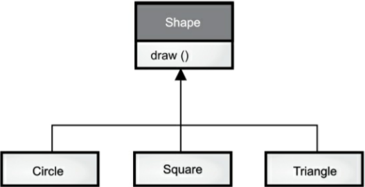

[TOC]

<!-- Type Information -->
# 第十九章 类型信息

> RTTI（RunTime Type Information，运行时类型信息）能够在程序运行时发现和使用类型信息

RTTI 把我们从只能在编译期进行面向类型操作的禁锢中解脱了出来，并且让我们可以使用某些非常强大的程序。对 RTTI 的需要，揭示了面向对象设计中许多有趣（并且复杂）的特性，同时也带来了关于如何组织程序的基本问题。

本章将讨论 Java 是如何在运行时识别对象和类信息的。主要有两种方式：

1. “传统的” RTTI：假定我们在编译时已经知道了所有的类型；
2. “反射”机制：允许我们在运行时发现和使用类的信息。

<!-- The Need for RTTI -->

## 为什么需要 RTTI

下面看一下我们已经很熟悉的一个例子，它使用了多态的类层次结构。基类 `Shape` 是泛化的类型，从它派生出了三个具体类： `Circle` 、`Square` 和 `Triangle`（见下图所示）。



这是一个典型的类层次结构图，基类位于顶部，派生类向下扩展。面向对象编程的一个基本目的是：让代码只操纵对基类(这里即 `Shape` )的引用。这样，如果你想添加一个新类(比如从 `Shape` 派生出 `Rhomboid`)来扩展程序，就不会影响原来的代码。在这个例子中，`Shape` 接口中动态绑定了 `draw()` 方法，这样做的目的就是让客户端程序员可以使用泛化的 `Shape` 引用来调用 `draw()`。`draw()` 方法在所有派生类里都会被覆盖，而且由于它是动态绑定的，所以即使通过 `Shape` 引用来调用它，也能产生恰当的行为，这就是多态。

因此，我们通常会创建一个具体的对象(`Circle`、`Square` 或者 `Triangle`)，把它向上转型成 `Shape` (忽略对象的具体类型)，并且在后面的程序中使用 `Shape` 引用来调用在具体对象中被重载的方法（如 `draw()`）。

代码如下：

```java
// typeinfo/Shapes.java
import java.util.stream.*;

abstract class Shape {
    void draw() { System.out.println(this + ".draw()"); }
    @Override
    public abstract String toString();
}

class Circle extends Shape {
    @Override
    public String toString() { return "Circle"; }
}

class Square extends Shape {
    @Override
    public String toString() { return "Square"; }
}

class Triangle extends Shape {
    @Override
    public String toString() { return "Triangle"; }
}

public class Shapes {
    public static void main(String[] args) {
        Stream.of(
            new Circle(), new Square(), new Triangle())
            .forEach(Shape::draw);
    }
}
```

输出结果：

```
Circle.draw()
Square.draw()
Triangle.draw()
```

基类中包含 `draw()` 方法，它通过传递 `this` 参数传递给 `System.out.println()`，间接地使用 `toString()` 打印类标识符(注意：这里将 `toString()` 声明为 `abstract`，以此强制继承者覆盖该方法，并防止对 `Shape` 的实例化)。如果某个对象出现在字符串表达式中(涉及"+"和字符串对象的表达式)，`toString()` 方法就会被自动调用，以生成表示该对象的 `String`。每个派生类都要覆盖（从 `Object` 继承来的）`toString()` 方法，这样 `draw()` 在不同情况下就打印出不同的消息(多态)。

这个例子中，在把 `Shape` 对象放入 `Stream<Shape>` 中时就会进行向上转型(隐式)，但在向上转型的时候也丢失了这些对象的具体类型。对 `stream` 而言，它们只是 `Shape` 对象。

严格来说，`Stream<Shape>` 实际上是把放入其中的所有对象都当做 `Object` 对象来持有，只是取元素时会自动将其类型转为 `Shape`。这也是 RTTI 最基本的使用形式，因为在 Java 中，所有类型转换的正确性检查都是在运行时进行的。这也正是 RTTI 的含义所在：在运行时，识别一个对象的类型。

另外在这个例子中，类型转换并不彻底：`Object` 被转型为 `Shape` ，而不是 `Circle`、`Square` 或者 `Triangle`。这是因为目前我们只能确保这个 `Stream<Shape>` 保存的都是 `Shape`：

- 编译期，`stream` 和 Java 泛型系统确保放入 `stream` 的都是 `Shape` 对象（`Shape` 子类的对象也可视为 `Shape` 的对象），否则编译器会报错；
- 运行时，自动类型转换确保了从 `stream` 中取出的对象都是 `Shape` 类型。

接下来就是多态机制的事了，`Shape` 对象实际执行什么样的代码，是由引用所指向的具体对象（`Circle`、`Square` 或者 `Triangle`）决定的。这也符合我们编写代码的一般需求，通常，我们希望大部分代码尽可能少了解对象的具体类型，而是只与对象家族中的一个通用表示打交道（本例中即为 `Shape`）。这样，代码会更容易写，更易读和维护；设计也更容易实现，更易于理解和修改。所以多态是面向对象的基本目标。

但是，有时你会碰到一些编程问题，在这些问题中如果你能知道某个泛化引用的具体类型，就可以把问题轻松解决。例如，假设我们允许用户将某些几何形状高亮显示，现在希望找到屏幕上所有高亮显示的三角形；或者，我们现在需要旋转所有图形，但是想跳过圆形(因为圆形旋转没有意义)。这时我们就希望知道 `Stream<Shape>` 里边的形状具体是什么类型，而 Java 实际上也满足了我们的这种需求。使用 RTTI，我们可以查询某个 `Shape` 引用所指向对象的确切类型，然后选择或者剔除特例。

<!-- The Class Object -->
## `Class` 对象

要理解 RTTI 在 Java 中的工作原理，首先必须知道类型信息在运行时是如何表示的。这项工作是由称为 **`Class`对象** 的特殊对象完成的，它包含了与类有关的信息。实际上，`Class` 对象就是用来创建该类所有"常规"对象的。Java 使用 `Class` 对象来实现 RTTI，即便是类型转换这样的操作都是用 `Class` 对象实现的。不仅如此，`Class` 类还提供了很多使用 RTTI 的其它方式。

类是程序的一部分，每个类都有一个 `Class` 对象。换言之，每当我们编写并且编译了一个新类，就会产生一个 `Class` 对象（更恰当的说，是被保存在一个同名的 `.class` 文件中）。为了生成这个类的对象，Java 虚拟机 (JVM) 先会调用"类加载器"子系统把这个类加载到内存中。

类加载器子系统可能包含一条类加载器链，但有且只有一个**原生类加载器**，它是 JVM 实现的一部分。原生类加载器加载的是”可信类”（包括 Java API 类）。它们通常是从本地盘加载的。在这条链中，通常不需要添加额外的类加载器，但是如果你有特殊需求（例如以某种特殊的方式加载类，以支持 Web 服务器应用，或者通过网络下载类），也可以挂载额外的类加载器。

所有的类都是第一次使用时动态加载到 JVM 中的，当程序创建第一个对类的静态成员的引用时，就会加载这个类。

> 其实构造器也是类的静态方法，虽然构造器前面并没有 `static` 关键字。所以，使用 `new` 操作符创建类的新对象，这个操作也算作对类的静态成员引用。

因此，Java 程序在它开始运行之前并没有被完全加载，很多部分是在需要时才会加载。这一点与许多传统编程语言不同，动态加载使得 Java 具有一些静态加载语言（如 C++）很难或者根本不可能实现的特性。

类加载器首先会检查这个类的 `Class` 对象是否已经加载，如果尚未加载，默认的类加载器就会根据类名查找 `.class` 文件（如果有附加的类加载器，这时候可能就会在数据库中或者通过其它方式获得字节码）。这个类的字节码被加载后，JVM 会对其进行验证，确保它没有损坏，并且不包含不良的 Java 代码(这是 Java 安全防范的一种措施)。

一旦某个类的 `Class` 对象被载入内存，它就可以用来创建这个类的所有对象。下面的示范程序可以证明这点：

```java
// typeinfo/SweetShop.java
// 检查类加载器工作方式
class Cookie {
    static { System.out.println("Loading Cookie"); }
}

class Gum {
    static { System.out.println("Loading Gum"); }
}

class Candy {
    static { System.out.println("Loading Candy"); }
}

public class SweetShop {
    public static void main(String[] args) {
        System.out.println("inside main");
        new Candy();
        System.out.println("After creating Candy");
        try {
            Class.forName("Gum");
        } catch(ClassNotFoundException e) {
            System.out.println("Couldn't find Gum");
        }
        System.out.println("After Class.forName(\"Gum\")");
        new Cookie();
        System.out.println("After creating Cookie");
    }
}
```

输出结果：

```
inside main
Loading Candy
After creating Candy
Loading Gum
After Class.forName("Gum")
Loading Cookie
After creating Cookie
```

上面的代码中，`Candy`、`Gum` 和 `Cookie` 这几个类都有一个 `static{...}` 静态初始化块，这些静态初始化块在类第一次被加载的时候就会执行。也就是说，静态初始化块会打印出相应的信息，告诉我们这些类分别是什么时候被加载了。而在主方法里边，创建对象的代码都放在了 `print()` 语句之间，以帮助我们判断类加载的时间点。

从输出中可以看到，`Class` 对象仅在需要的时候才会被加载，`static` 初始化是在类加载时进行的。

代码里面还有特别有趣的一行：

```java
Class.forName("Gum");
```

所有 `Class` 对象都属于 `Class` 类，而且它跟其他普通对象一样，我们可以获取和操控它的引用(这也是类加载器的工作)。`forName()` 是 `Class` 类的一个静态方法，我们可以使用 `forName()` 根据目标类的类名（`String`）得到该类的 `Class` 对象。上面的代码忽略了 `forName()` 的返回值，因为那个调用是为了得到它产生的“副作用”。从结果可以看出，`forName()` 执行的副作用是如果 `Gum` 类没有被加载就加载它，而在加载的过程中，`Gum` 的 `static` 初始化块被执行了。

还需要注意的是，如果 `Class.forName()` 找不到要加载的类，它就会抛出异常 `ClassNotFoundException`。上面的例子中我们只是简单地报告了问题，但在更严密的程序里，就要考虑在异常处理程序中把问题解决掉（具体例子详见[设计模式](./25-Patterns)章节）。

无论何时，只要你想在运行时使用类型信息，就必须先得到那个 `Class` 对象的引用。`Class.forName()` 就是实现这个功能的一个便捷途径，因为使用该方法你不需要先持有这个类型 的对象。但是，如果你已经拥有了目标类的对象，那就可以通过调用 `getClass()` 方法来获取 `Class` 引用了，这个方法来自根类 `Object`，它将返回表示该对象实际类型的 `Class` 对象的引用。`Class` 包含很多有用的方法，下面代码展示了其中的一部分：

```java
// typeinfo/toys/ToyTest.java
// 测试 Class 类
// {java typeinfo.toys.ToyTest}
package typeinfo.toys;

interface HasBatteries {}
interface Waterproof {}
interface Shoots {}

class Toy {
    // 注释下面的无参数构造器会引起 NoSuchMethodError 错误
    Toy() {}
    Toy(int i) {}
}

class FancyToy extends Toy
implements HasBatteries, Waterproof, Shoots {
    FancyToy() { super(1); }
}

public class ToyTest {
    static void printInfo(Class cc) {
        System.out.println("Class name: " + cc.getName() +
            " is interface? [" + cc.isInterface() + "]");
        System.out.println(
            "Simple name: " + cc.getSimpleName());
        System.out.println(
            "Canonical name : " + cc.getCanonicalName());
    }

    public static void main(String[] args) {
        Class c = null;
        try {
            c = Class.forName("typeinfo.toys.FancyToy");
        } catch(ClassNotFoundException e) {
            System.out.println("Can't find FancyToy");
            System.exit(1);
        }

        printInfo(c);
        for(Class face : c.getInterfaces())
            printInfo(face);

        Class up = c.getSuperclass();
        Object obj = null;

        try {
            // Requires no-arg constructor:
            obj = up.newInstance();
        } catch(InstantiationException e) {
            System.out.println("Cannot instantiate");
            System.exit(1);
        } catch(IllegalAccessException e) {
            System.out.println("Cannot access");
            System.exit(1);
        }

        printInfo(obj.getClass());
    }
}
```

输出结果：

```
Class name: typeinfo.toys.FancyToy is interface?
[false]
Simple name: FancyToy
Canonical name : typeinfo.toys.FancyToy
Class name: typeinfo.toys.HasBatteries is interface?
[true]
Simple name: HasBatteries
Canonical name : typeinfo.toys.HasBatteries
Class name: typeinfo.toys.Waterproof is interface?
[true]
Simple name: Waterproof
Canonical name : typeinfo.toys.Waterproof
Class name: typeinfo.toys.Shoots is interface? [true]
Simple name: Shoots
Canonical name : typeinfo.toys.Shoots
Class name: typeinfo.toys.Toy is interface? [false]
Simple name: Toy
Canonical name : typeinfo.toys.Toy
```

`FancyToy` 继承自 `Toy` 并实现了 `HasBatteries`、`Waterproof` 和 `Shoots` 接口。在 `main` 方法中，我们创建了一个 `Class` 引用，然后在 `try` 语句里边用 `forName()` 方法创建了一个 `FancyToy` 的类对象并赋值给该引用。需要注意的是，传递给 `forName()` 的字符串必须使用类的全限定名（包含包名）。

`printInfo()` 函数使用 `getName()` 来产生完整类名，使用 `getSimpleName()` 产生不带包名的类名，`getCanonicalName()` 也是产生完整类名（除内部类和数组外，对大部分类产生的结果与 `getName()` 相同）。`isInterface()` 用于判断某个 `Class` 对象代表的是否为一个接口。因此，通过 `Class` 对象，你可以得到关于该类型的所有信息。

在主方法中调用的 `Class.getInterfaces()` 方法返回的是存放 `Class` 对象的数组，里面的 `Class` 对象表示的是那个类实现的接口。

另外，你还可以调用 `getSuperclass()` 方法来得到父类的 `Class` 对象，再用父类的 `Class` 对象调用该方法，重复多次，你就可以得到一个对象完整的类继承结构。

`Class` 对象的 `newInstance()` 方法是实现“虚拟构造器”的一种途径，虚拟构造器可以让你在不知道一个类的确切类型的时候，创建这个类的对象。在前面的例子中，`up` 只是一个 `Class` 对象的引用，在编译期并不知道这个引用会指向哪个类的 `Class` 对象。当你创建新实例时，会得到一个 `Object` 引用，但是这个引用指向的是 `Toy` 对象。当然，由于得到的是 `Object` 引用，目前你只能给它发送 `Object` 对象能够接受的调用。而如果你想请求具体对象才有的调用，你就得先获取该对象更多的类型信息，并执行某种转型。另外，使用 `newInstance()` 来创建的类，必须带有无参数的构造器。在本章稍后部分，你将会看到如何通过 Java 的反射 API，用任意的构造器来动态地创建类的对象。

### 类字面常量

Java 还提供了另一种方法来生成类对象的引用：**类字面常量**。对上述程序来说，就像这样：`FancyToy.class;`。这样做不仅更简单，而且更安全，因为它在编译时就会受到检查（因此不必放在 `try` 语句块中）。并且它根除了对 `forName()` 方法的调用，所以效率更高。

类字面常量不仅可以应用于普通类，也可以应用于接口、数组以及基本数据类型。另外，对于基本数据类型的包装类，还有一个标准字段 `TYPE`。`TYPE` 字段是一个引用，指向对应的基本数据类型的 `Class` 对象，如下所示：

<figure>
<table style="text-align:center;">
  <thead>
    <tr>
      <th colspan="2">...等价于...</th>
    </tr>
  </thead>
  <tbody>
    <tr>
      <td>boolean.class</td>
      <td>Boolean.TYPE</td>
    </tr>
    <tr>
      <td>char.class</td>
      <td>Character.TYPE</td>
    </tr>
    <tr>
      <td>byte.class</td>
      <td>Byte.TYPE</td>
    </tr>
    <tr>
      <td>short.class</td>
      <td>Short.TYPE</td>
    </tr>
    <tr>
      <td>int.class</td>
      <td>Integer.TYPE</td>
    </tr>
    <tr>
      <td>long.class</td>
      <td>Long.TYPE</td>
    </tr>
    <tr>
      <td>float.class</td>
      <td>Float.TYPE</td>
    </tr>
    <tr>
      <td>double.class</td>
      <td>Double.TYPE</td>
    </tr>
    <tr>
      <td>void.class</td>
      <td>Void.TYPE</td>
    </tr>
  </tbody>
</table>
</figure>

我的建议是使用 `.class` 的形式，以保持与普通类的一致性。

注意，有一点很有趣：当使用 `.class` 来创建对 `Class` 对象的引用时，不会自动地初始化该 `Class` 对象。为了使用类而做的准备工作实际包含三个步骤：

1. **加载**，这是由类加载器执行的。该步骤将查找字节码（通常在 classpath 所指定的路径中查找，但这并非是必须的），并从这些字节码中创建一个 `Class` 对象。

2. **链接**。在链接阶段将验证类中的字节码，为 `static` 字段分配存储空间，并且如果需要的话，将解析这个类创建的对其他类的所有引用。

3. **初始化**。如果该类具有超类，则先初始化超类，执行 `static` 初始化器和 `static` 初始化块。

直到第一次引用一个 `static` 方法（构造器隐式地是 `static`）或者非常量的 `static` 字段，才会进行类初始化。

```java
// typeinfo/ClassInitialization.java
import java.util.*;

class Initable {
    static final int STATIC_FINAL = 47;
    static final int STATIC_FINAL2 =
        ClassInitialization.rand.nextInt(1000);
    static {
        System.out.println("Initializing Initable");
    }
}

class Initable2 {
    static int staticNonFinal = 147;
    static {
        System.out.println("Initializing Initable2");
    }
}

class Initable3 {
    static int staticNonFinal = 74;
    static {
        System.out.println("Initializing Initable3");
    }
}

public class ClassInitialization {
    public static Random rand = new Random(47);
    public static void
    main(String[] args) throws Exception {
        Class initable = Initable.class;
        System.out.println("After creating Initable ref");
        // Does not trigger initialization:
        System.out.println(Initable.STATIC_FINAL);
        // Does trigger initialization:
        System.out.println(Initable.STATIC_FINAL2);
        // Does trigger initialization:
        System.out.println(Initable2.staticNonFinal);
        Class initable3 = Class.forName("Initable3");
        System.out.println("After creating Initable3 ref");
        System.out.println(Initable3.staticNonFinal);
    }
}
```

输出结果：

```
After creating Initable ref
47
Initializing Initable
258
Initializing Initable2
147
Initializing Initable3
After creating Initable3 ref
74
```

初始化有效地实现了尽可能的“惰性”，从对 `initable` 引用的创建中可以看到，仅使用 `.class` 语法来获得对类对象的引用不会引发初始化。但与此相反，使用 `Class.forName()` 来产生 `Class` 引用会立即就进行初始化，如 `initable3`。

如果一个 `static final` 值是“编译期常量”（如 `Initable.staticFinal`），那么这个值不需要对 `Initable` 类进行初始化就可以被读取。但是，如果只是将一个字段设置成为 `static` 和 `final`，还不足以确保这种行为。例如，对 `Initable.staticFinal2` 的访问将强制进行类的初始化，因为它不是一个编译期常量。

如果一个 `static` 字段不是 `final` 的，那么在对它访问时，总是要求在它被读取之前，要先进行链接（为这个字段分配存储空间）和初始化（初始化该存储空间），就像在对 `Initable2.staticNonFinal` 的访问中所看到的那样。

### 泛化的 `Class` 引用

`Class` 引用总是指向某个 `Class` 对象，而 `Class` 对象可以用于产生类的实例，并且包含可作用于这些实例的所有方法代码。它还包含该类的 `static` 成员，因此 `Class` 引用表明了它所指向对象的确切类型，而该对象便是 `Class` 类的一个对象。

<!-- > 译者的理解： `Class` 对象是 `Class` 类产生的对象，而再往深一点说，`Class` 类的 `Class` 对象（`Class.class`）也是其本类产生的对象。即一切皆对象，类也是一种对象。 -->

但是，Java 设计者看准机会，将它的类型变得更具体了一些。Java 引入泛型语法之后，我们可以使用泛型对 `Class` 引用所指向的 `Class` 对象的类型进行限定。在下面的实例中，两种语法都是正确的：

```java
// typeinfo/GenericClassReferences.java

public class GenericClassReferences {
    public static void main(String[] args) {
        Class intClass = int.class;
        Class<Integer> genericIntClass = int.class;
        genericIntClass = Integer.class; // 同一个东西
        intClass = double.class;
        // genericIntClass = double.class; // 非法
    }
}
```

普通的类引用不会产生警告信息。你可以看到，普通的类引用可以重新赋值指向任何其他的 `Class` 对象，但是使用泛型限定的类引用只能指向其声明的类型。通过使用泛型语法，我们可以让编译器强制执行额外的类型检查。

那如果我们希望稍微放松一些限制，应该怎么办呢？乍一看，下面的操作好像是可以的：

```java
Class<Number> geenericNumberClass = int.class;
```

这看起来似乎是起作用的，因为 `Integer` 继承自 `Number`。但事实却是不行，因为 `Integer` 的 `Class` 对象并不是 `Number`的 `Class` 对象的子类（这看起来可能有点诡异，我们将在[泛型](./20-Generics)这一章详细讨论）。

为了在使用 `Class` 引用时放松限制，我们使用了通配符，它是 Java 泛型中的一部分。通配符就是 `?`，表示“任何事物”。因此，我们可以在上例的普通 `Class` 引用中添加通配符，并产生相同的结果：

```java
// typeinfo/WildcardClassReferences.java

public class WildcardClassReferences {
    public static void main(String[] args) {
        Class<?> intClass = int.class;
        intClass = double.class;
    }
}
```

使用 `Class<?>` 比单纯使用 `Class` 要好，虽然它们是等价的，并且单纯使用 `Class` 不会产生编译器警告信息。使用 `Class<?>` 的好处是它表示你并非是碰巧或者由于疏忽才使用了一个非具体的类引用，而是特意为之。

为了创建一个限定指向某种类型或其子类的 `Class` 引用，我们需要将通配符与 `extends` 关键字配合使用，创建一个范围限定。这与仅仅声明 `Class<Number>` 不同，现在做如下声明：

```java
// typeinfo/BoundedClassReferences.java

public class BoundedClassReferences {
    public static void main(String[] args) {
        Class<? extends Number> bounded = int.class;
        bounded = double.class;
        bounded = Number.class;
        // Or anything else derived from Number.
    }
}
```

向 `Class` 引用添加泛型语法的原因只是为了提供编译期类型检查，因此如果你操作有误，稍后就会发现这点。使用普通的 `Class` 引用你要确保自己不会犯错，因为一旦你犯了错误，就要等到运行时才能发现它，很不方便。

下面的示例使用了泛型语法，它保存了一个类引用，稍后又用 `newInstance()` 方法产生类的对象：

```java
// typeinfo/DynamicSupplier.java
import java.util.function.*;
import java.util.stream.*;

class CountedInteger {
    private static long counter;
    private final long id = counter++;
    @Override
    public String toString() { return Long.toString(id); }
}

public class DynamicSupplier<T> implements Supplier<T> {
    private Class<T> type;
    public DynamicSupplier(Class<T> type) {
        this.type = type;
    }
    public T get() {
        try {
            return type.newInstance();
        } catch(InstantiationException |
                        IllegalAccessException e) {
            throw new RuntimeException(e);
        }
    }
    public static void main(String[] args) {
        Stream.generate(
            new DynamicSupplier<>(CountedInteger.class))
            .skip(10)
            .limit(5)
            .forEach(System.out::println);
    }
}
```

输出结果:

```
10
11
12
13
14
```

注意，这个类必须假设与它一起工作的任何类型都有一个无参构造器，否则运行时会抛出异常。编译期对该程序不会产生任何警告信息。

当你将泛型语法用于 `Class` 对象时，`newInstance()` 将返回该对象的确切类型，而不仅仅只是在 `ToyTest.java` 中看到的基类 `Object`。然而，这在某种程度上有些受限：

```java
// typeinfo/toys/GenericToyTest.java
// 测试 Class 类
// {java typeinfo.toys.GenericToyTest}
package typeinfo.toys;

public class GenericToyTest {
    public static void
    main(String[] args) throws Exception {
        Class<FancyToy> ftClass = FancyToy.class;
        // Produces exact type:
        FancyToy fancyToy = ftClass.newInstance();
        Class<? super FancyToy> up =
            ftClass.getSuperclass();
        // This won't compile:
        // Class<Toy> up2 = ftClass.getSuperclass();
        // Only produces Object:
        Object obj = up.newInstance();
    }
}
```

如果你手头的是超类，那编译器将只允许你声明超类引用为“某个类，它是 `FancyToy` 的超类”，就像在表达式 `Class<? super FancyToy>` 中所看到的那样。而不会接收 `Class<Toy>` 这样的声明。这看上去显得有些怪，因为 `getSuperClass()` 方法返回的是基类（不是接口），并且编译器在编译期就知道它是什么类型了（在本例中就是 `Toy.class`），而不仅仅只是"某个类"。不管怎样，正是由于这种含糊性，`up.newInstance` 的返回值不是精确类型，而只是 `Object`。

### `cast()` 方法

Java 中还有用于 `Class` 引用的转型语法，即 `cast()` 方法：

```java
// typeinfo/ClassCasts.java

class Building {}
class House extends Building {}

public class ClassCasts {
    public static void main(String[] args) {
        Building b = new House();
        Class<House> houseType = House.class;
        House h = houseType.cast(b);
        h = (House)b; // ... 或者这样做.
    }
}
```

`cast()` 方法接受参数对象，并将其类型转换为 `Class` 引用的类型。但是，如果观察上面的代码，你就会发现，与实现了相同功能的 `main` 方法中最后一行相比，这种转型好像做了很多额外的工作。

`cast()` 在无法使用普通类型转换的情况下会显得非常有用，在你编写泛型代码（你将在[泛型](./20-Generics)这一章学习到）时，如果你保存了 `Class` 引用，并希望以后通过这个引用来执行转型，你就需要用到 `cast()`。但事实却是这种情况非常少见，我发现整个 Java 类库中，只有一处使用了 `cast()`（在 `com.sun.mirror.util.DeclarationFilter` 中）。

Java 类库中另一个没有任何用处的特性就是 `Class.asSubclass()`，该方法允许你将一个 `Class` 对象转型为更加具体的类型。

## 类型转换检测

直到现在，我们已知的 RTTI 类型包括：

1.  传统的类型转换，如 “`(Shape)`”，由 RTTI 确保转换的正确性，如果执行了一个错误的类型转换，就会抛出一个 `ClassCastException` 异常。

2.  代表对象类型的 `Class` 对象. 通过查询 `Class` 对象可以获取运行时所需的信息.

在 C++ 中，经典的类型转换 “`(Shape)`” 并不使用 RTTI。它只是简单地告诉编译器将这个对象作为新的类型对待. 而 Java 会进行类型检查，这种类型转换一般被称作“类型安全的向下转型”。之所以称作“向下转型”，是因为传统上类继承图是这么画的。将 `Circle` 转换为 `Shape` 是一次向上转型, 将 `Shape` 转换为 `Circle` 是一次向下转型。但是, 因为我们知道 `Circle` 肯定是一个 `Shape`，所以编译器允许我们自由地做向上转型的赋值操作，且不需要任何显式的转型操作。当你给编译器一个 `Shape` 的时候，编译器并不知道它到底是什么类型的 `Shape`——它可能是 `Shape`，也可能是 `Shape` 的子类型，例如 `Circle`、`Square`、`Triangle` 或某种其他的类型。在编译期，编译器只能知道它是 `Shape`。因此，你需要使用显式地进行类型转换，以告知编译器你想转换的特定类型，否则编译器就不允许你执行向下转型赋值。 （编译器将会检查向下转型是否合理，因此它不允许向下转型到实际不是待转型类型的子类类型上）。

RTTI 在 Java 中还有第三种形式，那就是关键字 `instanceof`。它返回一个布尔值，告诉我们对象是不是某个特定类型的实例，可以用提问的方式使用它，就像这个样子：

```java
if(x instanceof Dog)
    ((Dog)x).bark();
```

在将 `x` 的类型转换为 `Dog` 之前，`if` 语句会先检查 `x` 是否是 `Dog` 类型的对象。进行向下转型前，如果没有其他信息可以告诉你这个对象是什么类型，那么使用 `instanceof` 是非常重要的，否则会得到一个 `ClassCastException` 异常。

一般，可能想要查找某种类型（比如要找三角形，并填充为紫色），这时可以轻松地使用 `instanceof` 来度量所有对象。举个例子，假如你有一个类的继承体系，描述了 `Pet`（以及它们的主人，在后面一个例子中会用到这个特性）。在这个继承体系中的每个 `Individual` 都有一个 `id` 和一个可选的名字。尽管下面的类都继承自 `Individual`，但是 `Individual` 类复杂性较高，因此其代码将放在[附录：容器](./Appendix-Collection-Topics)中进行解释说明。正如你所看到的，此处并不需要去了解 `Individual` 的代码——你只需了解你可以创建其具名或不具名的对象，并且每个 `Individual` 都有一个 `id()` 方法，如果你没有为 `Individual` 提供名字，`toString()` 方法只产生类型名。

下面是继承自 `Individual` 的类的继承体系：

```java
// typeinfo/pets/Person.java
package typeinfo.pets;

public class Person extends Individual {
    public Person(String name) { super(name); }
}
```

```java
// typeinfo/pets/Pet.java
package typeinfo.pets;

public class Pet extends Individual {
    public Pet(String name) { super(name); }
    public Pet() { super(); }
}
```

```java
// typeinfo/pets/Dog.java
package typeinfo.pets;

public class Dog extends Pet {
    public Dog(String name) { super(name); }
    public Dog() { super(); }
}
```

```java
// typeinfo/pets/Mutt.java
package typeinfo.pets;

public class Mutt extends Dog {
    public Mutt(String name) { super(name); }
    public Mutt() { super(); }
}
```


```java
// typeinfo/pets/Pug.java
package typeinfo.pets;

public class Pug extends Dog {
    public Pug(String name) { super(name); }
    public Pug() { super(); }
}
```

```java
// typeinfo/pets/Cat.java
package typeinfo.pets;

public class Cat extends Pet {
    public Cat(String name) { super(name); }
    public Cat() { super(); }
}
```

```java
// typeinfo/pets/EgyptianMau.java
package typeinfo.pets;

public class EgyptianMau extends Cat {
    public EgyptianMau(String name) { super(name); }
    public EgyptianMau() { super(); }
}
```

```java
// typeinfo/pets/Manx.java
package typeinfo.pets;

public class Manx extends Cat {
    public Manx(String name) { super(name); }
    public Manx() { super(); }
}
```

```java
// typeinfo/pets/Cymric.java
package typeinfo.pets;

public class Cymric extends Manx {
    public Cymric(String name) { super(name); }
    public Cymric() { super(); }
}
```

```java
// typeinfo/pets/Rodent.java
package typeinfo.pets;

public class Rodent extends Pet {
    public Rodent(String name) { super(name); }
    public Rodent() { super(); }
}
```

```java
// typeinfo/pets/Rat.java
package typeinfo.pets;

public class Rat extends Rodent {
    public Rat(String name) { super(name); }
    public Rat() { super(); }
}
```

```java
// typeinfo/pets/Mouse.java
package typeinfo.pets;

public class Mouse extends Rodent {
    public Mouse(String name) { super(name); }
    public Mouse() { super(); }
}
```

```java
// typeinfo/pets/Hamster.java
package typeinfo.pets;

public class Hamster extends Rodent {
    public Hamster(String name) { super(name); }
    public Hamster() { super(); }
}
```

我们必须显式地为每一个子类编写无参构造器。因为我们有一个带一个参数的构造器，所以编译器不会自动地为我们加上无参构造器。

接下来，我们需要一个类，它可以随机地创建不同类型的宠物，同时，它还可以创建宠物数组和持有宠物的 `List`。为了使这个类更加普遍适用，我们将其定义为抽象类：

```java
// typeinfo/pets/PetCreator.java
// Creates random sequences of Pets
package typeinfo.pets;
import java.util.*;
import java.util.function.*;

public abstract class PetCreator implements Supplier<Pet> {
    private Random rand = new Random(47);

    // The List of the different types of Pet to create:
    public abstract List<Class<? extends Pet>> types();

    public Pet get() { // Create one random Pet
        int n = rand.nextInt(types().size());
        try {
            return types().get(n).newInstance();
        } catch (InstantiationException |
                IllegalAccessException e) {
            throw new RuntimeException(e);
        }
    }
}
```

抽象的 `types()` 方法需要子类来实现，以此来获取 `Class` 对象构成的 `List`（这是模板方法设计模式的一种变体）。注意，其中类的类型被定义为“任何从 `Pet` 导出的类型”，因此 `newInstance()` 不需要转型就可以产生 `Pet`。`get()` 随机的选取出一个 `Class` 对象，然后可以通过 `Class.newInstance()` 来生成该类的新实例。

在调用 `newInstance()` 时，可能会出现两种异常。在紧跟 `try` 语句块后面的 `catch` 子句中可以看到对它们的处理。异常的名字再次成为了一种对错误类型相对比较有用的解释（`IllegalAccessException` 违反了 Java 安全机制，在本例中，表示默认构造器为 `private` 的情况）。

当你创建 `PetCreator` 的子类时，你需要为 `get()` 方法提供 `Pet` 类型的 `List`。`types()` 方法会简单地返回一个静态 `List` 的引用。下面是使用 `forName()` 的一个具体实现：

```java
// typeinfo/pets/ForNameCreator.java
package typeinfo.pets;
import java.util.*;

public class ForNameCreator extends PetCreator {
    private static List<Class<? extends Pet>> types =
            new ArrayList<>();
    // 需要随机生成的类型名:
    private static String[] typeNames = {
            "typeinfo.pets.Mutt",
            "typeinfo.pets.Pug",
            "typeinfo.pets.EgyptianMau",
            "typeinfo.pets.Manx",
            "typeinfo.pets.Cymric",
            "typeinfo.pets.Rat",
            "typeinfo.pets.Mouse",
            "typeinfo.pets.Hamster"
    };

    @SuppressWarnings("unchecked")
    private static void loader() {
        try {
            for (String name : typeNames)
                types.add(
                        (Class<? extends Pet>) Class.forName(name));
        } catch (ClassNotFoundException e) {
            throw new RuntimeException(e);
        }
    }

    static {
        loader();
    }

    @Override
    public List<Class<? extends Pet>> types() {
        return types;
    }
}
```

`loader()` 方法使用 `Class.forName()` 创建了 `Class` 对象的 `List`。这可能会导致 `ClassNotFoundException` 异常，因为你传入的是一个 `String` 类型的参数，它不能再编译期间被确认是否合理。由于 `Pet` 相关的文件在 `typeinfo` 包里面，所以使用它们的时候需要填写完整的包名。

为了使得 `List` 装入的是具体的 `Class` 对象，类型转换是必须的，它会产生一个编译时警告。`loader()` 方法是分开编写的，然后它被放入到一个静态代码块里，因为 `@SuppressWarning` 注解不能够直接放置在静态代码块之上。

为了对 `Pet` 进行计数，我们需要一个能跟踪不同类型的 `Pet` 的工具。`Map` 的是这个需求的首选，我们将 `Pet` 类型名作为键，将保存 `Pet` 数量的 `Integer` 作为值。通过这种方式，你就看可以询问：“有多少个 `Hamster` 对象？”我们可以使用 `instanceof` 来对 `Pet` 进行计数：

```java
// typeinfo/PetCount.java
// 使用 instanceof
import typeinfo.pets.*;
import java.util.*;

public class PetCount {
    static class Counter extends HashMap<String, Integer> {
        public void count(String type) {
            Integer quantity = get(type);
            if (quantity == null)
                put(type, 1);
            else
                put(type, quantity + 1);
        }
    }

    public static void
    countPets(PetCreator creator) {
        Counter counter = new Counter();
        for (Pet pet : Pets.array(20)) {
            // List each individual pet:
            System.out.print(
                    pet.getClass().getSimpleName() + " ");
            if (pet instanceof Pet)
                counter.count("Pet");
            if (pet instanceof Dog)
                counter.count("Dog");
            if (pet instanceof Mutt)
                counter.count("Mutt");
            if (pet instanceof Pug)
                counter.count("Pug");
            if (pet instanceof Cat)
                counter.count("Cat");
            if (pet instanceof EgyptianMau)
                counter.count("EgyptianMau");
            if (pet instanceof Manx)
                counter.count("Manx");
            if (pet instanceof Cymric)
                counter.count("Cymric");
            if (pet instanceof Rodent)
                counter.count("Rodent");
            if (pet instanceof Rat)
                counter.count("Rat");
            if (pet instanceof Mouse)
                counter.count("Mouse");
            if (pet instanceof Hamster)
                counter.count("Hamster");
        }
        // Show the counts:
        System.out.println();
        System.out.println(counter);
    }

    public static void main(String[] args) {
        countPets(new ForNameCreator());
    }
}
```

输出结果：

```
Rat Manx Cymric Mutt Pug Cymric Pug Manx Cymric Rat
EgyptianMau Hamster EgyptianMau Mutt Mutt Cymric Mouse
Pug Mouse Cymric
{EgyptianMau=2, Pug=3, Rat=2, Cymric=5, Mouse=2, Cat=9,
Manx=7, Rodent=5, Mutt=3, Dog=6, Pet=20, Hamster=1}
```

在 `countPets()` 中，一个简短的静态方法 `Pets.array()` 生产出了一个随机动物的集合。每个 `Pet` 都被 `instanceof` 检测到并计算了一遍。

`instanceof` 有一个严格的限制：只可以将它与命名类型进行比较，而不能与 `Class` 对象作比较。在前面的例子中，你可能会觉得写出一大堆 `instanceof` 表达式很乏味，事实也是如此。但是，也没有办法让 `instanceof` 聪明起来，让它能够自动地创建一个 `Class` 对象的数组，然后将目标与这个数组中的对象逐一进行比较（稍后会看到一种替代方案）。其实这并不是那么大的限制，如果你在程序中写了大量的 `instanceof`，那就说明你的设计可能存在瑕疵。

### 使用类字面量

如果我们使用类字面量重新实现 `PetCreator` 类的话，其结果在很多方面都会更清晰：

```java
// typeinfo/pets/LiteralPetCreator.java
// 使用类字面量
// {java typeinfo.pets.LiteralPetCreator}
package typeinfo.pets;
import java.util.*;

public class LiteralPetCreator extends PetCreator {
    // try 代码块不再需要
    @SuppressWarnings("unchecked")
    public static final List<Class<? extends Pet>> ALL_TYPES =
            Collections.unmodifiableList(Arrays.asList(
                    Pet.class, Dog.class, Cat.class, Rodent.class,
                    Mutt.class, Pug.class, EgyptianMau.class,
                    Manx.class, Cymric.class, Rat.class,
                    Mouse.class, Hamster.class));
    // 用于随机创建的类型:
    private static final List<Class<? extends Pet>> TYPES =
            ALL_TYPES.subList(ALL_TYPES.indexOf(Mutt.class),
                    ALL_TYPES.size());

    @Override
    public List<Class<? extends Pet>> types() {
        return TYPES;
    }

    public static void main(String[] args) {
        System.out.println(TYPES);
    }
}
```

输出结果：

```
[class typeinfo.pets.Mutt, class typeinfo.pets.Pug,
class typeinfo.pets.EgyptianMau, class
typeinfo.pets.Manx, class typeinfo.pets.Cymric, class
typeinfo.pets.Rat, class typeinfo.pets.Mouse, class
typeinfo.pets.Hamster]
```


在即将到来的 `PetCount3.java` 示例中，我们用所有 `Pet` 类型预先加载一个 `Map`（不仅仅是随机生成的），因此 `ALL_TYPES` 类型的列表是必要的。`types` 列表是 `ALL_TYPES` 类型（使用 `List.subList()` 创建）的一部分，它包含精确的宠物类型，因此用于随机生成 `Pet`。

这次，`types` 的创建没有被 `try` 块包围，因为它是在编译时计算的，因此不会引发任何异常，不像 `Class.forName()`。

我们现在在 `typeinfo.pets` 库中有两个 `PetCreator` 的实现。为了提供第二个作为默认实现，我们可以创建一个使用 `LiteralPetCreator` 的 *外观模式*：

```java
// typeinfo/pets/Pets.java
// Facade to produce a default PetCreator
package typeinfo.pets;

import java.util.*;
import java.util.stream.*;

public class Pets {
    public static final PetCreator CREATOR = new LiteralPetCreator();

    public static Pet get() {
        return CREATOR.get();
    }

    public static Pet[] array(int size) {
        Pet[] result = new Pet[size];
        for (int i = 0; i < size; i++)
            result[i] = CREATOR.get();
        return result;
    }

    public static List<Pet> list(int size) {
        List<Pet> result = new ArrayList<>();
        Collections.addAll(result, array(size));
        return result;
    }

    public static Stream<Pet> stream() {
        return Stream.generate(CREATOR);
    }
}
```

这还提供了对 `get()`、`array()` 和 `list()` 的间接调用，以及生成 `Stream<Pet>` 的新方法。

因为 `PetCount.countPets()` 采用了 `PetCreator` 参数，所以我们可以很容易地测试 `LiteralPetCreator`（通过上面的外观模式）：

```java
// typeinfo/PetCount2.java
import typeinfo.pets.*;

public class PetCount2 {
    public static void main(String[] args) {
        PetCount.countPets(Pets.CREATOR);
    }
}
```

输出结果：

```
Rat Manx Cymric Mutt Pug Cymric Pug Manx Cymric Rat
EgyptianMau Hamster EgyptianMau Mutt Mutt Cymric Mouse
Pug Mouse Cymric
{EgyptianMau=2, Pug=3, Rat=2, Cymric=5, Mouse=2, Cat=9,
Manx=7, Rodent=5, Mutt=3, Dog=6, Pet=20, Hamster=1}
```

输出与 `PetCount.java` 的输出相同。

### 一个动态 `instanceof` 函数

`Class.isInstance()` 方法提供了一种动态测试对象类型的方法。因此，所有这些繁琐的 `instanceof` 语句都可以从 `PetCount.java` 中删除：

```java
// typeinfo/PetCount3.java
// 使用 isInstance() 方法

import java.util.*;
import java.util.stream.*;

import onjava.*;
import typeinfo.pets.*;

public class PetCount3 {
    static class Counter extends
            LinkedHashMap<Class<? extends Pet>, Integer> {
        Counter() {
            super(LiteralPetCreator.ALL_TYPES.stream()
                    .map(lpc -> Pair.make(lpc, 0))
                    .collect(
                            Collectors.toMap(Pair::key, Pair::value)));
        }

        public void count(Pet pet) {
            // Class.isInstance() 替换 instanceof:
            entrySet().stream()
                    .filter(pair -> pair.getKey().isInstance(pet))
                    .forEach(pair ->
                            put(pair.getKey(), pair.getValue() + 1));
        }

        @Override
        public String toString() {
            String result = entrySet().stream()
                    .map(pair -> String.format("%s=%s",
                            pair.getKey().getSimpleName(),
                            pair.getValue()))
                    .collect(Collectors.joining(", "));
            return "{" + result + "}";
        }
    }

    public static void main(String[] args) {
        Counter petCount = new Counter();
        Pets.stream()
                .limit(20)
                .peek(petCount::count)
                .forEach(p -> System.out.print(
                        p.getClass().getSimpleName() + " "));
        System.out.println("n" + petCount);
    }
}
```

输出结果：

```
Rat Manx Cymric Mutt Pug Cymric Pug Manx Cymric Rat
EgyptianMau Hamster EgyptianMau Mutt Mutt Cymric Mouse
Pug Mouse Cymric
{Rat=2, Pug=3, Mutt=3, Mouse=2, Cat=9, Dog=6, Cymric=5,
EgyptianMau=2, Rodent=5, Hamster=1, Manx=7, Pet=20}
```

为了计算所有不同类型的 `Pet`，`Counter Map` 预先加载了来自 `LiteralPetCreator.ALL_TYPES` 的类型。如果不预先加载 `Map`，将只计数随机生成的类型，而不是像 `Pet` 和 `Cat` 这样的基本类型。

`isInstance()` 方法消除了对 `instanceof` 表达式的需要。此外，这意味着你可以通过更改 `LiteralPetCreator.types` 数组来添加新类型的 `Pet`；程序的其余部分不需要修改（就像使用 `instanceof` 表达式时那样）。

`toString()` 方法被重载，以便更容易读取输出，该输出仍与打印 `Map` 时看到的典型输出匹配。

### 递归计数

`PetCount3.Counter` 中的 `Map` 预先加载了所有不同的 `Pet` 类。我们可以使用 `Class.isAssignableFrom()` 而不是预加载地图，并创建一个不限于计数 `Pet` 的通用工具：

```java
// onjava/TypeCounter.java
// 计算类型家族的实例数
package onjava;
import java.util.*;
import java.util.stream.*;

public class TypeCounter extends HashMap<Class<?>, Integer> {
    private Class<?> baseType;

    public TypeCounter(Class<?> baseType) {
        this.baseType = baseType;
    }

    public void count(Object obj) {
        Class<?> type = obj.getClass();
        if(!baseType.isAssignableFrom(type))
              throw new RuntimeException(
                obj + " incorrect type: " + type +
                ", should be type or subtype of " + baseType);
        countClass(type);
    }

    private void countClass(Class<?> type) {
        Integer quantity = get(type);
        put(type, quantity == null ? 1 : quantity + 1);
        Class<?> superClass = type.getSuperclass();
        if(superClass != null &&
               baseType.isAssignableFrom(superClass))
              countClass(superClass);
    }

    @Override
    public String toString() {
        String result = entrySet().stream()
              .map(pair -> String.format("%s=%s",
                pair.getKey().getSimpleName(),
                pair.getValue()))
              .collect(Collectors.joining(", "));
        return "{" + result + "}";
    }
}
```

`count()` 方法获取其参数的 `Class`，并使用 `isAssignableFrom()` 进行运行时检查，以验证传递的对象实际上属于感兴趣的层次结构。`countClass()` 首先计算类的确切类型。然后，如果 `baseType` 可以从超类赋值，则在超类上递归调用 `countClass()`。

```java
// typeinfo/PetCount4.java
import typeinfo.pets.*;
import onjava.*;

public class PetCount4 {
    public static void main(String[] args) {
        TypeCounter counter = new TypeCounter(Pet.class);
        Pets.stream()
              .limit(20)
              .peek(counter::count)
              .forEach(p -> System.out.print(
                p.getClass().getSimpleName() + " "));
        System.out.println("n" + counter);
  }
}
```

输出结果：

```
Rat Manx Cymric Mutt Pug Cymric Pug Manx Cymric Rat
EgyptianMau Hamster EgyptianMau Mutt Mutt Cymric Mouse
Pug Mouse Cymric
{Dog=6, Manx=7, Cat=9, Rodent=5, Hamster=1, Rat=2,
Pug=3, Mutt=3, Cymric=5, EgyptianMau=2, Pet=20,
Mouse=2}
```

输出表明两个基类型以及精确类型都被计数了。

<!-- Registered Factories -->

## 注册工厂

从 `Pet` 层次结构生成对象的问题是，每当向层次结构中添加一种新类型的 `Pet` 时，必须记住将其添加到 `LiteralPetCreator.java` 的条目中。在一个定期添加更多类的系统中，这可能会成为问题。

你可能会考虑向每个子类添加静态初始值设定项，因此初始值设定项会将其类添加到某个列表中。不幸的是，静态初始值设定项仅在首次加载类时调用，因此存在鸡和蛋的问题：生成器的列表中没有类，因此它无法创建该类的对象，因此类不会被加载并放入列表中。

基本上，你必须自己手工创建列表（除非你编写了一个工具来搜索和分析源代码，然后创建和编译列表）。所以你能做的最好的事情就是把列表集中放在一个明显的地方。层次结构的基类可能是最好的地方。

我们在这里所做的另一个更改是使用*工厂方法*设计模式将对象的创建推迟到类本身。工厂方法可以以多态方式调用，并为你创建适当类型的对象。事实证明，`java.util.function.Supplier` 用 `T get()` 描述了原型工厂方法。协变返回类型允许 `get()` 为 `Supplier` 的每个子类实现返回不同的类型。

在本例中，基类 `Part` 包含一个工厂对象的静态列表，列表成员类型为 `Supplier<Part>`。对于应该由 `get()` 方法生成的类型的工厂，通过将它们添加到 `prototypes` 列表向基类“注册”。奇怪的是，这些工厂本身就是对象的实例。此列表中的每个对象都是用于创建其他对象的*原型*：

```java
// typeinfo/RegisteredFactories.java
// 注册工厂到基础类
import java.util.*;
import java.util.function.*;
import java.util.stream.*;

class Part implements Supplier<Part> {
    @Override
    public String toString() {
        return getClass().getSimpleName();
    }

    static List<Supplier<? extends Part>> prototypes =
        Arrays.asList(
          new FuelFilter(),
          new AirFilter(),
          new CabinAirFilter(),
          new OilFilter(),
          new FanBelt(),
          new PowerSteeringBelt(),
          new GeneratorBelt()
        );

    private static Random rand = new Random(47);
    public Part get() {
        int n = rand.nextInt(prototypes.size());
        return prototypes.get(n).get();
    }
}

class Filter extends Part {}

class FuelFilter extends Filter {
    @Override
    public FuelFilter get() {
        return new FuelFilter();
    }
}

class AirFilter extends Filter {
    @Override
    public AirFilter get() {
        return new AirFilter();
    }
}

class CabinAirFilter extends Filter {
    @Override
    public CabinAirFilter get() {
        return new CabinAirFilter();
    }
}

class OilFilter extends Filter {
    @Override
    public OilFilter get() {
        return new OilFilter();
    }
}

class Belt extends Part {}

class FanBelt extends Belt {
    @Override
    public FanBelt get() {
        return new FanBelt();
    }
}

class GeneratorBelt extends Belt {
    @Override
    public GeneratorBelt get() {
        return new GeneratorBelt();
    }
}

class PowerSteeringBelt extends Belt {
    @Override
    public PowerSteeringBelt get() {
        return new PowerSteeringBelt();
    }
}

public class RegisteredFactories {
    public static void main(String[] args) {
        Stream.generate(new Part())
              .limit(10)
              .forEach(System.out::println);
    }
}
```

输出结果：

```
GeneratorBelt
CabinAirFilter
GeneratorBelt
AirFilter
PowerSteeringBelt
CabinAirFilter
FuelFilter
PowerSteeringBelt
PowerSteeringBelt
FuelFilter
```

并非层次结构中的所有类都应实例化；这里的 `Filter` 和 `Belt` 只是分类器，这样你就不会创建任何一个类的实例，而是只创建它们的子类（请注意，如果尝试这样做，你将获得 `Part` 基类的行为）。

因为 `Part implements Supplier<Part>`，`Part` 通过其 `get()` 方法供应其他 `Part`。如果为基类 `Part` 调用 `get()`（或者如果 `generate()` 调用 `get()`），它将创建随机特定的 `Part` 子类型，每个子类型最终都从 `Part` 继承，并重写相应的 `get()` 以生成它们中的一个。

<!-- Instanceof vs. Class Equivalence -->

## 类的等价比较

当你查询类型信息时，需要注意：instanceof 的形式(即 `instanceof` 或 `isInstance()` ，这两者产生的结果相同) 和 与 Class 对象直接比较 这两者间存在重要区别。下面的例子展示了这种区别：

```java
// typeinfo/FamilyVsExactType.java
// instanceof 与 class 的差别
// {java typeinfo.FamilyVsExactType}
package typeinfo;

class Base {}
class Derived extends Base {}

public class FamilyVsExactType {
    static void test(Object x) {
        System.out.println(
              "Testing x of type " + x.getClass());
        System.out.println(
              "x instanceof Base " + (x instanceof Base));
        System.out.println(
              "x instanceof Derived " + (x instanceof Derived));
        System.out.println(
              "Base.isInstance(x) " + Base.class.isInstance(x));
        System.out.println(
              "Derived.isInstance(x) " +
              Derived.class.isInstance(x));
        System.out.println(
              "x.getClass() == Base.class " +
              (x.getClass() == Base.class));
        System.out.println(
              "x.getClass() == Derived.class " +
              (x.getClass() == Derived.class));
        System.out.println(
              "x.getClass().equals(Base.class)) "+
              (x.getClass().equals(Base.class)));
        System.out.println(
              "x.getClass().equals(Derived.class)) " +
              (x.getClass().equals(Derived.class)));
    }

    public static void main(String[] args) {
        test(new Base());
        test(new Derived());
    }
}
```

输出结果：

```
Testing x of type class typeinfo.Base
x instanceof Base true
x instanceof Derived false
Base.isInstance(x) true
Derived.isInstance(x) false
x.getClass() == Base.class true
x.getClass() == Derived.class false
x.getClass().equals(Base.class)) true
x.getClass().equals(Derived.class)) false
Testing x of type class typeinfo.Derived
x instanceof Base true
x instanceof Derived true
Base.isInstance(x) true
Derived.isInstance(x) true
x.getClass() == Base.class false
x.getClass() == Derived.class true
x.getClass().equals(Base.class)) false
x.getClass().equals(Derived.class)) true
```

`test()` 方法使用两种形式的 `instanceof` 对其参数执行类型检查。然后，它获取 `Class` 引用，并使用 `==` 和 `equals()` 测试 `Class` 对象的相等性。令人放心的是，`instanceof` 和 `isInstance()` 产生的结果相同， `equals()` 和 `==` 产生的结果也相同。但测试本身得出了不同的结论。与类型的概念一致，`instanceof` 说的是“你是这个类，还是从这个类派生的类？”。而如果使用 `==` 比较实际的`Class` 对象，则与继承无关 —— 它要么是确切的类型，要么不是。

<!-- Reflection: Runtime Class Information -->
## 反射：运行时类信息

如果你不知道对象的确切类型，RTTI 会告诉你。但是，有一个限制：必须在编译时知道类型，才能使用 RTTI 检测它，并对信息做一些有用的事情。换句话说，编译器必须知道你使用的所有类。

起初，这看起来并没有那么大的限制，但是假设你引用了一个对不在程序空间中的对象。实际上，该对象的类在编译时甚至对程序都不可用。也许你从磁盘文件或网络连接中获得了大量的字节，并被告知这些字节代表一个类。由于这个类在编译器为你的程序生成代码后很长时间才会出现，你如何使用这样的类？

在传统编程环境中，这是一个牵强的场景。但是，当我们进入一个更大的编程世界时，会有一些重要的情况发生。第一个是基于组件的编程，你可以在应用程序构建器*集成开发环境*中使用*快速应用程序开发*（RAD）构建项目。这是一种通过将表示组件的图标移动到窗体上来创建程序的可视化方法。然后，通过在编程时设置这些组件的一些值来配置这些组件。这种设计时配置要求任何组件都是可实例化的，它公开自己的部分，并且允许读取和修改其属性。此外，处理*图形用户界面*（GUI）事件的组件必须公开有关适当方法的信息，以便 IDE 可以帮助程序员覆写这些事件处理方法。反射提供了检测可用方法并生成方法名称的机制。

在运行时发现类信息的另一个令人信服的动机是提供跨网络在远程平台上创建和执行对象的能力。这称为*远程方法调用*（RMI），它使 Java 程序的对象分布在许多机器上。这种分布有多种原因。如果你想加速一个计算密集型的任务，你可以把它分解成小块放到空闲的机器上。或者你可以将处理特定类型任务的代码（例如，多层次客户机/服务器体系结构中的“业务规则”）放在特定的机器上，这样机器就成为描述这些操作的公共存储库，并且可以很容易地更改它以影响系统中的每个人。分布式计算还支持专门的硬件，这些硬件可能擅长于某个特定的任务——例如矩阵转换——但对于通用编程来说不合适或过于昂贵。

类 `Class` 支持*反射*的概念， `java.lang.reflect` 库中包含类 `Field`、`Method` 和 `Constructor`（每一个都实现了 `Member` 接口）。这些类型的对象由 JVM 在运行时创建，以表示未知类中的对应成员。然后，可以使用 `Constructor` 创建新对象，`get()` 和 `set()` 方法读取和修改与 `Field` 对象关联的字段，`invoke()` 方法调用与 `Method` 对象关联的方法。此外，还可以调用便利方法 `getFields()`、`getMethods()`、`getConstructors()` 等，以返回表示字段、方法和构造函数的对象数组。（你可以通过在 JDK 文档中查找类 `Class` 来了解更多信息。）因此，匿名对象的类信息可以在运行时完全确定，编译时不需要知道任何信息。

重要的是要意识到反射没有什么魔力。当你使用反射与未知类型的对象交互时，JVM 将查看该对象，并看到它属于特定的类（就像普通的 RTTI）。在对其执行任何操作之前，必须加载 `Class` 对象。因此，该特定类型的 `.class` 文件必须在本地计算机上或通过网络对 JVM 仍然可用。因此，RTTI 和反射的真正区别在于，使用 RTTI 时，编译器在编译时会打开并检查 `.class` 文件。换句话说，你可以用“正常”的方式调用一个对象的所有方法。通过反射，`.class` 文件在编译时不可用；它由运行时环境打开并检查。

### 类方法提取器

通常，你不会直接使用反射工具，但它们可以帮助你创建更多的动态代码。反射是用来支持其他 Java 特性的，例如对象序列化（参见[附录：对象序列化](https://lingcoder.github.io/OnJava8/#/book/Appendix-Object-Serialization)）。但是，有时动态提取有关类的信息很有用。

考虑一个类方法提取器。查看类定义的源代码或 JDK 文档，只显示*在该类定义中*定义或重写的方法。但是，可能还有几十个来自基类的可用方法。找到它们既单调又费时[^1]。幸运的是，反射提供了一种方法，可以简单地编写一个工具类自动地向你展示所有的接口：

```java
// typeinfo/ShowMethods.java
// 使用反射展示一个类的所有方法，甚至包括定义在基类中方法
// {java ShowMethods ShowMethods}
import java.lang.reflect.*;
import java.util.regex.*;

public class ShowMethods {
    private static String usage =
            "usage:\n" +
            "ShowMethods qualified.class.name\n" +
            "To show all methods in class or:\n" +
            "ShowMethods qualified.class.name word\n" +
            "To search for methods involving 'word'";
    private static Pattern p = Pattern.compile("\\w+\\.");

    public static void main(String[] args) {
        if (args.length < 1) {
            System.out.println(usage);
            System.exit(0);
        }
        int lines = 0;
        try {
            Class<?> c = Class.forName(args[0]);
            Method[] methods = c.getMethods();
            Constructor[] ctors = c.getConstructors();
            if (args.length == 1) {
                for (Method method : methods)
                    System.out.println(
                            p.matcher(
                                    method.toString()).replaceAll(""));
                for (Constructor ctor : ctors)
                    System.out.println(
                            p.matcher(ctor.toString()).replaceAll(""));
                lines = methods.length + ctors.length;
            } else {
                for (Method method : methods)
                    if (method.toString().contains(args[1])) {
                        System.out.println(p.matcher(
                                method.toString()).replaceAll(""));
                        lines++;
                    }
                for (Constructor ctor : ctors)
                    if (ctor.toString().contains(args[1])) {
                        System.out.println(p.matcher(
                                ctor.toString()).replaceAll(""));
                        lines++;
                    }
            }
        } catch (ClassNotFoundException e) {
            System.out.println("No such class: " + e);
        }
    }
}
```

输出结果：

```
public static void main(String[])
public final void wait() throws InterruptedException
public final void wait(long,int) throws
InterruptedException
public final native void wait(long) throws
InterruptedException
public boolean equals(Object)
public String toString()
public native int hashCode()
public final native Class getClass()
public final native void notify()
public final native void notifyAll()
public ShowMethods()
```

`Class` 方法 `getmethods()` 和 `getconstructors()`  分别返回 `Method` 数组和 `Constructor` 数组。这些类中的每一个都有进一步的方法来解析它们所表示的方法的名称、参数和返回值。但你也可以像这里所做的那样，使用 `toString()`，生成带有整个方法签名的 `String`。代码的其余部分提取命令行信息，确定特定签名是否与目标 `String`（使用 `indexOf()`）匹配，并使用正则表达式（在 [Strings](#ch021.xhtml#strings) 一章中介绍）删除名称限定符。

编译时无法知道 `Class.forName()` 生成的结果，因此所有方法签名信息都是在运行时提取的。如果你研究 JDK 反射文档，你将看到有足够的支持来实际设置和对编译时完全未知的对象进行方法调用（本书后面有这样的例子）。虽然最初你可能认为你永远都不需要这样做，但是反射的全部价值可能会令人惊讶。

上面的输出来自命令行：

```java
java ShowMethods ShowMethods
```

输出包含一个 `public` 无参数构造函数，即使未定义构造函数。你看到的构造函数是由编译器自动合成的。如果将 `ShowMethods` 设置为非 `public` 类（即只有包级访问权），则合成的无参数构造函数将不再显示在输出中。自动为合成的无参数构造函数授予与类相同的访问权。

尝试运行 `java ShowMethods java.lang.String`，并附加一个 `char`、`int`、`String` 等参数。

编程时，当你不记得某个类是否有特定的方法，并且不想在 JDK 文档中搜索索引或类层次结构时，或者如果你不知道该类是否可以对 `Color` 对象执行任何操作时，该工具能节省不少时间。

<!-- Dynamic Proxies -->

## 动态代理

*代理*是基本的设计模式之一。一个对象封装真实对象，代替其提供其他或不同的操作---这些操作通常涉及到与“真实”对象的通信，因此代理通常充当中间对象。这是一个简单的示例，显示代理的结构：

```java
// typeinfo/SimpleProxyDemo.java

interface Interface {
    void doSomething();

    void somethingElse(String arg);
}

class RealObject implements Interface {
    @Override
    public void doSomething() {
        System.out.println("doSomething");
    }

    @Override
    public void somethingElse(String arg) {
        System.out.println("somethingElse " + arg);
    }
}

class SimpleProxy implements Interface {
    private Interface proxied;

    SimpleProxy(Interface proxied) {
        this.proxied = proxied;
    }

    @Override
    public void doSomething() {
        System.out.println("SimpleProxy doSomething");
        proxied.doSomething();
    }

    @Override
    public void somethingElse(String arg) {
        System.out.println(
                "SimpleProxy somethingElse " + arg);
        proxied.somethingElse(arg);
    }
}

class SimpleProxyDemo {
    public static void consumer(Interface iface) {
        iface.doSomething();
        iface.somethingElse("bonobo");
    }

    public static void main(String[] args) {
        consumer(new RealObject());
        consumer(new SimpleProxy(new RealObject()));
    }
}
```

输出结果：

```
doSomething
somethingElse bonobo
SimpleProxy doSomething
doSomething
SimpleProxy somethingElse bonobo
somethingElse bonobo
```

因为 `consumer()` 接受 `Interface`，所以它不知道获得的是 `RealObject` 还是 `SimpleProxy`，因为两者都实现了 `Interface`。
但是，在客户端和 `RealObject` 之间插入的 `SimpleProxy` 执行操作，然后在 `RealObject` 上调用相同的方法。

当你希望将额外的操作与“真实对象”做分离时，代理可能会有所帮助，尤其是当你想要轻松地启用额外的操作时，反之亦然（设计模式就是封装变更---所以你必须改变一些东西以证明模式的合理性）。例如，如果你想跟踪对 `RealObject` 中方法的调用，或衡量此类调用的开销，该怎么办？你不想这部分代码耦合到你的程序中，而代理能使你可以很轻松地添加或删除它。

Java 的*动态代理*更进一步，不仅动态创建代理对象而且动态处理对代理方法的调用。在动态代理上进行的所有调用都被重定向到单个*调用处理程序*，该处理程序负责发现调用的内容并决定如何处理。这是 `SimpleProxyDemo.java` 使用动态代理重写的例子：

```java
// typeinfo/SimpleDynamicProxy.java

import java.lang.reflect.*;

class DynamicProxyHandler implements InvocationHandler {
    private Object proxied;

    DynamicProxyHandler(Object proxied) {
        this.proxied = proxied;
    }

    @Override
    public Object
    invoke(Object proxy, Method method, Object[] args)
            throws Throwable {
        System.out.println(
                "**** proxy: " + proxy.getClass() +
                        ", method: " + method + ", args: " + args);
        if (args != null)
            for (Object arg : args)
                System.out.println("  " + arg);
        return method.invoke(proxied, args);
    }
}

class SimpleDynamicProxy {
    public static void consumer(Interface iface) {
        iface.doSomething();
        iface.somethingElse("bonobo");
    }

    public static void main(String[] args) {
        RealObject real = new RealObject();
        consumer(real);
        // Insert a proxy and call again:
        Interface proxy = (Interface) Proxy.newProxyInstance(
                Interface.class.getClassLoader(),
                new Class[]{Interface.class},
                new DynamicProxyHandler(real));
        consumer(proxy);
    }
}
```

输出结果：

```
doSomething
somethingElse bonobo
**** proxy: class $Proxy0, method: public abstract void
Interface.doSomething(), args: null
doSomething
**** proxy: class $Proxy0, method: public abstract void
Interface.somethingElse(java.lang.String), args:
[Ljava.lang.Object;@6bc7c054
  bonobo
somethingElse bonobo
```

可以通过调用静态方法 `Proxy.newProxyInstance()` 来创建动态代理，该方法需要一个类加载器（通常可以从已加载的对象中获取），希望代理实现的接口列表（不是类或抽象类），以及接口  `InvocationHandler` 的一个实现。动态代理会将所有调用重定向到调用处理程序，因此通常为调用处理程序的构造函数提供对“真实”对象的引用，以便一旦执行中介任务便可以转发请求。

`invoke()` 方法被传递给代理对象，以防万一你必须区分请求的来源---但是在很多情况下都无需关心。但是，在 `invoke()` 内的代理上调用方法时要小心，因为接口的调用是通过代理重定向的。

通常执行代理操作，然后使用 `Method.invoke()` 将请求转发给被代理对象，并携带必要的参数。这在一开始看起来是有限制的，好像你只能执行一般的操作。但是，可以过滤某些方法调用，同时传递其他方法调用：

```java
// typeinfo/SelectingMethods.java
// Looking for particular methods in a dynamic proxy

import java.lang.reflect.*;

class MethodSelector implements InvocationHandler {
    private Object proxied;

    MethodSelector(Object proxied) {
        this.proxied = proxied;
    }

    @Override
    public Object
    invoke(Object proxy, Method method, Object[] args)
            throws Throwable {
        if (method.getName().equals("interesting"))
            System.out.println(
                    "Proxy detected the interesting method");
        return method.invoke(proxied, args);
    }
}

interface SomeMethods {
    void boring1();

    void boring2();

    void interesting(String arg);

    void boring3();
}

class Implementation implements SomeMethods {
    @Override
    public void boring1() {
        System.out.println("boring1");
    }

    @Override
    public void boring2() {
        System.out.println("boring2");
    }

    @Override
    public void interesting(String arg) {
        System.out.println("interesting " + arg);
    }

    @Override
    public void boring3() {
        System.out.println("boring3");
    }
}

class SelectingMethods {
    public static void main(String[] args) {
        SomeMethods proxy =
                (SomeMethods) Proxy.newProxyInstance(
                        SomeMethods.class.getClassLoader(),
                        new Class[]{ SomeMethods.class },
                        new MethodSelector(new Implementation()));
        proxy.boring1();
        proxy.boring2();
        proxy.interesting("bonobo");
        proxy.boring3();
    }
}
```

输出结果：

```
boring1
boring2
Proxy detected the interesting method
interesting bonobo
boring3
```

在这个示例里，我们只是在寻找方法名，但是你也可以寻找方法签名的其他方面，甚至可以搜索特定的参数值。

动态代理不是你每天都会使用的工具，但是它可以很好地解决某些类型的问题。你可以在 Erich Gamma 等人的*设计模式*中了解有关*代理*和其他设计模式的更多信息。 （Addison-Wesley，1995年），以及[设计模式](./25-Patterns.md)一章。

<!-- Using Optional -->

## Optional类

如果你使用内置的 `null` 来表示没有对象，每次使用引用的时候就必须测试一下引用是否为 `null`，这显得有点枯燥，而且势必会产生相当乏味的代码。问题在于 `null` 没什么自己的行为，只会在你想用它执行任何操作的时候产生 `NullPointException`。`java.util.Optional`（首次出现是在[函数式编程](docs/book/13-Functional-Programming.md)这章）为 `null` 值提供了一个轻量级代理，`Optional` 对象可以防止你的代码直接抛出 `NullPointException`。

虽然 `Optional` 是 Java 8 为了支持流式编程才引入的，但其实它是一个通用的工具。为了证明这点，在本节中，我们会把它用在普通的类中。因为涉及一些运行时检测，所以把这一小节放在了本章。

实际上，在所有地方都使用 `Optional` 是没有意义的，有时候检查一下是不是 `null` 也挺好的，或者有时我们可以合理地假设不会出现 `null`，甚至有时候检查 `NullPointException` 异常也是可以接受的。`Optional` 最有用武之地的是在那些“更接近数据”的地方，在问题空间中代表实体的对象上。举个简单的例子，很多系统中都有 `Person` 类型，代码中有些情况下你可能没有一个实际的 `Person` 对象（或者可能有，但是你还没用关于那个人的所有信息）。这时，在传统方法下，你会用到一个 `null` 引用，并且在使用的时候测试它是不是 `null`。而现在，我们可以使用 `Optional`：

```java
// typeinfo/Person.java
// Using Optional with regular classes

import onjava.*;

import java.util.*;

class Person {
    public final Optional<String> first;
    public final Optional<String> last;
    public final Optional<String> address;
    // etc.
    public final Boolean empty;

    Person(String first, String last, String address) {
        this.first = Optional.ofNullable(first);
        this.last = Optional.ofNullable(last);
        this.address = Optional.ofNullable(address);
        empty = !this.first.isPresent()
                && !this.last.isPresent()
                && !this.address.isPresent();
    }

    Person(String first, String last) {
        this(first, last, null);
    }

    Person(String last) {
        this(null, last, null);
    }

    Person() {
        this(null, null, null);
    }

    @Override
    public String toString() {
        if (empty)
            return "<Empty>";
        return (first.orElse("") +
                " " + last.orElse("") +
                " " + address.orElse("")).trim();
    }

    public static void main(String[] args) {
        System.out.println(new Person());
        System.out.println(new Person("Smith"));
        System.out.println(new Person("Bob", "Smith"));
        System.out.println(new Person("Bob", "Smith",
                "11 Degree Lane, Frostbite Falls, MN"));
    }
}
```

输出结果：

```
<Empty>
Smith
Bob Smith
Bob Smith 11 Degree Lane, Frostbite Falls, MN
```

`Person` 的设计有时候又叫“数据传输对象（DTO，data-transfer object）”。注意，所有字段都是 `public` 和 `final` 的，所以没有 `getter` 和 `setter` 方法。也就是说，`Person` 是不可变的，你只能通过构造器给它赋值，之后就只能读而不能修改它的值（字符串本身就是不可变的，因此你无法修改字符串的内容，也无法给它的字段重新赋值）。如果你想修改一个 `Person`，你只能用一个新的 `Person` 对象来替换它。`empty` 字段在对象创建的时候被赋值，用于快速判断这个 `Person` 对象是不是空对象。

如果想使用 `Person`，就必须使用 `Optional` 接口才能访问它的 `String` 字段，这样就不会意外触发 `NullPointException` 了。

现在假设你已经因你惊人的理念而获得了一大笔风险投资，现在你要招兵买马了，但是在虚位以待时，你可以将 `Person Optional` 对象放在每个 `Position` 上：

```java
// typeinfo/Position.java

import java.util.*;

class EmptyTitleException extends RuntimeException {
}

class Position {
    private String title;
    private Person person;

    Position(String jobTitle, Person employee) {
        setTitle(jobTitle);
        setPerson(employee);
    }

    Position(String jobTitle) {
        this(jobTitle, null);
    }

    public String getTitle() {
        return title;
    }

    public void setTitle(String newTitle) {
        // Throws EmptyTitleException if newTitle is null:
        title = Optional.ofNullable(newTitle)
                .orElseThrow(EmptyTitleException::new);
    }

    public Person getPerson() {
        return person;
    }

    public void setPerson(Person newPerson) {
        // Uses empty Person if newPerson is null:
        person = Optional.ofNullable(newPerson)
                .orElse(new Person());
    }

    @Override
    public String toString() {
        return "Position: " + title +
                ", Employee: " + person;
    }

    public static void main(String[] args) {
        System.out.println(new Position("CEO"));
        System.out.println(new Position("Programmer",
                new Person("Arthur", "Fonzarelli")));
        try {
            new Position(null);
        } catch (Exception e) {
            System.out.println("caught " + e);
        }
    }
}
```

输出结果：

```
Position: CEO, Employee: <Empty>
Position: Programmer, Employee: Arthur Fonzarelli
caught EmptyTitleException
```

这里使用 `Optional` 的方式不太一样。请注意，`title` 和 `person` 都是普通字段，不受 `Optional` 的保护。但是，修改这些字段的唯一途径是调用 `setTitle()` 和 `setPerson()` 方法，这两个都借助 `Optional` 对字段进行了严格的限制。

同时，我们想保证 `title` 字段永远不会变成 `null` 值。为此，我们可以自己在 `setTitle()` 方法里边检查参数 `newTitle` 的值。但其实还有更好的做法，函数式编程一大优势就是可以让我们重用经过验证的功能（即便是个很小的功能），以减少自己手动编写代码可能产生的一些小错误。所以在这里，我们用 `ofNullable()` 把 `newTitle` 转换一个 `Optional`（如果传入的值为 `null`，`ofNullable()` 返回的将是 `Optional.empty()`）。紧接着我们调用了 `orElseThrow()` 方法，所以如果 `newTitle` 的值是 `null`，你将会得到一个异常。这里我们并没有把 `title` 保存成 `Optional`，但通过应用 `Optional` 的功能，我们仍然如愿以偿地对这个字段施加了约束。

`EmptyTitleException` 是一个 `RuntimeException`，因为它意味着程序存在错误。在这个方案里边，你仍然可能会得到一个异常。但不同的是，在错误产生的那一刻（向 `setTitle()` 传 `null` 值时）就会抛出异常，而不是发生在其它时刻，需要你通过调试才能发现问题所在。另外，使用 `EmptyTitleException` 还有助于定位 BUG。

`Person` 字段的限制又不太一样：如果你把它的值设为 `null`，程序会自动把将它赋值成一个空的 `Person` 对象。先前我们也用过类似的方法把字段转换成 `Option`，但这里我们是在返回结果的时候使用 `orElse(new Person())` 插入一个空的 `Person` 对象替代了 `null`。

在 `Position` 里边，我们没有创建一个表示“空”的标志位或者方法，因为 `person` 字段的 `Person` 对象为空，就表示这个 `Position` 是个空缺位置。之后，你可能会发现你必须添加一个显式的表示“空位”的方法，但是正如 YAGNI[^2] (You Aren't Going to Need It，你永远不需要它)所言，在初稿时“实现尽最大可能的简单”，直到程序在某些方面要求你为其添加一些额外的特性，而不是假设这是必要的。

请注意，虽然你清楚你使用了 `Optional`，可以免受 `NullPointerExceptions` 的困扰，但是 `Staff` 类却对此毫不知情。

```java
// typeinfo/Staff.java

import java.util.*;

public class Staff extends ArrayList<Position> {
    public void add(String title, Person person) {
        add(new Position(title, person));
    }

    public void add(String... titles) {
        for (String title : titles)
            add(new Position(title));
    }

    public Staff(String... titles) {
        add(titles);
    }

    public Boolean positionAvailable(String title) {
        for (Position position : this)
            if (position.getTitle().equals(title) &&
                    position.getPerson().empty)
                return true;
        return false;
    }

    public void fillPosition(String title, Person hire) {
        for (Position position : this)
            if (position.getTitle().equals(title) &&
                    position.getPerson().empty) {
                position.setPerson(hire);
                return;
            }
        throw new RuntimeException(
                "Position " + title + " not available");
    }

    public static void main(String[] args) {
        Staff staff = new Staff("President", "CTO",
                "Marketing Manager", "Product Manager",
                "Project Lead", "Software Engineer",
                "Software Engineer", "Software Engineer",
                "Software Engineer", "Test Engineer",
                "Technical Writer");
        staff.fillPosition("President",
                new Person("Me", "Last", "The Top, Lonely At"));
        staff.fillPosition("Project Lead",
                new Person("Janet", "Planner", "The Burbs"));
        if (staff.positionAvailable("Software Engineer"))
            staff.fillPosition("Software Engineer",
                    new Person(
                            "Bob", "Coder", "Bright Light City"));
        System.out.println(staff);
    }
}
```

输出结果：

```
[Position: President, Employee: Me Last The Top, Lonely
At, Position: CTO, Employee: <Empty>, Position:
Marketing Manager, Employee: <Empty>, Position: Product
Manager, Employee: <Empty>, Position: Project Lead,
Employee: Janet Planner The Burbs, Position: Software
Engineer, Employee: Bob Coder Bright Light City,
Position: Software Engineer, Employee: <Empty>,
Position: Software Engineer, Employee: <Empty>,
Position: Software Engineer, Employee: <Empty>,
Position: Test Engineer, Employee: <Empty>, Position:
Technical Writer, Employee: <Empty>]
```

注意，在有些地方你可能还是要测试引用是不是 `Optional`，这跟检查是否为 `null` 没什么不同。但是在其它地方（例如本例中的 `toString()` 转换），你就不必执行额外的测试了，而可以直接假设所有对象都是有效的。

### 标记接口

有时候使用一个**标记接口**来表示空值会更方便。标记接口里边什么都没有，你只要把它的名字当做标签来用就可以。

```java
// onjava/Null.java
package onjava;
public interface Null {}
```

如果你用接口取代具体类，那么就可以使用 `DynamicProxy` 来自动地创建 `Null` 对象。假设我们有一个 `Robot` 接口，它定义了一个名字、一个模型和一个描述 `Robot` 行为能力的 `List<Operation>`：

```java
// typeinfo/Robot.java

import onjava.*;

import java.util.*;

public interface Robot {
    String name();

    String model();

    List<Operation> operations();

    static void test(Robot r) {
        if (r instanceof Null)
            System.out.println("[Null Robot]");
        System.out.println("Robot name: " + r.name());
        System.out.println("Robot model: " + r.model());
        for (Operation operation : r.operations()) {
            System.out.println(operation.description.get());
            operation.command.run();
        }
    }
}
```

你可以通过调用 `operations()` 来访问 `Robot` 的服务。`Robot` 里边还有一个 `static` 方法来执行测试。

`Operation` 包含一个描述和一个命令（这用到了**命令模式**）。它们被定义成函数式接口的引用，所以可以把 lambda 表达式或者方法的引用传给 `Operation` 的构造器：

```java
// typeinfo/Operation.java

import java.util.function.*;

public class Operation {
    public final Supplier<String> description;
    public final Runnable command;

    public Operation(Supplier<String> descr, Runnable cmd) {
        description = descr;
        command = cmd;
    }
}
```

现在我们可以创建一个扫雪 `Robot`：

```java
// typeinfo/SnowRemovalRobot.java

import java.util.*;

public class SnowRemovalRobot implements Robot {
    private String name;

    public SnowRemovalRobot(String name) {
        this.name = name;
    }

    @Override
    public String name() {
        return name;
    }

    @Override
    public String model() {
        return "SnowBot Series 11";
    }

    private List<Operation> ops = Arrays.asList(
            new Operation(
                    () -> name + " can shovel snow",
                    () -> System.out.println(
                            name + " shoveling snow")),
            new Operation(
                    () -> name + " can chip ice",
                    () -> System.out.println(name + " chipping ice")),
            new Operation(
                    () -> name + " can clear the roof",
                    () -> System.out.println(
                            name + " clearing roof")));

    public List<Operation> operations() {
        return ops;
    }

    public static void main(String[] args) {
        Robot.test(new SnowRemovalRobot("Slusher"));
    }
}
```

输出结果：

```
Robot name: Slusher
Robot model: SnowBot Series 11
Slusher can shovel snow
Slusher shoveling snow
Slusher can chip ice
Slusher chipping ice
Slusher can clear the roof
Slusher clearing roof
```

假设存在许多不同类型的 `Robot`，我们想让每种 `Robot` 都创建一个 `Null` 对象来执行一些特殊的操作——在本例中，即提供 `Null` 对象所代表 `Robot` 的确切类型信息。这些信息是通过动态代理捕获的：

```java
// typeinfo/NullRobot.java
// Using a dynamic proxy to create an Optional

import java.lang.reflect.*;
import java.util.*;
import java.util.stream.*;

import onjava.*;

class NullRobotProxyHandler
        implements InvocationHandler {
    private String nullName;
    private Robot proxied = new NRobot();

    NullRobotProxyHandler(Class<? extends Robot> type) {
        nullName = type.getSimpleName() + " NullRobot";
    }

    private class NRobot implements Null, Robot {
        @Override
        public String name() {
            return nullName;
        }

        @Override
        public String model() {
            return nullName;
        }

        @Override
        public List<Operation> operations() {
            return Collections.emptyList();
        }
    }

    @Override
    public Object
    invoke(Object proxy, Method method, Object[] args)
            throws Throwable {
        return method.invoke(proxied, args);
    }
}

public class NullRobot {
    public static Robot
    newNullRobot(Class<? extends Robot> type) {
        return (Robot) Proxy.newProxyInstance(
                NullRobot.class.getClassLoader(),
                new Class[] { Null.class, Robot.class },
                new NullRobotProxyHandler(type));
    }

    public static void main(String[] args) {
        Stream.of(
                new SnowRemovalRobot("SnowBee"),
                newNullRobot(SnowRemovalRobot.class)
        ).forEach(Robot::test);
    }
}
```

输出结果：

```
Robot name: SnowBee
Robot model: SnowBot Series 11
SnowBee can shovel snow
SnowBee shoveling snow
SnowBee can chip ice
SnowBee chipping ice
SnowBee can clear the roof
SnowBee clearing roof
[Null Robot]
Robot name: SnowRemovalRobot NullRobot
Robot model: SnowRemovalRobot NullRobot
```

无论何时，如果你需要一个空 `Robot` 对象，只需要调用 `newNullRobot()`，并传递需要代理的 `Robot` 的类型。这个代理满足了 `Robot` 和 `Null` 接口的需要，并提供了它所代理的类型的确切名字。

### Mock 对象和桩

**Mock 对象**和 **桩（Stub）**在逻辑上都是 `Optional` 的变体。他们都是最终程序中所使用的“实际”对象的代理。不过，Mock 对象和桩都是假扮成那些可以传递实际信息的实际对象，而不是像 `Optional` 那样把包含潜在 `null` 值的对象隐藏。

Mock 对象和桩之间的的差别在于程度不同。Mock 对象往往是轻量级的，且用于自测试。通常，为了处理各种不同的测试场景，我们会创建出很多 Mock 对象。而桩只是返回桩数据，它通常是重量级的，并且经常在多个测试中被复用。桩可以根据它们被调用的方式，通过配置进行修改。因此，桩是一种复杂对象，它可以做很多事情。至于 Mock 对象，如果你要做很多事，通常会创建大量又小又简单的 Mock 对象。

<!-- Interfaces and Type -->
## 接口和类型

`interface` 关键字的一个重要目标就是允许程序员隔离组件，进而降低耦合度。使用接口可以实现这一目标，但是通过类型信息，这种耦合性还是会传播出去——接口并不是对解耦的一种无懈可击的保障。比如我们先写一个接口：

```java
// typeinfo/interfacea/A.java
package typeinfo.interfacea;

public interface A {
    void f();
}
```

然后实现这个接口，你可以看到其代码是怎么从实际类型开始顺藤摸瓜的：

```java
// typeinfo/InterfaceViolation.java
// Sneaking around an interface

import typeinfo.interfacea.*;

class B implements A {
    public void f() {
    }

    public void g() {
    }
}

public class InterfaceViolation {
    public static void main(String[] args) {
        A a = new B();
        a.f();
        // a.g(); // Compile error
        System.out.println(a.getClass().getName());
        if (a instanceof B) {
            B b = (B) a;
            b.g();
        }
    }
}
```

输出结果：

```
B
```

通过使用 RTTI，我们发现 `a` 是用 `B` 实现的。通过将其转型为 `B`，我们可以调用不在 `A` 中的方法。

这样的操作完全是合情合理的，但是你也许并不想让客户端开发者这么做，因为这给了他们一个机会，使得他们的代码与你的代码的耦合度超过了你的预期。也就是说，你可能认为 `interface` 关键字正在保护你，但其实并没有。另外，在本例中使用 `B` 来实现 `A` 这种情况是有公开案例可查的[^3]。

一种解决方案是直接声明，如果开发者决定使用实际的类而不是接口，他们需要自己对自己负责。这在很多情况下都是可行的，但“可能”还不够，你或许希望能有一些更严格的控制方式。

最简单的方式是让实现类只具有包访问权限，这样在包外部的客户端就看不到它了：

```java
// typeinfo/packageaccess/HiddenC.java
package typeinfo.packageaccess;

import typeinfo.interfacea.*;

class C implements A {
    @Override
    public void f() {
        System.out.println("public C.f()");
    }

    public void g() {
        System.out.println("public C.g()");
    }

    void u() {
        System.out.println("package C.u()");
    }

    protected void v() {
        System.out.println("protected C.v()");
    }

    private void w() {
        System.out.println("private C.w()");
    }
}

public class HiddenC {
    public static A makeA() {
        return new C();
    }
}
```

在这个包中唯一 `public` 的部分就是 `HiddenC`，在被调用时将产生 `A`接口类型的对象。这里有趣之处在于：即使你从 `makeA()` 返回的是 `C` 类型，你在包的外部仍旧不能使用 `A` 之外的任何方法，因为你不能在包的外部命名 `C`。

现在如果你试着将其向下转型为 `C`，则将被禁止，因为在包的外部没有任何 `C` 类型可用：

```java
// typeinfo/HiddenImplementation.java
// Sneaking around package hiding

import typeinfo.interfacea.*;
import typeinfo.packageaccess.*;

import java.lang.reflect.*;

public class HiddenImplementation {
    public static void main(String[] args) throws Exception {
        A a = HiddenC.makeA();
        a.f();
        System.out.println(a.getClass().getName());
        // Compile error: cannot find symbol 'C':
        /* if(a instanceof C) {
            C c = (C)a;
            c.g();
        } */
        // Oops! Reflection still allows us to call g():
        callHiddenMethod(a, "g");
        // And even less accessible methods!
        callHiddenMethod(a, "u");
        callHiddenMethod(a, "v");
        callHiddenMethod(a, "w");
    }

    static void callHiddenMethod(Object a, String methodName) throws Exception {
        Method g = a.getClass().getDeclaredMethod(methodName);
        g.setAccessible(true);
        g.invoke(a);
    }
}
```

输出结果：

```
public C.f()
typeinfo.packageaccess.C
public C.g()
package C.u()
protected C.v()
private C.w()
```

正如你所看到的，通过使用反射，仍然可以调用所有方法，甚至是 `private` 方法！如果知道方法名，你就可以在其 `Method` 对象上调用 `setAccessible(true)`，就像在 `callHiddenMethod()` 中看到的那样。

你可能觉得，可以通过只发布编译后的代码来阻止这种情况，但其实这并不能解决问题。因为只需要运行 `javap`（一个随 JDK 发布的反编译器）即可突破这一限制。下面是一个使用 `javap` 的命令行：

```shell
javap -private C
```

`-private` 标志表示所有的成员都应该显示，甚至包括私有成员。下面是输出：

```
class typeinfo.packageaccess.C extends
java.lang.Object implements typeinfo.interfacea.A {
  typeinfo.packageaccess.C();
  public void f();
  public void g();
  void u();
  protected void v();
  private void w();
}
```

因此，任何人都可以获取你最私有的方法的名字和签名，然后调用它们。

那如果把接口实现为一个私有内部类，又会怎么样呢？下面展示了这种情况：

```java
// typeinfo/InnerImplementation.java
// Private inner classes can't hide from reflection

import typeinfo.interfacea.*;

class InnerA {
    private static class C implements A {
        public void f() {
            System.out.println("public C.f()");
        }

        public void g() {
            System.out.println("public C.g()");
        }

        void u() {
            System.out.println("package C.u()");
        }

        protected void v() {
            System.out.println("protected C.v()");
        }

        private void w() {
            System.out.println("private C.w()");
        }
    }

    public static A makeA() {
        return new C();
    }
}

public class InnerImplementation {
    public static void
    main(String[] args) throws Exception {
        A a = InnerA.makeA();
        a.f();
        System.out.println(a.getClass().getName());
        // Reflection still gets into the private class:
        HiddenImplementation.callHiddenMethod(a, "g");
        HiddenImplementation.callHiddenMethod(a, "u");
        HiddenImplementation.callHiddenMethod(a, "v");
        HiddenImplementation.callHiddenMethod(a, "w");
    }
}
```

输出结果：

```
public C.f()
InnerA$C
public C.g()
package C.u()
protected C.v()
private C.w()
```

这里对反射仍然没有任何东西可以隐藏。那么如果是匿名类呢？

```java
// typeinfo/AnonymousImplementation.java
// Anonymous inner classes can't hide from reflection

import typeinfo.interfacea.*;

class AnonymousA {
    public static A makeA() {
        return new A() {
            public void f() {
                System.out.println("public C.f()");
            }

            public void g() {
                System.out.println("public C.g()");
            }

            void u() {
                System.out.println("package C.u()");
            }

            protected void v() {
                System.out.println("protected C.v()");
            }

            private void w() {
                System.out.println("private C.w()");
            }
        };
    }
}

public class AnonymousImplementation {
    public static void
    main(String[] args) throws Exception {
        A a = AnonymousA.makeA();
        a.f();
        System.out.println(a.getClass().getName());
        // Reflection still gets into the anonymous class:
        HiddenImplementation.callHiddenMethod(a, "g");
        HiddenImplementation.callHiddenMethod(a, "u");
        HiddenImplementation.callHiddenMethod(a, "v");
        HiddenImplementation.callHiddenMethod(a, "w");
    }
}
```

输出结果：

```
public C.f()
AnonymousA$1
public C.g()
package C.u()
protected C.v()
private C.w()
```

看起来任何方式都没法阻止反射调用那些非公共访问权限的方法。对于字段来说也是这样，即便是 `private` 字段：

```java
// typeinfo/ModifyingPrivateFields.java

import java.lang.reflect.*;

class WithPrivateFinalField {
    private int i = 1;
    private final String s = "I'm totally safe";
    private String s2 = "Am I safe?";

    @Override
    public String toString() {
        return "i = " + i + ", " + s + ", " + s2;
    }
}

public class ModifyingPrivateFields {
    public static void main(String[] args) throws Exception {
        WithPrivateFinalField pf =
                new WithPrivateFinalField();
        System.out.println(pf);
        Field f = pf.getClass().getDeclaredField("i");
        f.setAccessible(true);
        System.out.println(
                "f.getInt(pf): " + f.getInt(pf));
        f.setInt(pf, 47);
        System.out.println(pf);
        f = pf.getClass().getDeclaredField("s");
        f.setAccessible(true);
        System.out.println("f.get(pf): " + f.get(pf));
        f.set(pf, "No, you're not!");
        System.out.println(pf);
        f = pf.getClass().getDeclaredField("s2");
        f.setAccessible(true);
        System.out.println("f.get(pf): " + f.get(pf));
        f.set(pf, "No, you're not!");
        System.out.println(pf);
    }
}
```

输出结果：

```
i = 1, I'm totally safe, Am I safe?
f.getInt(pf): 1
i = 47, I'm totally safe, Am I safe?
f.get(pf): I'm totally safe
i = 47, I'm totally safe, Am I safe?
f.get(pf): Am I safe?
i = 47, I'm totally safe, No, you're not!
```

但实际上 `final` 字段在被修改时是安全的。运行时系统会在不抛出异常的情况下接受任何修改的尝试，但是实际上不会发生任何修改。

通常，所有这些违反访问权限的操作并不是什么十恶不赦的。如果有人使用这样的技术去调用标志为 `private` 或包访问权限的方法（很明显这些访问权限表示这些人不应该调用它们），那么对他们来说，如果你修改了这些方法的某些地方，他们不应该抱怨。另一方面，总是在类中留下后门，也许会帮助你解决某些特定类型的问题（这些问题往往除此之外，别无它法）。总之，不可否认，反射给我们带来了很多好处。

程序员往往对编程语言提供的访问控制过于自信，甚至认为 Java 在安全性上比其它提供了（明显）更宽松的访问控制的语言要优越[^4]。然而，正如你所看到的，事实并不是这样。

<!-- Summary -->
## 本章小结

RTTI 允许通过匿名类的引用来获取类型信息。初学者极易误用它，因为在学会使用多态调用方法之前，这么做也很有效。有过程化编程背景的人很容易把程序组织成一系列 `switch` 语句，你可以用 RTTI 和 `switch` 实现功能，但这样就损失了多态机制在代码开发和维护过程中的重要价值。面向对象编程语言是想让我们尽可能地使用多态机制，只在非用不可的时候才使用 RTTI。

然而使用多态机制的方法调用，要求我们拥有基类定义的控制权。因为在你扩展程序的时候，可能会发现基类并未包含我们想要的方法。如果基类来自别人的库，这时 RTTI 便是一种解决之道：可继承一个新类，然后添加你需要的方法。在代码的其它地方，可以检查你自己特定的类型，并调用你自己的方法。这样做不会破坏多态性以及程序的扩展能力，因为这样添加一个新的类并不需要修改程序中的 `switch` 语句。但如果想在程序中增加具有新特性的代码，你就必须使用 RTTI 来检查这个特定的类型。

如果只是为了方便某个特定的类，就将某个特性放进基类里边，这将使得从那个基类派生出的所有其它子类都带有这些可能毫无意义的东西。这会导致接口更加不清晰，因为我们必须覆盖从基类继承而来的所有抽象方法，事情就变得很麻烦。举个例子，现在有一个表示乐器 `Instrument` 的类层次结构。假设我们想清理管弦乐队中某些乐器残留的口水，一种办法是在基类 `Instrument` 中放入 `clearSpitValve()` 方法。但这样做会导致类结构混乱，因为这意味着打击乐器 `Percussion`、弦乐器 `Stringed` 和电子乐器 `Electronic` 也需要清理口水。在这个例子中，RTTI 可以提供一种更合理的解决方案。可以将 `clearSpitValve()` 放在某个合适的类中，在这个例子中是管乐器 `Wind`。不过，在这里你可能会发现还有更好的解决方法，就是将 `prepareInstrument()` 放在基类中，但是初次面对这个问题的读者可能想不到还有这样的解决方案，而误认为必须使用 RTTI。

最后一点，RTTI 有时候也能解决效率问题。假设你的代码运用了多态，但是为了实现多态，导致其中某个对象的效率非常低。这时候，你就可以挑出那个类，使用 RTTI 为它编写一段特别的代码以提高效率。然而必须注意的是，不要太早地关注程序的效率问题，这是个诱人的陷阱。最好先让程序能跑起来，然后再去看看程序能不能跑得更快，下一步才是去解决效率问题（比如使用 Profiler）[^5]。

我们已经看到，反射，因其更加动态的编程风格，为我们开创了编程的新世界。但对有些人来说，反射的动态特性却是一种困扰。对那些已经习惯于静态类型检查的安全性的人来说，Java 中允许这种动态类型检查（只在运行时才能检查到，并以异常的形式上报检查结果）的操作似乎是一种错误的方向。有些人想得更远，他们认为引入运行时异常本身就是一种指示，指示我们应该避免这种代码。我发现这种意义的安全是一种错觉，因为总是有些事情是在运行时才发生并抛出异常的，即使是在那些不包含任何 `try` 语句块或异常声明的程序中也是如此。因此，我认为一致性错误报告模型的存在使我们能够通过使用反射编写动态代码。当然，尽力编写能够进行静态检查的代码是有价值的，只要你有这样的能力。但是我相信动态代码是将 Java 与其它诸如 C++ 这样的语言区分开的重要工具之一。

[^1]: 特别是在过去。但现在 Java 的 HTML 文档有了很大的提升，要查看基类的方法已经变得很容易了。

[^2]: 这是极限编程（XP，Extreme Programming）的原则之一：“Try the simplest thing that could possibly work，实现尽最大可能的简单。”

[^3]: 最著名的例子是 Windows 操作系统，Windows 为开发者提供了公开的 API，但是开发者还可以找到一些非公开但是可以调用的函数。为了解决问题，很多程序员使用了隐藏的 API 函数。这就迫使微软公司要像维护公开 API 一样维护这些隐藏的 API，消耗了巨大的成本和精力。

[^4]: 比如，Python 中在元素前面添加双下划线 `__`，就表示你想隐藏这个元素。如果你在类或者包外面调用了这个元素，运行环境就会报错。

[^5]: 译者注：Java Profiler 是一种 Java 性能分析工具，用于在 JVM 级别监视 Java 字节码的构造和执行。主流的 Profiler 有 JProfiler、YourKit 和 Java VisualVM 等。

<!-- 分页 -->

<div style="page-break-after: always;"></div>
