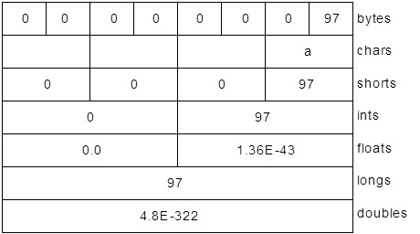
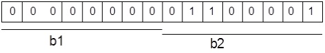
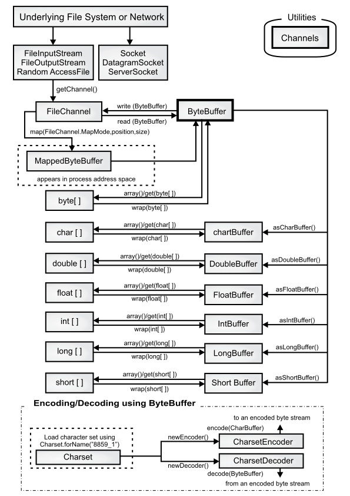
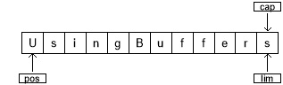
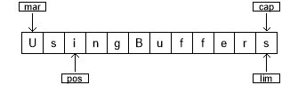
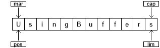
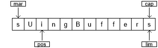
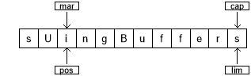

[TOC]

<!-- Appendix: New I/O -->
# 附录:新IO


> Java 新I/O 库是在 1.4 版本引入到 `Java .nio.* package` 中的，旨在更快速。

实际上，新 I/O 使用 **NIO**（同步非阻塞）的方式重写了老的 I/O 了，因此它获得了 **NIO** 的种种优点。即使我们不显式地使用 **NIO** 方式来编写代码，也能带来性能和速度的提高。这种提升不仅仅体现在文件读写（File I/O），同时也体现在网络读写（Network I/O）中。例如，网络编程。

速度的提升来自于使用了更接近操作系统 I/O 执行方式的结构：**Channel**（通道） 和 **Buffer**（缓冲区）。我们可以想象一个煤矿：通道就是连接矿层（数据）的矿井，缓冲区是运送煤矿的小车。通过小车装煤，再从车里取矿。换句话说，我们不能直接和 **Channel** 交互; 我们需要与 **Buffer** 交互并将 **Buffer** 中的数据发送到 **Channel** 中；**Channel** 需要从 **Buffer** 中提取或放入数据。

本篇我们将深入探讨 `nio` 包。虽然 像 I/O 流这样的高级库使用了 **NIO**，但多数时候，我们考虑这个层次的问题。使用Java 7 和 8 版本，理想情况下我们甚至不必费心去处理 I/O 流。当然，一些特殊情况除外。在[文件](./17-Files.md)（**File**）一章中基本涵盖了我们日常使用的相关内容。只有在遇到性能瓶颈（例如内存映射文件）或创建自己的 I/O 库时，我们才需要去理解 **NIO**。


<!-- ByteBufferS -->
## ByteBuffer


有且仅有 **ByteBuffer**（字节缓冲区，保存原始字节的缓冲区）这一类型可直接与通道交互。查看 `java.nio.`**ByteBuffer** 的 JDK 文档，你会发现它是相当基础的：通过初始化某个大小的存储空间，再使用一些方法以原始字节形式或原始数据类型来放置和获取数据。但是我们无法直接存放对象，即使是最基本的 **String** 类型数据。这是一个相当底层的操作，也正因如此，使得它与大多数操作系统的映射更加高效。


旧式 I/O 中的三个类分别被更新成 **FileChannel**（文件通道），分别是：**FileInputStream**、**FileOutputStream**，以及用于读写的 **RandomAccessFile** 类。

注意，这些都是符合底层 **NIO** 特性的字节操作流。 另外，还有 **Reader** 和 **Writer** 字符模式的类是不产生通道的。但 `java.nio.channels.`**Channels** 类具有从通道中生成 **Reader** 和 **Writer** 的实用方法。

下面来练习上述三种类型的流生成可读、可写、可读/写的通道：

```java
// (c)2017 MindView LLC: see Copyright.txt
// 我们不保证这段代码用于其他用途时是否有效
// 访问 http://OnJava8.com 了解更多信息
// 从流中获取通道
import java.nio.*;
import java.nio.channels.*;
import java.io.*;

public class GetChannel {
  private static String name = "data.txt";
  private static final int BSIZE = 1024;
  public static void main(String[] args) {
    // 写入一个文件:
    try(
      FileChannel fc = new FileOutputStream(name)
        .getChannel()
    ) {
      fc.write(ByteBuffer
        .wrap("Some text ".getBytes()));
    } catch(IOException e) {
      throw new RuntimeException(e);
    }
    // 在文件尾添加：
    try(
      FileChannel fc = new RandomAccessFile(
        name, "rw").getChannel()
    ) {
      fc.position(fc.size()); // 移动到结尾
      fc.write(ByteBuffer
        .wrap("Some more".getBytes()));
    } catch(IOException e) {
      throw new RuntimeException(e);
    }
    // 读取文件e:
    try(
      FileChannel fc = new FileInputStream(name)
        .getChannel()
    ) {
      ByteBuffer buff = ByteBuffer.allocate(BSIZE);
      fc.read(buff);
      buff.flip();
      while(buff.hasRemaining())
        System.out.write(buff.get());
    } catch(IOException e) {
      throw new RuntimeException(e);
    }
    System.out.flush();
  }
}
```

输出结果：

```
Some text Some more
```

我们这里所讲的任何流类，都可以通过调用 `getChannel( )` 方法生成一个 **FileChannel**（文件通道）。**FileChannel** 的操作相当基础：操作 **ByteBuffer**  来用于读写，并独占式访问和锁定文件区域(稍后将对此进行描述)。

将字节放入 **ByteBuffer** 的一种方法是直接调用 `put()` 方法将一个或多个字节放入 **ByteBuffer**；当然也可以是其它基本类型的数据。此外，参考上例，我们还可以调用 `wrap()` 方法包装现有字节数组到 **ByteBuffer**。执行此操作时，不会复制底层数组，而是将其用作生成的 **ByteBuffer** 存储。这样产生的 **ByteBuffer** 是数组“支持”的。

data.txt 文件被 **RandomAccessFile** 重新打开。**注意**，你可以在文件中移动 **FileChanne**。 在这里，它被移动到末尾，以便添加额外的写操作。

对于只读访问，必须使用静态 `allocate()` 方法显式地分配 **ByteBuffer**。**NIO** 的目标是快速移动大量数据，因此 **ByteBuffer** 的大小应该很重要 —— 实际上，这里设置的 1K 都可能偏小了(我们在工作中应该反复测试以找到最佳大小)。

通过使用 `allocateDirect()` 而不是 `allocate()` 来生成与操作系统具备更高耦合度的“直接”缓冲区，也有可能获得更高的速度。然而，这种分配的开销更大，而且实际效果因操作系统的不同而有所不同，因此，在工作中你必须再次测试程序，以检验直接缓冲区是否能为你带来速度上的优势。

一旦调用 **FileChannel** 类的 `read()` 方法将字节数据存储到 **ByteBuffer** 中，你还必须调用缓冲区上的 `flip()` 方法来准备好提取字节（这听起来有点粗糙，实际上这已是非常低层的操作，且为了达到最高速度）。如果要进一步调用 `read()` 来使用 **ByteBuffer** ，还需要每次 `clear()` 来准备缓冲区。下面是个简单的代码示例:

```java
// newio/ChannelCopy.java

// 使用 channels and buffers 移动文件
// {java ChannelCopy ChannelCopy.java test.txt}
import java.nio.*;
import java.nio.channels.*;
import java.io.*;

public class ChannelCopy {
  private static final int BSIZE = 1024;
  public static void main(String[] args) {
    if(args.length != 2) {
      System.out.println(
        "arguments: sourcefile destfile");
      System.exit(1);
    }
    try(
      FileChannel in = new FileInputStream(
        args[0]).getChannel();
      FileChannel out = new FileOutputStream(
        args[1]).getChannel()
    ) {
      ByteBuffer buffer = ByteBuffer.allocate(BSIZE);
      while(in.read(buffer) != -1) {
        buffer.flip(); // 准备写入
        out.write(buffer);
        buffer.clear();  // 准备读取
      }
    } catch(IOException e) {
      throw new RuntimeException(e);
    }
  }
}

```

**FileChannel** 用于读取；**FileChannel** 用于写入。当 **ByteBuffer** 分配好存储，调用 **FileChannel** 的 `read()` 方法返回 **-1**（毫无疑问，这是来源于 Unix 和 C 语言）时，说明输入流读取完了。在每次 `read()` 将数据放入缓冲区之后，`flip()` 都会准备好缓冲区，以便 `write()` 提取它的信息。在 `write()` 之后，数据仍然在缓冲区中，我们需要 `clear()` 来重置所有内部指针，以便在下一次 `read()` 中接受数据。 

但是，上例并不是处理这种操作的理想方法。方法 `transferTo()` 和 `transferFrom()` 允许你直接连接此通道到彼通道：

```java
// newio/TransferTo.java

// 使用 transferTo() 在通道间传输
// {java TransferTo TransferTo.java TransferTo.txt}
import java.nio.channels.*;
import java.io.*;

public class TransferTo {
  public static void main(String[] args) {
    if(args.length != 2) {
      System.out.println(
        "arguments: sourcefile destfile");
      System.exit(1);
    }
    try(
      FileChannel in = new FileInputStream(
        args[0]).getChannel();
      FileChannel out = new FileOutputStream(
        args[1]).getChannel()
    ) {
      in.transferTo(0, in.size(), out);
      // Or:
      // out.transferFrom(in, 0, in.size());
    } catch(IOException e) {
      throw new RuntimeException(e);
    }
  }
}
```

可能不会经常用到，但知道这一点很好。


<!-- Converting Data -->
## 数据转换


为了将 **GetChannel.java** 文件中的信息打印出来。在 Java 中，我们每次提取一个字节的数据并将其转换为字符。看起来很简单 —— 如果你有看过 `ava.nio.`**CharBuffer**  类，你会发现一个 `toString()` 方法。该方法的作用是“返回一个包含此缓冲区字符的字符串”。

既然 **ByteBuffer** 可以通过 **CharBuffer** 类的 `asCharBuffer()` 方法查看，那我们就来尝试一样。从下面输出语句的第一行可以看出，这并不正确：

```java
// newio/BufferToText.java
// (c)2017 MindView LLC: see Copyright.txt
// 我们无法保证该代码是否适用于其他用途。
// 访问 http://OnJava8.com 了解更多本书信息。
// text 和 ByteBuffers 互转
import java.nio.*;
import java.nio.channels.*;
import java.nio.charset.*;
import java.io.*;

public class BufferToText {
  private static final int BSIZE = 1024;
  public static void main(String[] args) {

    try(
      FileChannel fc = new FileOutputStream(
        "data2.txt").getChannel()
    ) {
      fc.write(ByteBuffer.wrap("Some text".getBytes()));
    } catch(IOException e) {
      throw new RuntimeException(e);
    }

    ByteBuffer buff = ByteBuffer.allocate(BSIZE);

    try(
      FileChannel fc = new FileInputStream(
        "data2.txt").getChannel()
    ) {
      fc.read(buff);
    } catch(IOException e) {
      throw new RuntimeException(e);
    }

    buff.flip();
    // 无法运行
    System.out.println(buff.asCharBuffer());
    // 使用默认系统默认编码解码
    buff.rewind();
    String encoding =
      System.getProperty("file.encoding");
    System.out.println("Decoded using " +
      encoding + ": "
      + Charset.forName(encoding).decode(buff));

    // 编码和打印
    try(
      FileChannel fc = new FileOutputStream(
        "data2.txt").getChannel()
    ) {
      fc.write(ByteBuffer.wrap(
        "Some text".getBytes("UTF-16BE")));
    } catch(IOException e) {
      throw new RuntimeException(e);
    }

    // 尝试再次读取：
    buff.clear();
    try(
      FileChannel fc = new FileInputStream(
        "data2.txt").getChannel()
    ) {
      fc.read(buff);
    } catch(IOException e) {
      throw new RuntimeException(e);
    }

    buff.flip();
    System.out.println(buff.asCharBuffer());
    // 通过 CharBuffer 写入：
    buff = ByteBuffer.allocate(24);
    buff.asCharBuffer().put("Some text");

    try(
      FileChannel fc = new FileOutputStream(
        "data2.txt").getChannel()
    ) {
      fc.write(buff);
    } catch(IOException e) {
      throw new RuntimeException(e);
    }
    // 读取和显示：
    buff.clear();

    try(
      FileChannel fc = new FileInputStream(
        "data2.txt").getChannel()
    ) {
      fc.read(buff);
    } catch(IOException e) {
      throw new RuntimeException(e);
    }

    buff.flip();
    System.out.println(buff.asCharBuffer());
  }
}
```

输出结果：

```
????
Decoded using windows-1252: Some text
Some text
Some textNULNULNUL
```

缓冲区包含普通字节，为了将这些字节转换为字符，我们必须在输入时对它们进行编码(这样它们输出时就有意义了)，或者在输出时对它们进行解码。我们可以使用 `java.nio.charset.`**Charset** 字符集工具类来完成。代码示例：

```java
// newio/AvailableCharSets.java
// (c)2017 MindView LLC: see Copyright.txt
// 我们无法保证该代码是否适用于其他用途。
// 访问 http://OnJava8.com 了解更多本书信息。
// 展示 Charsets 和 aliases
import java.nio.charset.*;
import java.util.*;

public class AvailableCharSets {

  public static void main(String[] args) {
      SortedMap<String,Charset> charSets =
      Charset.availableCharsets();

    for(String csName : charSets.keySet()) {
      System.out.print(csName);
      Iterator aliases = charSets.get(csName)
        .aliases().iterator();
      if(aliases.hasNext())
        System.out.print(": ");
        
      while(aliases.hasNext()) {
        System.out.print(aliases.next());
        if(aliases.hasNext())
          System.out.print(", ");
      }
      System.out.println();
    }
  }
}
```

输出结果：

```
Big5: csBig5
Big5-HKSCS: big5-hkscs, big5hk, Big5_HKSCS, big5hkscs
CESU-8: CESU8, csCESU-8
EUC-JP: csEUCPkdFmtjapanese, x-euc-jp, eucjis,
Extended_UNIX_Code_Packed_Format_for_Japanese, euc_jp,
eucjp, x-eucjp
EUC-KR: ksc5601-1987, csEUCKR, ksc5601_1987, ksc5601,
5601,
euc_kr, ksc_5601, ks_c_5601-1987, euckr
GB18030: gb18030-2000
GB2312: gb2312, euc-cn, x-EUC-CN, euccn, EUC_CN,
gb2312-80,
gb2312-1980
                  ...
```


回到 **BufferToText.java** 中，如果你 `rewind()` 缓冲区（回到数据的开头），使用该平台的默认字符集 `decode()` 数据，那么生成的 **CharBuffer** 数据将在控制台上正常显示。可以通过 `System.getProperty(“file.encoding”)` 方法来查看平台默认字符集名称。传递该名称参数到 `Charset.forName()` 方法可以生成对应的 `Charset` 对象用于解码字符串。

另一种方法是使用字符集 `encode()` 方法，该字符集在读取文件时生成可打印的内容，如你在 **BufferToText.java**  的第三部分中所看到的。上例中，**UTF-16BE** 被用于将文本写入文件，当文本被读取时，你所要做的就是将其转换为 **CharBuffer**，并生成预期的文本。

最后，如果将 **CharBuffer** 写入 **ByteBuffer**，你会看到发生了什么(更多详情，稍后了解)。**注意**，为 **ByteBuffer** 分配了24个字节，按照每个字符占用 2 个自字节， 12 个字符的空间已经足够了。由于“some text”只有 9 个字符，受其 `toString()` 方法影响，剩下的 0 字节部分也出现在了 **CharBuffer** 的展示中，如输出所示。


<!-- Fetching Primitives -->
## 基本类型获取


虽然 **ByteBuffer** 只包含字节，但它包含了一些方法，用于从其所包含的字节中生成各种不同的基本类型数据。代码示例：

```java
// newio/GetData.java
// (c)2017 MindView LLC: see Copyright.txt
// 我们无法保证该代码是否适用于其他用途。
// 访问 http://OnJava8.com 了解更多本书信息。
// 从 ByteBuffer 中获取不同的数据展示
import java.nio.*;

public class GetData {
  private static final int BSIZE = 1024;
  public static void main(String[] args) {
    ByteBuffer bb = ByteBuffer.allocate(BSIZE);
    // 自动分配 0 到 ByteBuffer:
    int i = 0;
    while(i++ < bb.limit())
      if(bb.get() != 0)
        System.out.println("nonzero");
    System.out.println("i = " + i);
    bb.rewind();
    // 保存和读取 char 数组:
    bb.asCharBuffer().put("Howdy!");
    char c;
    while((c = bb.getChar()) != 0)
      System.out.print(c + " ");
    System.out.println();
    bb.rewind();
    // 保存和读取 short:
    bb.asShortBuffer().put((short)471142);
    System.out.println(bb.getShort());
    bb.rewind();
    // 保存和读取 int:
    bb.asIntBuffer().put(99471142);
    System.out.println(bb.getInt());
    bb.rewind();
    // 保存和读取 long:
    bb.asLongBuffer().put(99471142);
    System.out.println(bb.getLong());
    bb.rewind();
    // 保存和读取 float:
    bb.asFloatBuffer().put(99471142);
    System.out.println(bb.getFloat());
    bb.rewind();
    // 保存和读取 double:
    bb.asDoubleBuffer().put(99471142);
    System.out.println(bb.getDouble());
    bb.rewind();
  }
}
```

输出结果：

```
i = 1025
H o w d y !
12390
99471142
99471142
9.9471144E7
9.9471142E7
```

在分配 **ByteBuffer** 之后，我们检查并确认它的 1,024 元素被初始化为 0。（截至到达 `limit()` 结果的位置）。

将基本类型数据插入 **ByteBuffer** 的最简单方法就是使用 `asCharBuffer()`、`asShortBuffer()` 等方法获取该缓冲区适当的“视图”（View），然后调用该“视图”的 `put()` 方法。

这是针对每种基本数据类型执行的。其中唯一有点奇怪的是 **ShortBuffer** 的 `put()`，它需要类型强制转换。其他视图缓冲区不需要在其 `put()` 方法中进行转换。


<!-- View Buffers -->
## 视图缓冲区


“视图缓冲区”（view buffer）是通过特定的基本类型的窗口来查看底层 **ByteBuffer**。**ByteBuffer** 仍然是“支持”视图的实际存储，因此对视图所做的任何更改都反映在对 **ByteBuffer** 中的数据的修改中。

如前面的示例所示，这方便地将基本类型插入 **ByteBuffer**。视图缓冲区还可以从 **ByteBuffer** 读取基本类型数据，每次单个（**ByteBuffer** 规定），或者批量读取到数组。下面是一个通过 **IntBuffer** 在 **ByteBuffer** 中操作 **int** 的例子：

```java
// newio/IntBufferDemo.java
// (c)2017 MindView LLC: see Copyright.txt
// 我们无法保证该代码是否适用于其他用途。
// 访问 http://OnJava8.com 了解更多本书信息。
// 利用 IntBuffer 保存 int 数据到 ByteBuffer
import java.nio.*;

public class IntBufferDemo {
  private static final int BSIZE = 1024;
  public static void main(String[] args) {
    ByteBuffer bb = ByteBuffer.allocate(BSIZE);
    IntBuffer ib = bb.asIntBuffer();
    // 保存 int 数组：
    ib.put(new int[]{ 11, 42, 47, 99, 143, 811, 1016 });
    //绝对位置读写：
    System.out.println(ib.get(3));
    ib.put(3, 1811);
    // 在重置缓冲区前设置新的限制
    
    ib.flip();
    while(ib.hasRemaining()) {
      int i = ib.get();
      System.out.println(i);
    }
  }
}
```

输出结果：

```
99
11
42
47
1811
143
811
1016
```

`put()` 方法重载，首先用于存储 **int** 数组。下面的 `get()` 和 `put()` 方法调用直接访问底层 **ByteBuffer** 中的 **int** 位置。**注意**，通过直接操作 **ByteBuffer** ，这些绝对位置访问也可以用于基本类型。

一旦底层 **ByteBuffer** 通过视图缓冲区填充了 **int** 或其他基本类型，那么就可以直接将该 **ByteBuffer** 写入通道。你可以轻松地从通道读取数据，并使用视图缓冲区将所有内容转换为特定的基本类型。下面是一个例子，通过在同一个 **ByteBuffer** 上生成不同的视图缓冲区，将相同的字节序列解释为 **short**、**int**、**float**、**long** 和 **double**。代码示例：

```java
// newio/ViewBuffers.java
// (c)2017 MindView LLC: see Copyright.txt
// 我们无法保证该代码是否适用于其他用途。
// 访问 http://OnJava8.com 了解更多本书信息。
import java.nio.*;

public class ViewBuffers {
  public static void main(String[] args) {
    ByteBuffer bb = ByteBuffer.wrap(
      new byte[]{ 0, 0, 0, 0, 0, 0, 0, 'a' });
    bb.rewind();
    System.out.print("Byte Buffer ");
    while(bb.hasRemaining())
      System.out.print(
        bb.position()+ " -> " + bb.get() + ", ");
    System.out.println();
    CharBuffer cb =
      ((ByteBuffer)bb.rewind()).asCharBuffer();
    System.out.print("Char Buffer ");
    while(cb.hasRemaining())
      System.out.print(
        cb.position() + " -> " + cb.get() + ", ");
    System.out.println();
    FloatBuffer fb =
      ((ByteBuffer)bb.rewind()).asFloatBuffer();
    System.out.print("Float Buffer ");
    while(fb.hasRemaining())
      System.out.print(
        fb.position()+ " -> " + fb.get() + ", ");
    System.out.println();
    IntBuffer ib =
      ((ByteBuffer)bb.rewind()).asIntBuffer();
    System.out.print("Int Buffer ");
    while(ib.hasRemaining())
      System.out.print(
        ib.position()+ " -> " + ib.get() + ", ");
    System.out.println();
    LongBuffer lb =
      ((ByteBuffer)bb.rewind()).asLongBuffer();
    System.out.print("Long Buffer ");
    while(lb.hasRemaining())
      System.out.print(
        lb.position()+ " -> " + lb.get() + ", ");
    System.out.println();
    ShortBuffer sb =
      ((ByteBuffer)bb.rewind()).asShortBuffer();
    System.out.print("Short Buffer ");
    while(sb.hasRemaining())
      System.out.print(
        sb.position()+ " -> " + sb.get() + ", ");
    System.out.println();
    DoubleBuffer db =
      ((ByteBuffer)bb.rewind()).asDoubleBuffer();
    System.out.print("Double Buffer ");
    while(db.hasRemaining())
      System.out.print(
        db.position()+ " -> " + db.get() + ", ");
  }
}
```

输出结果：

```
Byte Buffer 0 -> 0, 1 -> 0, 2 -> 0, 3 -> 0, 4 -> 0, 5
-> 0, 6 -> 0, 7 -> 97,
Char Buffer 0 -> NUL, 1 -> NUL, 2 -> NUL, 3 -> a,
Float Buffer 0 -> 0.0, 1 -> 1.36E-43,
Int Buffer 0 -> 0, 1 -> 97,
Long Buffer 0 -> 97,
Short Buffer 0 -> 0, 1 -> 0, 2 -> 0, 3 -> 97,
Double Buffer 0 -> 4.8E-322,
```


**ByteBuffer** 通过“包装”一个 8 字节数组生成，然后通过所有不同基本类型的视图缓冲区显示该数组。下图显示了从不同类型的缓冲区读取数据时，数据显示的差异：



<!-- Endians -->
### 字节存储次序

不同的机器可以使用不同的字节存储顺序（Endians）来存储数据。“高位优先”（Big Endian）：将最重要的字节放在最低内存地址中，而“低位优先”（Little Endian）：将最重要的字节放在最高内存地址中。

当存储大于单字节的数据时，如 **int**、**float** 等，我们可能需要考虑字节排序问题。**ByteBuffer** 以“高位优先”形式存储数据；通过网络发送的数据总是使用“高位优先”形式。我们可以 使用 **ByteOrder** 的 `order()` 方法和参数 **ByteOrder.BIG_ENDIAN** 或 **ByteOrder.LITTLE_ENDIAN** 来改变它的字节存储次序。

下例是一个包含两个字节的 **ByteBuffer** ：




将数据作为 **short** 型来读取（`ByteBuffer.asshortbuffer()`)），生成数字 97 （00000000 01100001）。更改为“低位优先”后 将生成数字 24832 （01100001 00000000）。

这显示了字节顺序的变化取决于字节存储次序设置:

```java
// newio/Endians.java
// (c)2017 MindView LLC: see Copyright.txt
// 我们无法保证该代码是否适用于其他用途。
// 访问 http://OnJava8.com 了解更多本书信息。
// 不同字节存储次序的存储
import java.nio.*;
import java.util.*;

public class Endians {
  public static void main(String[] args) {
    ByteBuffer bb = ByteBuffer.wrap(new byte[12]);
    bb.asCharBuffer().put("abcdef");
    System.out.println(Arrays.toString(bb.array()));
    bb.rewind();
    bb.order(ByteOrder.BIG_ENDIAN);
    bb.asCharBuffer().put("abcdef");
    System.out.println(Arrays.toString(bb.array()));
    bb.rewind();
    bb.order(ByteOrder.LITTLE_ENDIAN);
    bb.asCharBuffer().put("abcdef");
    System.out.println(Arrays.toString(bb.array()));
  }
}
```

输出结果：

```
[0, 97, 0, 98, 0, 99, 0, 100, 0, 101, 0, 102]
[0, 97, 0, 98, 0, 99, 0, 100, 0, 101, 0, 102]
[97, 0, 98, 0, 99, 0, 100, 0, 101, 0, 102, 0]
```

**ByteBuffer** 分配空间将 **charArray** 中的所有字节作为外部缓冲区保存，因此可以调用 `array()` 方法来显示底层字节。`array()` 方法是“可选的”，你只能在数组支持的缓冲区上调用它，否则将抛出 **UnsupportedOperationException** 异常。

**charArray** 通过 **CharBuffer** 视图插入到 **ByteBuffer** 中。当显示底层字节时，默认排序与后续“高位”相同，而“地位”交换字节

<!-- Data Manipulation with Buffers -->
## 缓冲区数据操作


下图说明了 **nio** 类之间的关系，展示了如何移动和转换数据。例如，要将字节数组写入文件，使用 **ByteBuffer.**`wrap()` 方法包装字节数组，使用 `getChannel()` 在 **FileOutputStream** 上打开通道，然后从 **ByteBuffer** 将数据写入 **FileChannel**。



**ByteBuffer** 是将数据移入和移出通道的唯一方法，我们只能创建一个独立的基本类型缓冲区，或者使用 `as` 方法从 **ByteBuffer** 获得一个新缓冲区。也就是说，不能将基本类型缓冲区转换为 **ByteBuffer**。但我们能够通过视图缓冲区将基本类型数据移动到 **ByteBuffer** 中或移出 **ByteBuffer**。

 

### 缓冲区细节

缓冲区由数据和四个索引组成，以有效地访问和操作该数据：mark、position、limit 和 capacity（标记、位置、限制和容量）。伴随着的还有一组方法可以设置和重置这些索引，并可查询它们的值。

|  |  |
| :----- | :----- |
| **capacity()** | 返回缓冲区的 capacity |
|**clear()** |清除缓冲区，将 position 设置为零并 设 limit 为 capacity;可调用此方法来覆盖现有缓冲区|
|**flip()** | 将 limit 设置为 position，并将 position 设置为 0;此方法用于准备缓冲区，以便在数据写入缓冲区后进行读取|
|**limit()** |返回 limit 的值|
|**limit(int limit)**| 重设 limit|
|**mark()**  |设置 mark 为当前的 position |
|**position()** |返回 position |
|**position(int pos)**| 设置 position|
|**remaining()** |返回 limit 到 position |
|**hasRemaining()**| 如果在 position 与 limit 中间有元素，返回 `true`|

从缓冲区插入和提取数据的方法通过更新索引来反映所做的更改。下例使用一种非常简单的算法（交换相邻字符）来对 **CharBuffer** 中的字符进行加扰和解扰。代码示例：

```java
// newio/UsingBuffers.java
// (c)2017 MindView LLC: see Copyright.txt
// 我们无法保证该代码是否适用于其他用途。
// 访问 http://OnJava8.com 了解更多本书信息。
import java.nio.*;

public class UsingBuffers {
  private static
  void symmetricScramble(CharBuffer buffer) {
    while(buffer.hasRemaining()) {
      buffer.mark();
      char c1 = buffer.get();
      char c2 = buffer.get();
      buffer.reset();
      buffer.put(c2).put(c1);
    }
  }

  public static void main(String[] args) {
    char[] data = "UsingBuffers".toCharArray();
    ByteBuffer bb =
      ByteBuffer.allocate(data.length * 2);
    CharBuffer cb = bb.asCharBuffer();
    cb.put(data);
    System.out.println(cb.rewind());
    symmetricScramble(cb);
    System.out.println(cb.rewind());
    symmetricScramble(cb);
    System.out.println(cb.rewind());
  }
}
```

输出结果：

```
UsingBuffers
sUniBgfuefsr
UsingBuffers
```

虽然可以通过使用 **char** 数组调用 `wrap()` 直接生成 **CharBuffer**，但是底层的 **ByteBuffer** 将被分配，而 **CharBuffer** 将作为 **ByteBuffer** 上的视图生成。这强调了目标始终是操作 **ByteBuffer**，因为它与通道交互。

下面是程序在 `symmetricgrab()` 方法入口时缓冲区的样子:



position 指向缓冲区中的第一个元素，capacity 和 limit 紧接在最后一个元素之后。在`symmetricgrab()` 中，**while** 循环迭代到 position 等于 limit。当在缓冲区上调用相对位置的 `get()` 或 `put()` 函数时，缓冲区的位置会发生变化。你可以调用绝对位置的 `get()` 和 `put()` 方法，它们包含索引参数：`get()` 或 `put()` 发生的位置。这些方法不修改缓冲区 position 的值。

当控件进入 **while** 循环时，使用 `mark()` 设置 mark 的值。缓冲区的状态为：


两个相对 `get()` 调用将前两个字符的值保存在变量 `c1` 和 `c2` 中。在这两个调用之后，缓冲区看起来是这样的：



为了执行交换，我们在位置 0 处编写 `c2`，在位置 1 处编写 `c1`。我们可以使用绝对 `put()` 方法来实现这一点，或者用 `reset()` 方法，将 position 的值设置为 mark：


两个 `put()` 方法分别编写 `c2` 和 `c1` ：



在下一次循环中，将 mark 设置为 position 的当前值：



 该过程将继续，直到遍历整个缓冲区为止。在 **while** 循环的末尾，position 位于缓冲区的末尾。如果显示缓冲区，则只显示位置和限制之间的字符。因此，要显示缓冲区的全部内容，必须使用 `rewind()` 将 position 设置为缓冲区的开始位置。这是 `rewind()` 调用后缓冲区的状态（mark 的值变成未定义）：



再次调用 `symmetricgrab()` 方法时，**CharBuffer** 将经历相同的过程并恢复到原始状态。


<!-- Memory-Mapped Files -->
##  内存映射文件

内存映射文件能让你创建和修改那些因为太大而无法放入内存的文件。有了内存映射文件，你就可以认为文件已经全部读进了内存，然后把它当成一个非常大的数组来访问。这种解决办法能大大简化修改文件的代码：

```java
// newio/LargeMappedFiles.java
// (c)2017 MindView LLC: see Copyright.txt
// 我们无法保证该代码是否适用于其他用途。
// 访问 http://OnJava8.com 了解更多本书信息。
// 使用内存映射来创建一个大文件
import java.nio.*;
import java.nio.channels.*;
import java.io.*;

public class LargeMappedFiles {
  static int length = 0x8000000; // 128 MB
  public static void
  main(String[] args) throws Exception {
    try(
      RandomAccessFile tdat =
        new RandomAccessFile("test.dat", "rw")
    ) {
      MappedByteBuffer out = tdat.getChannel().map(
        FileChannel.MapMode.READ_WRITE, 0, length);
      for(int i = 0; i < length; i++)
        out.put((byte)'x');
      System.out.println("Finished writing");
      for(int i = length/2; i < length/2 + 6; i++)
        System.out.print((char)out.get(i));
    }
  }
}
```

输出结果：

```
Finished writing
xxxxxx
```

为了读写，我们从 **RandomAccessFile** 开始，获取该文件的通道，然后调用 `map()` 来生成 **MappedByteBuffer** ，这是一种特殊的直接缓冲区。你必须指定要在文件中映射的区域的起始点和长度—这意味着你可以选择映射大文件的较小区域。

**MappedByteBuffer**  继承了 **ByteBuffer**，所以拥有**ByteBuffer** 全部的方法。这里只展示了 `put()` 和 `get()` 的最简单用法，但是你也可以使用 `asCharBuffer()` 等方法。

使用前面的程序创建的文件长度为 128MB，可能比你的操作系统单次所允许的操作的内存要大。该文件似乎可以同时访问，因为它只有一部分被带进内存，而其他部分被交换出去。这样，一个非常大的文件（最多 2GB）可以很容易地修改。**注意**，操作系统底层的文件映射工具用于性能的最大化。

<!-- Performance -->
### 性能

虽然旧的 I/O 流的性能通过使用 **NIO** 实现得到了改进，但是映射文件访问往往要快得多。下例带来一个简单的性能比较。代码示例：

```java
// newio/MappedIO.java
// 我们无法保证该代码是否适用于其他用途。
// 访问 http://OnJava8.com 了解更多本书信息。
import java.util.*;
import java.nio.*;
import java.nio.channels.*;
import java.io.*;

public class MappedIO {
  private static int numOfInts =      4_000_000;
  private static int numOfUbuffInts = 100_000;
  private abstract static class Tester {
    private String name;
    Tester(String name) {
      this.name = name;
    }

    public void runTest() {
      System.out.print(name + ": ");
      long start = System.nanoTime();
      test();
      double duration = System.nanoTime() - start;
      System.out.format("%.3f%n", duration/1.0e9);
    }

    public abstract void test();
  }

  private static Tester[] tests = {
    new Tester("Stream Write") {
      @Override
      public void test() {
        try(
          DataOutputStream dos =
            new DataOutputStream(
              new BufferedOutputStream(
                new FileOutputStream(
                  new File("temp.tmp"))))
        ) {
          for(int i = 0; i < numOfInts; i++)
            dos.writeInt(i);
        } catch(IOException e) {
          throw new RuntimeException(e);
        }
      }
    },
    new Tester("Mapped Write") {
      @Override
      public void test() {
        try(
          FileChannel fc =
            new RandomAccessFile("temp.tmp", "rw")
              .getChannel()
        ) {
          IntBuffer ib =
            fc.map(FileChannel.MapMode.READ_WRITE,
              0, fc.size()).asIntBuffer();
          for(int i = 0; i < numOfInts; i++)
            ib.put(i);
        } catch(IOException e) {
          throw new RuntimeException(e);
        }
      }
    },
    new Tester("Stream Read") {
      @Override
      public void test() {
        try(
          DataInputStream dis =
            new DataInputStream(
              new BufferedInputStream(
                new FileInputStream("temp.tmp")))
        ) {
          for(int i = 0; i < numOfInts; i++)
            dis.readInt();
        } catch(IOException e) {
          throw new RuntimeException(e);
        }
      }
    },
    new Tester("Mapped Read") {
      @Override
      public void test() {
        try(
          FileChannel fc = new FileInputStream(
            new File("temp.tmp")).getChannel()
        ) {
          IntBuffer ib =
            fc.map(FileChannel.MapMode.READ_ONLY,
              0, fc.size()).asIntBuffer();
          while(ib.hasRemaining())
            ib.get();
        } catch(IOException e) {
          throw new RuntimeException(e);
        }
      }
    },
    new Tester("Stream Read/Write") {
      @Override
      public void test() {
        try(
          RandomAccessFile raf =
            new RandomAccessFile(
              new File("temp.tmp"), "rw")
        ) {
          raf.writeInt(1);
          for(int i = 0; i < numOfUbuffInts; i++) {
            raf.seek(raf.length() - 4);
            raf.writeInt(raf.readInt());
          }
        } catch(IOException e) {
          throw new RuntimeException(e);
        }
      }
    },
    new Tester("Mapped Read/Write") {
      @Override
      public void test() {
        try(
          FileChannel fc = new RandomAccessFile(
            new File("temp.tmp"), "rw").getChannel()
        ) {
          IntBuffer ib =
            fc.map(FileChannel.MapMode.READ_WRITE,
              0, fc.size()).asIntBuffer();
          ib.put(0);
          for(int i = 1; i < numOfUbuffInts; i++)
            ib.put(ib.get(i - 1));
        } catch(IOException e) {
          throw new RuntimeException(e);
        }
      }
    }
  };
  public static void main(String[] args) {
    Arrays.stream(tests).forEach(Tester::runTest);
  }
}
```

输出结果：

```
Stream Write: 0.615
Mapped Write: 0.050
Stream Read: 0.577
Mapped Read: 0.015
Stream Read/Write: 4.069
Mapped Read/Write: 0.013
```

**Tester** 使用了模板方法（Template Method）模式，它为匿名内部子类中定义的 `test()` 的各种实现创建一个测试框架。每个子类都执行一种测试，因此 `test()` 方法还提供了执行各种I/O 活动的原型。

虽然映射的写似乎使用 **FileOutputStream**，但是文件映射中的所有输出必须使用 **RandomAccessFile**，就像前面代码中的读/写一样。

请注意，`test()` 方法包括初始化各种 I/O 对象的时间，因此，尽管映射文件的设置可能很昂贵，但是与流 I/O 相比，总体收益非常可观。

<!-- File Locking -->
## 文件锁定

文件锁定可同步访问，因此文件可以共享资源。但是，争用同一文件的两个线程可能位于不同的 JVM 中，或者一个可能是 Java 线程，另一个可能是操作系统中的本机线程。文件锁对其他操作系统进程可见，因为 Java 文件锁定直接映射到本机操作系统锁定工具。

```java
// newio/FileLocking.java
// (c)2017 MindView LLC: see Copyright.txt
// 我们无法保证该代码是否适用于其他用途。
// 访问 http://OnJava8.com 了解更多本书信息。
import java.nio.channels.*;
import java.util.concurrent.*;
import java.io.*;

public class FileLocking {
  public static void main(String[] args) {
    try(
      FileOutputStream fos =
        new FileOutputStream("file.txt");
      FileLock fl = fos.getChannel().tryLock()
    ) {
      if(fl != null) {
        System.out.println("Locked File");
        TimeUnit.MILLISECONDS.sleep(100);
        fl.release();
        System.out.println("Released Lock");
      }
    } catch(IOException | InterruptedException e) {
      throw new RuntimeException(e);
    }
  }
}
```

输出结果：

```
Locked File
Released Lock
```

通过调用 **FileChannel** 上的 `tryLock()` 或 `lock()`，可以获得整个文件的 **FileLock**。（**SocketChannel**、**DatagramChannel** 和 **ServerSocketChannel** 不需要锁定，因为它们本质上是单进程实体；通常不会在两个进程之间共享一个网络套接字）。

`tryLock()` 是非阻塞的。它试图获取锁，若不能获取（当其他进程已经持有相同的锁，并且它不是共享的），它只是从方法调用返回。

`lock()` 会阻塞，直到获得锁，或者调用 `lock()` 的线程中断，或者调用 `lock()` 方法的通道关闭。使用 **FileLock.**`release()` 释放锁。

还可以使用

 > `tryLock(long position, long size, boolean shared)`

  或 

 > `lock(long position, long size, boolean shared)` 
 
 锁定文件的一部分，锁住 **size-position** 区域。第三个参数指定是否共享此锁。

虽然零参数锁定方法适应文件大小的变化，但是如果文件大小发生变化，具有固定大小的锁不会发生变化。如果从一个位置到另一个位置获得一个锁，并且文件的增长超过了 position + size ，那么超出 position + size 的部分没有被锁定。零参数锁定方法锁定整个文件，即使它在增长。

底层操作系统必须提供对独占锁或共享锁的支持。如果操作系统不支持共享锁并且对一个操作系统发出请求，则使用独占锁。可以使用 **FileLock.**`isShared()` 查询锁的类型（共享或独占）。

<!-- Locking Portions of a Mapped File -->
### 映射文件的部分锁定

文件映射通常用于非常大的文件。你可能需要锁定此类文件的某些部分，以便其他进程可以修改未锁定的部分。例如，数据库必须同时对许多用户可用。这里你可以看到两个线程，每个线程都锁定文件的不同部分:


```java
// newio/LockingMappedFiles.java
// (c)2017 MindView LLC: see Copyright.txt
// 我们无法保证该代码是否适用于其他用途。
// 访问 http://OnJava8.com 了解更多本书信息。
// Locking portions of a mapped file
import java.nio.*;
import java.nio.channels.*;
import java.io.*;

public class LockingMappedFiles {
  static final int LENGTH = 0x8FFFFFF; // 128 MB
  static FileChannel fc;
  public static void
  main(String[] args) throws Exception {
    fc = new RandomAccessFile("test.dat", "rw")
      .getChannel();
    MappedByteBuffer out = fc.map(
      FileChannel.MapMode.READ_WRITE, 0, LENGTH);
    for(int i = 0; i < LENGTH; i++)
      out.put((byte)'x');
    new LockAndModify(out, 0, 0 + LENGTH/3);
    new LockAndModify(
      out, LENGTH/2, LENGTH/2 + LENGTH/4);
  }

  private static class LockAndModify extends Thread {
    private ByteBuffer buff;
    private int start, end;
    LockAndModify(ByteBuffer mbb, int start, int end) {
      this.start = start;
      this.end = end;
      mbb.limit(end);
      mbb.position(start);
      buff = mbb.slice();
      start();
    }

    @Override
    public void run() {
      try {
        // Exclusive lock with no overlap:
        FileLock fl = fc.lock(start, end, false);
        System.out.println(
          "Locked: "+ start +" to "+ end);
        // Perform modification:
        while(buff.position() < buff.limit() - 1)
          buff.put((byte)(buff.get() + 1));
        fl.release();
        System.out.println(
          "Released: " + start + " to " + end);
      } catch(IOException e) {
        throw new RuntimeException(e);
      }
    }
  }
}
```

输出结果：

```
Locked: 75497471 to 113246206
Locked: 0 to 50331647
Released: 75497471 to 113246206
Released: 0 to 50331647
```


**LockAndModify** 线程类设置缓冲区并创建要修改的 `slice()`，在 `run()` 中，锁在文件通道上获取（不能在缓冲区上获取锁—只能在通道上获取锁）。`lock()` 的调用非常类似于获取对象上的线程锁 —— 现在有了一个“临界区”，可以对文件的这部分进行独占访问。[^1]

当 JVM 退出或关闭获取锁的通道时，锁会自动释放，但是你也可以显式地调用 **FileLock** 对象上的 `release()`，如上所示。


<!-- 脚注 -->
[^1]:更多详情可参考[附录:并发底层原理](./book/Appendix-Low-Level-Concurrency.md)。

<!-- 分页 -->
<div style="page-break-after: always;"></div>
